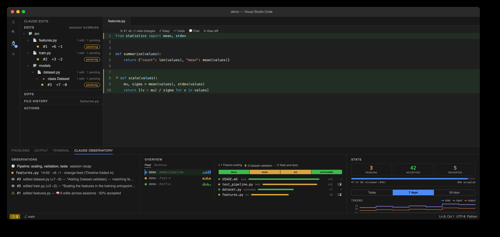
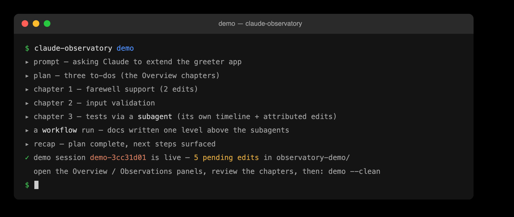
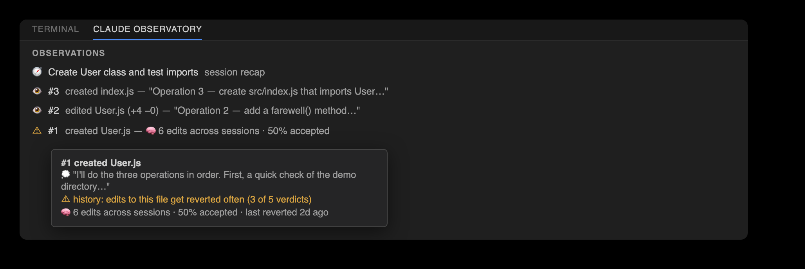
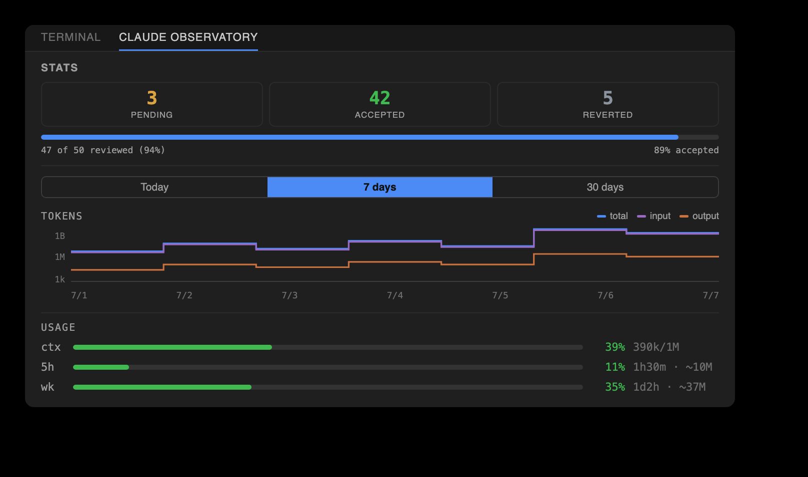
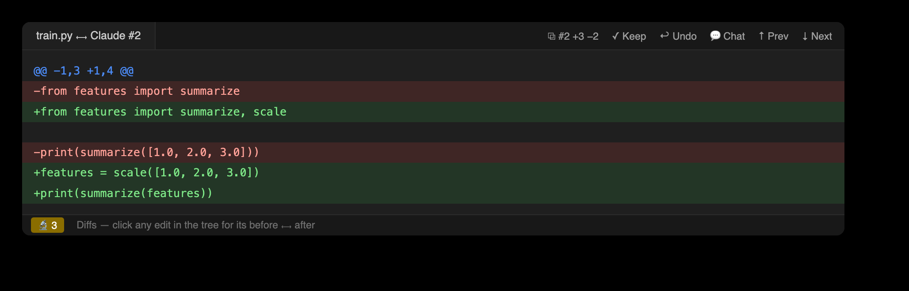
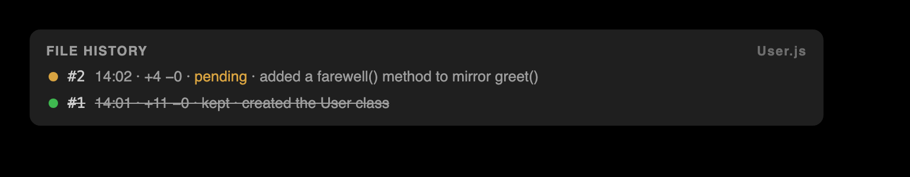
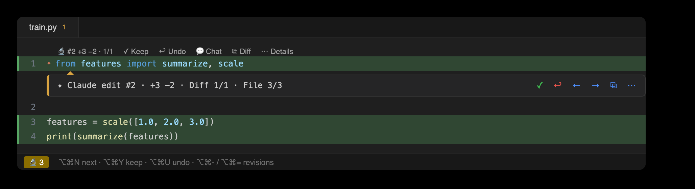
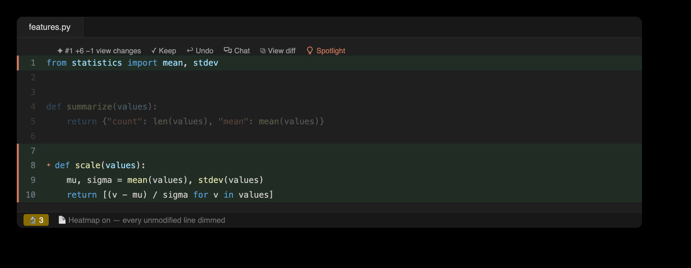
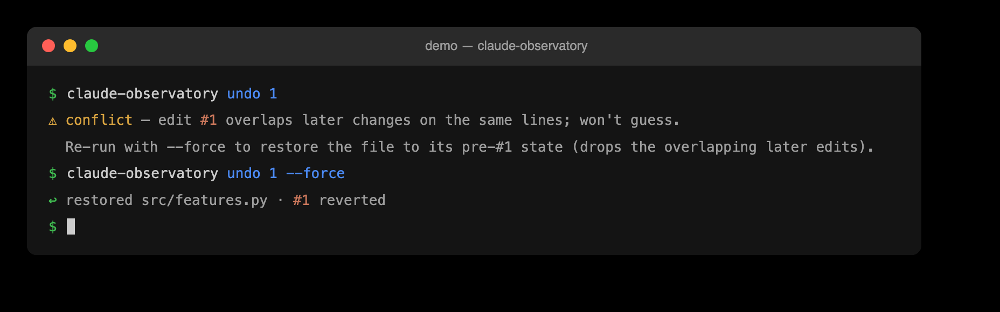
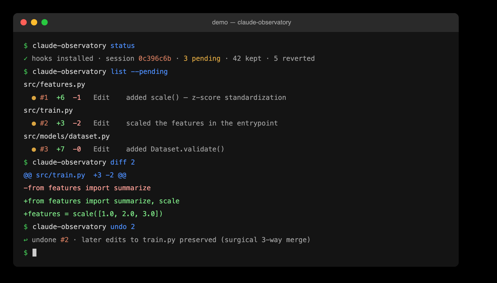

# 🔬 Claude Observatory

[](https://github.com/cell-observatory/claude-observatory/actions/workflows/linux.yml)
[](https://github.com/cell-observatory/claude-observatory/actions/workflows/macos.yml)
[](https://github.com/cell-observatory/claude-observatory/actions/workflows/windows.yml)
[](https://github.com/cell-observatory/claude-observatory/actions/workflows/vscode.yml)
[](https://github.com/cell-observatory/claude-observatory/actions/workflows/jetbrains.yml)
[](https://github.com/cell-observatory/claude-observatory/actions/workflows/codeql.yml)
[](https://github.com/cell-observatory/claude-observatory/actions/workflows/pages.yml)
[](https://github.com/cell-observatory/claude-observatory/actions/workflows/release.yml)
[](https://github.com/cell-observatory/claude-observatory/blob/main/.github/dependabot.yml)
[](https://github.com/cell-observatory/claude-observatory/releases/latest)
[](https://github.com/cell-observatory/claude-observatory/blob/main/LICENSE)


**[🔬 Live showcase →](https://cell-observatory.github.io/claude-observatory/)** &nbsp;·&nbsp; **[Interactive demo →](https://cell-observatory.github.io/claude-observatory/demo.html)** &nbsp;·&nbsp; [Changelog](CHANGELOG.md)

**Per-edit Keep / Undo for [Claude Code](https://claude.com/claude-code).** Every file change Claude makes
becomes a reviewable entry with its own surgical undo — in your **terminal**, **VS Code**, and **JetBrains
IDEs** — at **zero extra Claude tokens**. Like Cursor's "keep/undo each change," but standalone, shareable,
and git-free.



<details>
<summary><b>Anatomy</b> — every surface, named</summary>


</details>

**New in 0.8.0 — real-time multi-agent observability.** Run Claude in several git **worktrees** of one
repo and the observatory unifies them into a single **fleet**, right inside the **Overview** — now a
**master–detail** panel. Its **Fleet** tab lists every running agent with a live **phase** (working /
awaiting-input / awaiting-permission / idle / errored / done; `~` marks an inferred one), an activity
sparkline, its ±diff, risk, and a cross-agent file-collision strip; nested **subagents** show their task
and to-dos. A companion **Workflows** tab tracks Claude Code's multi-agent orchestration runs, and a **Tasks**
tab shows the session's numbered task list — each task linked to its chapter, with live statuses and
per-task edit counts; the right pane is the selected item's **change-map**. Still **zero extra Claude tokens**, still fully **local**, and
the worktree correlation is **git-free** — it reads the `.git` pointer files, never the git binary.


## Why use it?

Claude can change dozens of files in a turn. On code that matters, you don't want to skim a giant diff at
the end — you want to **stay in the loop on every edit** and decide, one at a time, what to keep.

- **Surgical review of AI edits** — accept, undo, or diff each change individually; undo one edit while
  keeping later edits to the same file.
- **Critical-infrastructure work** — keep a human in the loop when Claude touches code you can't afford to
  get wrong.
- **Any surface** — the same store is read/written by the CLI, the VS Code sidebar, and the JetBrains
  plugin, so terminal and editor stay in sync (great for remote/SSH/devcontainers where Claude runs on a host).
- **Shareable & auditable** — a git-free content-addressed log of what the agent did and what you decided,
  that you own and can hand to a teammate.

Complements Claude Code's native `/rewind` (whole-turn) with **per-edit** control, and costs **zero extra
tokens** — capture runs in local hooks, entirely outside the model loop.

## Quickstart

**1 — Install** the CLI + editor extensions from the latest [release](https://github.com/cell-observatory/claude-observatory/releases)
(no build toolchain, no accounts):

```bash
curl -fsSL https://raw.githubusercontent.com/cell-observatory/claude-observatory/main/scripts/bootstrap.sh | bash
```

**2 — Wire the capture hooks** — with **Claude Code closed** (it snapshots hooks at session start):

```bash
claude-observatory init          # add --with-statusline for the 5h/week Usage bars
```

**3 — Launch Claude Code** and start working. Every edit is captured automatically; open the **🔬 Claude
Observatory** view in your editor (or run `claude-observatory list`) to review.

**Try it without Claude** — the same scenario is clickable in the browser on the
**[interactive demo](https://cell-observatory.github.io/claude-observatory/demo.html)** page, nothing to
install. Locally, `claude-observatory demo` replays a scripted session through the real
pipeline in an isolated `demo-*` session and an `observatory-demo/` folder: open the Overview and watch
chapters, fleet rows, and observations fill in live, then review the edits for real.
`claude-observatory demo --clean` removes every trace.



**Prefer to let Claude install it?** Paste this prompt into a Claude Code session:

```text
Please install Claude Observatory (github.com/cell-observatory/claude-observatory) for me:
run its installer with
  curl -fsSL https://raw.githubusercontent.com/cell-observatory/claude-observatory/main/scripts/bootstrap.sh | bash
then run `claude-observatory doctor` and show me the output. Note: the capture hooks only
take effect on a fresh session — after installing, tell me to quit you, run
`claude-observatory init` in a plain terminal, and relaunch you.
```

> Verify anytime with `claude-observatory doctor`. Update by re-running the one-liner or `claude-observatory update`.
> Full install options (Windows, build-from-source, per-editor, teams) are in [Install](#install) below;
> remote/SSH/devcontainer setup is in **[docs/REMOTE.md](docs/REMOTE.md)**.

## The observatory

Built for **surgical Claude usage on critical infrastructure**: you see every change in realtime and accept
/ edit / revert each one, while Claude accelerates the work. Every surface below ships in **both editors**
(and most in the terminal too).

**Observatory dashboards** — the bottom panel, side by side like Terminal / Problems:

| View | What you get |
| --- | --- |
| **Overview** | *(the flagship 0.8.0 surface — a **master–detail** map of the whole fleet)* A left nav (~25%) has three tabs, each opening with a one-line description (the tabs and the change-map's sections also carry hover descriptions). **Fleet**: every running agent across the repo's git **worktrees**, each with a live **phase** (working / awaiting-input / awaiting-permission / idle / errored / done; `~` marks an inferred one), its worktree + branch, an activity **sparkline**, **±diff**, tokens·time, **risk**, and a **collision** badge — unfolding to nested **subagents** (`agentType` / description, phase, current task + todos, ±lines, a **💬 chat** button). **Workflows**: each multi-agent **workflow run** (Claude Code's deterministic orchestration), running / done, with per-**phase** progress and its agents' tokens·time·edits. **Tasks**: the session's numbered task list, each task linked to its chapter with a live status and per-task edit count. An **Active only** toggle, **Clear completed** (dismisses / hides, never deletes), and a live cross-agent **conflicts** strip (it flags a live agent overlapping an idle agent's unreviewed work too). The detail pane (~75%) is the selected item's **change-map**, in three labeled sections top to bottom: **Chapters** — a ribbon of subtask chips (each a to-do Claude worked, showing its lines / edits / pending; chapters are **total**, so work outside any to-do lands in a synthesized session chapter, and every chapter's Accept / Reject / Clear act **WYSIWYG** on exactly the edits its row shows); **Folders** — a proportional strip of tiles, one per changed directory (tile width = lines changed, colour = review status); and **Files** — a churn-ranked ledger of every changed file (±line bars, coloured by review status, worst-unreviewed-wins). Clicking a **Folder** tile or a **Chapter** chip navigates the matching nav-bar axis, opening that folder's or chapter's first pending edit. A **summary bar** along the bottom shows the pending / accepted / reverted edit counts plus file and folder totals for whatever is in scope, and names the current chapter (or folder filter). Up top, the **review nav bar** is two rows. The **controls** row carries the **session selector** (the session's human-readable **name** — its title or first prompt, with the raw id in the tooltip), the session-wide **Accept All · Revert All · Clear Resolved · Export**, and, at the right, **Search · Active only · Spotlight · Refresh**. The **axes** row steps the pending edits at four granularities: **Diff** ◄► across the open file's edits (Keep · Undo · Chat · View diff — opens a real side-by-side diff editor — and the edit's relative time); **File** ◄► across changed files (filename + that file's edit count; Accept / Reject File); **Folder** ◄► across changed directories (folder + its file / edit totals; Accept / Reject Folder, acting on that folder's edits only); and **Chapter** ◄► across the session's subtasks (the chapter's folder / file / edit totals; Review · Accept Chapter · Reject Chapter · Chat). Actions are color-coded (green keep/accept, red undo/reject, blue chevrons, orange clear, purple search/spotlight), every icon unique to its action, with live n/m counters on each axis. |
| **Observations** | A **session recap** on top (Claude Code's own title — zero token; ✨ to refine via `claude -p --resume`), then a coalesced **change feed** — files ordered by most-recent activity, each expanding to its edits (id + a small dimmed time + delta, adjacent same-file edits collapsing into a **×N** run) — with Claude's actual reasoning per row. Each row carries the observatory's **memory of that file** — cross-session accept/revert history and prior analyses; files whose edits get reverted repeatedly are flagged. |
| **Stats** | A **top navbar** — the active Claude Code session, shown by **name** (its title or first prompt, not the raw id); a **clickable pending count** that jumps to the first edit list (the same filter the Edits / Diffs trees use) — over a live **review scoreboard** (pending / accepted / reverted + a progress bar; the **pending** count is clickable, jumping to the first / oldest edit to review), a **tokens** step-line plot (total / input / output, log axis, Today / 7 days / 30 days), and live **Usage** bars — context fill plus 5h / week plan usage (from [claude-statusline](https://github.com/cell-observatory/claude-statusline)), the 5h and weekly rows now showing an estimated **used / total** (the 100 % total inferred from tokens ÷ percent). |


<p>
  
  
</p>

**Review surfaces** — the left sidebar / tool window (icon-only tabs, 🔬 microscope badged with the pending count):

| View | What you get |
| --- | --- |
| **Edits** | Pending edits grouped **folder → file → class**, each with inline Keep / Undo. Click to open the file at the edit. |
| **Diffs** | The same tree; click any edit for a **before ⟷ after** diff, with title-bar Prev / Next stepping the file's edits. |
| **File History** | A flat, chronological list of just the **active file's** edits that **follows the editor** as you switch tabs — jump to an edit, keep/undo it, diff it, or step revisions. |
| **Actions** | A **zero-token action timeline** mined from the transcript: **every** tool call this session — reads, greps, shell commands, web fetches, subagent spawns, to-dos — each correlated with its result (ok / error). **Grouped by category** (Edits · Commands · Reads · Searches · Web · To-dos · Egress…), **collapsed by default** and **curated** (high-signal categories, errors always surface) with a **Show all** toggle; edit rows link straight to the review. Two zero-token audits ride the same timeline: **Risk** — ⚠ high / med badges on shell commands that can destroy data (`rm -rf`, `git reset --hard`, force push), run remote code (`curl \| sh`), escalate privilege (`sudo`), or touch credential files; and **Egress** — what this session touched off-machine (WebFetch hosts · MCP servers · network shell, remote vs unknown). |





**Inline review, right in the editor.** A **✨ gutter star** at each pending edit, a clearly-visible
green whole-line highlight on added lines and a red one on deletions (removed text shown as red ghost
text) — each carrying a **bold change-bar** in the gutter, green for added and red for removed — plus a
**Claude-coral marker** on the scrollbar. Above each
edit sits an **inline menu**: **✦ #N · +A −R · view changes**, then **✓ Keep · ↩ Undo · Chat · ⧉ View
diff**. Kept edits grey out; reverted edits stay struck through everywhere.



In **VS Code**, "view changes" opens an **inline review bubble** right at the edit — the diff in git's own
colors plus Claude's reasoning, with **Accept · Revert · Chat · Prev · Next** on its toolbar. In
**JetBrains**, the ✨ lens opens the edit's before ⟷ after as a **unified diff** (Keep / Undo / Chat / View
diff on the lens; reasoning in the title).

**More, mirrored in both editors:**

- **Navigation bar** — a review stepper on three surfaces: the **status bar** (both editors), the **editor
  tab bar**, and a single floating **review bubble** over the current edit (VS Code). Two axes step the work
  — **Diff n/m** across the open file's pending edits and **File n/m** across every file with edits —
  alongside Keep / Undo, Accept / Reject File, Clear resolved, a **Spotlight** toggle, and Search. It's
  two-tier: the File axis and Clear / Spotlight / Search show whenever anything's pending, while the Diff
  axis and the per-edit / per-file actions appear only once the open file has edits; the counters follow the
  active editor. **⌥⌘N/P · ⌥⌘Y/U · ⌥⌘K/R · ⌥⌘[ /]** still drive it all from the keyboard.
- **File spotlight** — dim every unmodified line so Claude's edits stand out (a spotlight). Toggle with the
  📄 button.
- **Revision navigation** — step a file's edit history in a *current-vs-revision* diff with **⌥⌘[** / **⌥⌘]**
  or the buttons atop **File History**.
- **Per-file review** — **Accept all / Revert all in this file** from the Edits toolbar, the editor banner,
  and the File-History toolbar.
- **Chat handoff** — the chat button on any action, edit, subagent, or task hands your own Claude a
  **context-preloaded** prompt: the target, Claude's own reasoning, and the before/after diff or
  command/result, assembled by `chat-context`. **Zero-token** — Observatory never calls a model.
- **Toggle inline review** — hide/show the whole overlay with one button (👁).

<p>
  
  
</p>

**Realtime awareness:** a **status-bar 🔬** shows the pending count the moment Claude writes (amber while
anything awaits review); its tooltip is the review scoreboard, click jumps to the next pending edit. The
whole loop runs from the keyboard: **⌥⌘N** to the oldest pending edit, **⌥⌘Y** keep at cursor, **⌥⌘U** undo
— jump, decide, repeat.

**Opt-in deeper analysis** (spends tokens, your choice): _Analyze_ an observation or _Refresh recap_ prefer
`claude -p --resume <session>` so Claude reuses the session's already-cached context — cheaper and better
grounded — falling back to a self-contained prompt if the session can't be resumed.

## Terminal usage

The `claude-observatory` CLI is a first-class front-end — review without leaving the shell:



```text
claude-observatory status          # hooks + hook-path health + active session + counts
claude-observatory sessions        # list all sessions in the store (● = current dir)
claude-observatory list            # edits in the active session (grouped by file, ±lines, status)
claude-observatory list --pending  # filters: --pending | --kept | --undone, and --file <substr>
claude-observatory timeline        # edits newest-first as a chronological feed (time · id · Δ · file)
claude-observatory diff <id>       # colored before/after for one edit
claude-observatory keep <id>       # mark reviewed; no disk change (bulk: --all | --file <substr> | --under <path>)
claude-observatory undo <id>       # surgically undo one edit (bulk: --all | --file <substr> | --under <path>)
claude-observatory undo <id> --force   # per-file restore fallback (used on overlap conflicts)
claude-observatory redo <id>       # re-apply an undone edit (--force to override later edits)
claude-observatory task-keep <id>      # keep every pending edit shown under a chapter (WYSIWYG); --json
claude-observatory task-undo <id>      # revert every pending edit shown under a chapter (WYSIWYG); --json
claude-observatory task-clear <taskId> # drop a task's resolved edits (--completed clears every settled chapter); --json
claude-observatory demo            # simulate a Claude session LIVE through the real pipeline (isolated demo-* session + folder) — review works for real; --fast for scripts; demo --clean removes every trace
claude-observatory insights        # Observations: recap + per-edit reasoning/flags/memory + next steps
claude-observatory actions         # every tool call this session — typed, grouped, zero-token (alias `trace`); --json | --category <c> | --errors | --limit <n> | --all
claude-observatory risk            # audit shell commands for destructive / remote-code / privilege / credential risk — ⚠ high/med
claude-observatory egress          # what this session touched off-machine: WebFetch hosts · MCP servers · network shell (remote vs unknown)
claude-observatory subagents       # per-subagent action timeline + metrics (duration · tokens · tool-uses · status), zero-token (alias `agents`); --json
claude-observatory siblings        # other Claude sessions in this project: active/idle · pending edits · files · risk flags — read-only, path-only (alias `fleet`); --json | --all | --repo (every worktree of the repo)
claude-observatory multitask       # real-time multi-agent view: every running agent across the repo's worktrees — phase · sparkline · ±diff · risk · subagents · workflows · collisions, git-free; --json
claude-observatory tasklog         # cross-agent task log: one row per stable taskId, unioned across worktrees + subagents, zero-token; --json
claude-observatory chat-context    # zero-token, ready-to-paste chat prompt about an action/edit/subagent/task (--tool-use-id | --edit | --agent | --task); --json
claude-observatory changemap       # the Overview view-model: to-do task ribbon + per-file/per-module churn rollups (per task/subagent/workflow/agent), zero-token; --json
claude-observatory metrics         # session rollup: per-edit diff stats · action/error counts · per-subagent duration/tokens · tool latency (median/p95/max); --json
claude-observatory summary         # per-session review recap (kept/reverted per file); --markdown to export
claude-observatory clean           # GC orphaned blobs; --resolved [--under <path>] | --drop <id> | --older-than 30d | --all
claude-observatory update          # update the CLI + installed editor extensions to the latest release (--check to only report)
claude-observatory uninstall       # remove the capture hooks (--all also reverts the bundled status line)
claude-observatory version [--check]  # print the installed version; --check also shows the latest release
```

The active session is resolved from your workspace; override with `--session <id>` or `CLAUDE_OBSERVATORY_SESSION`.

## Install

The one-liner in [Quickstart](#quickstart) covers most people. The details:

### Keeping up to date

`claude-observatory update` refreshes **everything installed** — the CLI, the VS Code extension, and
the JetBrains plugin — from the [latest release](https://github.com/cell-observatory/claude-observatory/releases/latest)
(add `--check` to preview without installing); re-running the [one-liner](#quickstart) does the same.
The CLI also nudges you once a day when a newer release exists (opt out with
`CLAUDE_OBSERVATORY_NO_UPDATE_CHECK=1`). Beyond that, each surface can keep **itself** current:

- **CLI** — `claude-observatory update`, or the daily nudge above; `claude-observatory version --check`
  shows your installed version next to the latest release at any time.
- **VS Code** — a background check (once a day) offers a one-click **Update now**; or run
  **“Claude Observatory: Check for updates”** from the Command Palette. Downloads are sha256-verified.
- **JetBrains** — add the self-hosted plugin repository **once** and the IDE auto-updates the plugin
  like any Marketplace plugin (see [the JetBrains guide](packages/jetbrains/README.md#auto-updates)):
  **Settings → Plugins → ⚙ → Manage Plugin Repositories → +**, then paste
  `https://github.com/cell-observatory/claude-observatory/releases/latest/download/updatePlugins.xml`.

**Platforms:** macOS and Linux work as-is. On **Windows**, the CLI, capture hooks, and both editor plugins
run natively (npm's `.cmd` shims are handled) — but the installer and the bundled status line are bash, so
run them from **Git Bash** (`jq` needed for the status line) or use WSL.

**Build from source (contributors):**

```bash
./install.sh                 # deps → build → CLI on PATH → extension → status line → offer `init`
```

Or step by step:

```bash
npm install                  # workspace deps
npm run build                # build core + cli
npm i -g ./packages/cli      # put `claude-observatory` on PATH  (or: npm link in packages/cli)
claude-observatory init --with-statusline   # capture hooks + the bundled status line (backs settings up first)
```

The [claude-statusline](https://github.com/cell-observatory/claude-statusline) status line is **bundled**
— `claude-observatory statusline` installs/refreshes it with no network (it powers the Usage bars). Refresh
the vendored copy with `scripts/sync-statusline.sh`.

> **Important — install hooks _before_ launching Claude Code.** Claude Code snapshots your hooks at session
> start, so hooks added to a **running** session get reverted. Run `claude-observatory init` with Claude
> Code closed, then launch it. Verify with `claude-observatory status`.

**VS Code extension** (optional):

```bash
npm run build:vscode
cd packages/vscode && npm run package     # -> claude-observatory.vsix
code --install-extension claude-observatory.vsix
```

Fully quit VS Code (⌘Q) once after installing so the activity-bar icon refreshes. The extension then
keeps itself current — a daily background check offers a one-click **Update now** (see [Keeping up to
date](#keeping-up-to-date)).

**JetBrains / PyCharm plugin** (optional; needs JDK 21 + Gradle to build — or grab the `.zip` from a
[Release](https://github.com/cell-observatory/claude-observatory/releases)):

```bash
./scripts/install-jetbrains.sh   # build + install into your local JetBrains IDEs, then restart the IDE
```

Or manually: **Settings → Plugins → ⚙ → Install Plugin from Disk…** with the built/downloaded zip. Works in
every JetBrains IDE (platform-only APIs — PyCharm CE/Pro, IntelliJ, WebStorm, …). For hands-off updates
afterward, add the [plugin repository](packages/jetbrains/README.md#auto-updates) once. Details:
[packages/jetbrains/README.md](packages/jetbrains/README.md).

**Teams:** run `claude-observatory init --project` to write the hook into the repo's `./.claude/settings.json`
(checked in). Teammates then only need `claude-observatory` on their PATH.

**Remote development (SSH & devcontainers):** the extension runs on the **remote host** (where Claude, the
transcripts, and the store live). Full setup — Remote-SSH, JetBrains Gateway/Toolbox, the devcontainer
template, and relocating `CLAUDE_CONFIG_DIR` — is in **[docs/REMOTE.md](docs/REMOTE.md)**.

## How it works

| Piece | What it does |
| --- | --- |
| **Capture hook** (`capture`) | PreToolUse snapshots the file before an edit, PostToolUse commits before + after. Zero-dep, always `exit 0`, never writes to the model context. Captures `Edit` / `Write` / `MultiEdit` / `NotebookEdit` — and files changed by `Bash` (set `CLAUDE_OBSERVATORY_NO_BASH=1` to opt out). |
| **Store** | `~/.claude/claude-observatory/<session_id>/` — `log.jsonl` (append-only) + content-addressed `blobs/`. No network. |
| **Session resolution** | The active session is the newest transcript **that holds a real conversation**. Local commands (`/effort`, `/model`), interrupted commands, and bridge records write command-only transcript stubs; those never displace the session under review (0.8.4). When the current session has no edits yet, the panels say so honestly and offer a one-click switch to the previous session's work. |
| **Undo engine** | Position-anchored 3-way line merge (base = the file right after the edit; sides = current on-disk content and the pre-edit content). Later edits to other lines survive; a genuine overlap → clear conflict + per-file restore. Anchoring on line positions (not fuzzy text search) keeps it safe against duplicated content. |
| **Observations** | Correlates each edit with Claude's real reasoning + to-dos parsed from the session transcript — zero token. |
| **Front-ends** | The CLI (in-process), the VS Code sidebar (in-process `core`), and the JetBrains plugin (over the CLI + store) — all on the same store + engine. |

Architecture deep-dive: **[docs/ARCHITECTURE.md](docs/ARCHITECTURE.md)**.

## Performance

Built to add **zero overhead** to your Claude sessions:

- **Capture** runs in local hooks entirely outside the model loop — zero tokens, zero-dependency hot path.
- **Every render is cache-backed** — the extension memoizes the edit log, transcript reasoning, and blob
  reads on each file's `(mtime, size)`; a cache hit costs one `stat()` instead of re-parsing a multi-MB
  transcript.
- **The Overview loads ~2× faster in 0.8.0** — core's pure transcript parsers are memoized per
  `(mtime, size)`, and the JetBrains panels share one throttled CLI fetch per view (≤1 spawn per view
  per ~3s) instead of polling independently.
- **Heavy scans never touch the UI thread** — Stats aggregation runs in a `claude-observatory stats`
  subprocess with an incremental on-disk cache (first scan ~0.4 s, steady-state ~0.05 s).
- **Refreshes are debounced** — a burst of capture events produces one re-render.
- **The Bash capture walk is memoized (0.8.4)** — a per-session `(mtime, size)` stat cache makes the
  before/after tree snapshots stat-only for unchanged files (binary verdicts cached too), roughly
  halving steady-state hook latency; a self-healing blob-presence guard keeps undo safe across GC.
- **Worktree discovery is gated (0.8.4)** — the JetBrains plugin re-runs sibling discovery only when
  a new project dir actually appears, instead of spawning a full `multitask` scan every 15 s.

## Packages

- `packages/core` — capture + store + surgical undo + transcript observations + shared installer (pure TS;
  only runtime dep is `diff`). No model calls.
- `packages/cli` — the `claude-observatory` bin: installer + terminal review UI + the machine-readable
  `--json` surface other front-ends build on. Bundles the [claude-statusline](https://github.com/cell-observatory/claude-statusline) installer.
- `packages/vscode` — the VS Code extension (depends on core; bundled with esbuild).
- `packages/jetbrains` — the PyCharm/JetBrains plugin (Kotlin; a front-end over the CLI + store — see its
  [README](packages/jetbrains/README.md)).

## Contributing

New features **ship in every front-end** — CLI, VS Code, and JetBrains — with shared logic in core/CLI.
Start here:

- **[CONTRIBUTING.md](CONTRIBUTING.md)** — the practical "add a feature across all platforms" guide, with
  the file-by-file steps, the build/test cheat-sheet, and the cross-platform parity checklist.
- **[docs/ARCHITECTURE.md](docs/ARCHITECTURE.md)** — how the pieces fit: core → CLI `--json` → both editors.
- **Have an idea?** Open a [feature request](https://github.com/cell-observatory/claude-observatory/issues/new?template=feature_request.yml).

```bash
npm test          # core unit tests + the extension smoke test
npm run e2e       # end-to-end CLI + capture-hook integration harness
npm run release   # build shareable artifacts into ./release (CLI .tgz + .vsix + JetBrains .zip)
```

To cut a release: `git tag v0.5.0 && git push origin v0.5.0` — CI re-runs the suites (npm + e2e + Gradle)
and attaches the CLI `.tgz`, the VS Code `.vsix`, and the JetBrains `.zip` to a
[GitHub Release](https://github.com/cell-observatory/claude-observatory/releases). See
[docs/DEMO.md](docs/DEMO.md) for a feature-by-feature walkthrough, or the
**[visual showcase](https://cell-observatory.github.io/claude-observatory/showcase.html)**.

## Notes

- Binary and >5 MB files are skipped. **Bash-driven file changes are tracked too** — a Bash command
  snapshots the candidate tree under its cwd before/after and records one edit per changed file (bounded:
  skips vendor/build dirs, caps the file count). Opt out with `CLAUDE_OBSERVATORY_NO_BASH=1`.
- New-file creates are captured (undo deletes the file). No-op edits are not logged.
- **Multi-agent is git-free and path-only.** Agents running in separate git **worktrees** of one repo are
  unified into a single fleet by reading the `.git` pointer files (never shelling out to the git binary);
  the cross-agent views (the Overview's Fleet tab, siblings, task log) are **path-only** — filenames, never contents — so
  nothing leaks between agents. Attribution stays **honest**: an edit that can't be strictly placed in a
  task is never guessed onto the wrong one — the Overview files it under the nearest displayed chapter
  (the strict rollup stays in the JSON for scripts). Chapter review ops act WYSIWYG — exactly the edits
  the chapter row displays — while the strict per-task attribution keeps powering the analytics.
- Everything is local: no network calls, no telemetry, **zero extra Claude tokens** — every 0.8.0 view is
  mined from the transcript + the local store. Deep analysis only runs the `claude` CLI you already have,
  and only when you ask.
