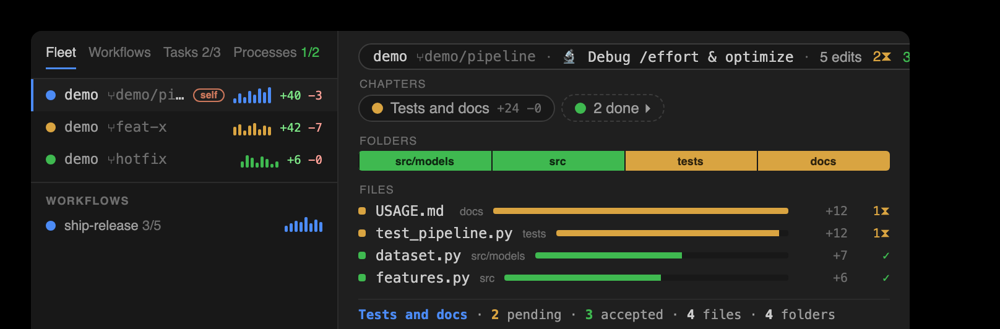
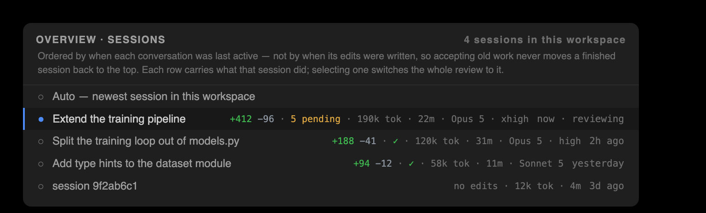
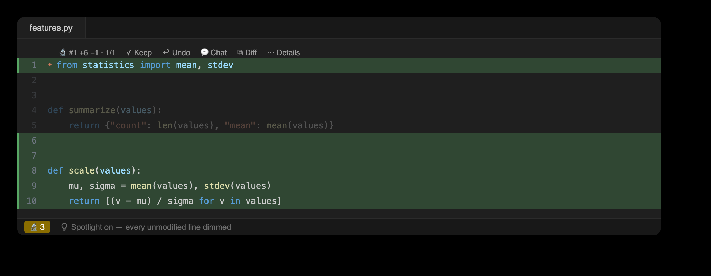

# 🔬 Claude Observatory

[](https://github.com/cell-observatory/claude-observatory/actions/workflows/linux.yml)
[](https://github.com/cell-observatory/claude-observatory/actions/workflows/macos.yml)
[](https://github.com/cell-observatory/claude-observatory/actions/workflows/windows.yml)
[](https://github.com/cell-observatory/claude-observatory/actions/workflows/vscode.yml)
[](https://github.com/cell-observatory/claude-observatory/actions/workflows/jetbrains.yml)
[](https://github.com/cell-observatory/claude-observatory/actions/workflows/codeql.yml)
[](https://github.com/cell-observatory/claude-observatory/actions/workflows/pages.yml)
[](https://github.com/cell-observatory/claude-observatory/actions/workflows/release.yml)
[](https://github.com/cell-observatory/claude-observatory/blob/main/.github/dependabot.yml)
[](https://github.com/cell-observatory/claude-observatory/releases/latest)
[](https://github.com/cell-observatory/claude-observatory/blob/main/LICENSE)


**[🔬 Live showcase →](https://cell-observatory.github.io/claude-observatory/)** &nbsp;·&nbsp; **[Interactive demo →](https://cell-observatory.github.io/claude-observatory/showcase.html#demo)** &nbsp;·&nbsp; [Changelog](CHANGELOG.md)

**Per-edit Keep / Undo for [Claude Code](https://claude.com/claude-code).** Every file change Claude makes
becomes a reviewable entry with its own surgical undo — in your **terminal**, **VS Code**, and **JetBrains
IDEs** — at **zero extra Claude tokens**. The review model resembles Cursor's per-change keep/undo, but it
is standalone, shareable, and git-free. It is built for **established and mission-critical codebases**
rather than throwaway prototypes.


<details>
<summary><b>Anatomy</b> — every surface, named</summary>


</details>

**New in 0.9.0 — the Overview's cache actually hits, and sessions read like fleet rows.** Opening an older
session and watching it redraw for twelve seconds was not a cold cache; it was a cache being thrown away on
almost every tick. Everything a change map derives from the project directory is a *count* of sibling
sessions, but the stamp carried every file's `(mtime, size)` — so one session appending a single line
invalidated every other session's map, and both editors refresh on the transcript watcher, which made the
trigger and the invalidator the same event. A refresh that cost **16.0 s** now costs **2.4 s** and
rewrites one cache file instead of 32. Edit placement is memoized across processes (**2.27 s → 0.28 s**,
byte-identical), conversations quiet for over a week **fold** into one collapsed group instead of being
rebuilt on every tick (**cold 15.9 s → 9.1 s**), and a folded row with no cached map says *not loaded*
rather than showing zeros. Session rows now carry the same badges a fleet row does — ±lines, pending,
tokens, wall-clock and a model · effort chip — and **Clear completed sessions…** drops the stored
edits of sessions whose review is finished, never touching the session you are in, anything with pending
edits, anything mid-capture, anything from another workspace, or anything whose conversation moved in the
last 24 hours. **Windows stores no longer forge phantom edits**: drive-letter case is canonicalized at
capture and on every lookup in all three front-ends, undo refuses the destructive half of an existing
phantom pair, and `clean --phantoms` removes the pairs for good (#43). **Export** grew a second form —
the **full session trace**, everything the observatory recorded as one JSON document, from the same
Export button in both editors or `claude-observatory export`. (Earlier releases: see the
[changelog](CHANGELOG.md).)

The observatory groups a session's work two ways, and names both. A **prompt** is one of your own turns
together with the work it caused, attributed by what it **started**; picking one in the **Prompts**
window scopes the whole Overview to it. A **task** is one of Claude's own numbered to-dos, and it owns
only the edits captured while that task was in progress — an edit outside every in-progress window stays
unassigned rather than being attributed to a neighboring task. Both groupings run through the whole
product: the Prompts window, the `prompts` command, and the `prompts[]` key of the JSON view API on one
side; the Tasks tab, the `task-keep` / `task-undo` / `task-clear` verbs, and the per-task rollup on the
other. A **Sessions** tab ends the Overview's left nav: it lists this workspace's sessions by
conversation recency, and selecting one switches what the whole observatory reviews. The
**[Docs](https://cell-observatory.github.io/claude-observatory/concepts.html)** page defines the
vocabulary the observatory is built from — the record, the two groupings of a session (prompts and
tasks), the agents, the audits, and the review verbs — and every prose surface uses it consistently, in
the register described in [docs/STYLE.md](docs/STYLE.md).

The rest of the Overview is as it has been since 0.8.0. Claude running in several git **worktrees** of one
repo unifies into a single **fleet** under the **Fleet** tab, each agent with a live **phase** and its
nested **subagents**; the detail pane is the selected item's **change-map**. Still **zero extra Claude
tokens**, still fully **local**, and the worktree correlation is **git-free** — it reads the `.git`
pointer files, never the git binary.


## Why use it?

Claude can change dozens of files in one turn. On established and mission-critical codebases, a giant
diff skimmed at the end is not review. The observatory keeps you **in the loop on every edit**, deciding
one change at a time.

- **Surgical review of AI edits** — accept, undo, or diff each change individually; undo one edit while
  keeping later edits to the same file.
- **Established and mission-critical codebases** — keep a human in the loop when Claude touches code whose
  failure is expensive.
- **Any surface** — the same store is read/written by the CLI, the VS Code sidebar, and the JetBrains
  plugin, so terminal and editor stay in sync (great for remote/SSH/devcontainers where Claude runs on a host).
- **Shareable & auditable** — a git-free content-addressed log of what the agent did and what you decided,
  that you own and can hand to a teammate.

Complements Claude Code's native `/rewind` (whole-turn) with **per-edit** control, and costs **zero extra
tokens** — capture runs in local hooks, entirely outside the model loop.

## Quickstart

**1 — Install** the CLI + editor extensions from the latest [release](https://github.com/cell-observatory/claude-observatory/releases)
(requires Node.js 18+; no build toolchain, no accounts):

```bash
# macOS / Linux (and Windows via Git Bash)
curl -fsSL https://raw.githubusercontent.com/cell-observatory/claude-observatory/main/scripts/bootstrap.sh | bash
```

```powershell
# Windows — native, no bash needed
irm https://raw.githubusercontent.com/cell-observatory/claude-observatory/main/install.ps1 | iex
```

Both install the CLI and then the extensions for whatever editors are on the machine — VS Code family
and/or JetBrains. Add `--channel dev` (PowerShell: `-Channel dev`) for the rolling
[pre-release channel](#keeping-up-to-date); the choice is remembered, so later updates follow it.

**2 — Wire the capture hooks** — with **Claude Code closed** (it snapshots hooks at session start):

```bash
claude-observatory init          # add --with-statusline for the 5h/week Usage bars
```

**3 — Launch Claude Code** and start working. Every edit is captured automatically; open the **🔬 Claude
Observatory** view in your editor (or run `claude-observatory list`) to review.

**Try it without Claude** — the same scenario is clickable in the browser on the
**[interactive demo](https://cell-observatory.github.io/claude-observatory/showcase.html#demo)** on the
homepage, nothing to install. In your editor, run **Start Demo Mode** from the VS Code command palette or JetBrains Find Action, use
the buttons at the end of the Overview's nav bar, or click **Try the demo** in an empty panel. It replays a scripted
session through the real pipeline in an isolated `demo-*` session and an `observatory-demo/` folder it
creates in the current directory, then walks you through every panel. In the terminal the same replay is
`claude-observatory demo`, and `claude-observatory demo --tour` prints the tour as prose. Starting it
again resets it; **Exit Demo Mode** (or `claude-observatory demo --clean`) removes every trace.


**Prefer to let Claude install it?** Paste this prompt into a Claude Code session:

```text
Please install Claude Observatory (github.com/cell-observatory/claude-observatory) for me:
run its installer with
  curl -fsSL https://raw.githubusercontent.com/cell-observatory/claude-observatory/main/scripts/bootstrap.sh | bash
then run `claude-observatory doctor` and show me the output. Note: the capture hooks only
take effect on a fresh session — after installing, tell me to quit you, run
`claude-observatory init` in a plain terminal, and relaunch you.
```

> Verify anytime with `claude-observatory doctor`. Update by re-running the one-liner or `claude-observatory update`.
> Full install options (Windows, build-from-source, per-editor, teams) are in [Install](#install) below;
> remote/SSH/devcontainer setup is in **[docs/REMOTE.md](docs/REMOTE.md)**.

## The observatory

The observatory is built for surgical Claude use on established and mission-critical codebases: you see
every change as it lands and accept, edit, or revert each one while Claude accelerates the work. Every surface below ships in
**both editors**, and most ship in the terminal as well. The terms used here — session, prompt, task,
edit, action — are defined on the
**[Docs](https://cell-observatory.github.io/claude-observatory/concepts.html)** page.

The **Observatory Dashboards** bottom panel holds the Overview and Stats side by side like Terminal /
Problems; Prompts sits with Actions and Observations in the **Observatory Timeline** panel.

### Prompts

The Prompts window shows the session as the conversation you had: one row per thing **you** asked for, in
order, each with its own counts — edits (±lines, pending / reverted), files and folders touched, tokens
spent answering, the subagents, workflow runs, tasks, and background shells it produced, the tool calls
that failed, the compactions it suffered, and how long it took (an ask still being answered is marked, its
duration elapsed so far). The ask itself is printed whole, wrapped rather than clipped; an ask that changed
no files says which kind it was — a question, a decision, or work that did not land in the tree. Expanding
a row shows Claude's reply to that ask, its prose with the tool calls stripped out, fetched on demand.
Selecting a row scopes the Overview beside it: the fleet, the runs, the shells, and the whole change map
narrow to the work that ask caused, the bulk actions retarget to it ("Accept All in #N"), and every pane
that dropped rows says how many and why. The Tasks tab is the exception — the task list stays session-wide.
Attribution is by what **started** the work, never by what finished during it.

### Overview

The Overview is a **master–detail** map of the whole fleet. The left nav (~25%) has five tabs, each
opening with a one-line description. **Fleet** lists every running agent across the repo's git worktrees —
a live phase (working / awaiting-input / awaiting-permission / idle / errored / done; `~` marks an
inferred one), worktree and branch, an activity sparkline, ±diff, tokens·time, risk, a conflict badge, and
an ↗ suffix counting the files read or written outside the workspace — each unfolding to its nested
subagents (agentType, description, phase, current task and to-dos, ±lines, a chat button). **Workflows**
lists each multi-agent workflow run, running or done, with per-phase progress and its agents'
tokens·time·edits. **Tasks** lists the session's numbered task list — or, on newer Claude Code builds, its
background Agent runs — each row carrying a live status and the ±lines, edits, and pending count of the
edits captured while that task was in progress. **Processes** lists the background shells the session
started with `run_in_background`, each with its state, runtime, and output volume; shell ids are the
harness's own, because a transcript records no OS process id. **Sessions** lists every Claude Code session
for this workspace, ordered by when each conversation was last active, with the live session marked;
selecting a row pins what the whole observatory reviews, while the other tabs only re-point the detail
pane.

The panel follows its own width. Docked narrow — under about 620 px — the master and detail stack
instead of splitting side by side, and the nav bar gives each review axis its own row, so a narrow dock
loses no control.

The detail pane (~75%) is the selected item's **change map**, two labeled sections top to bottom.
**Folders** is a strip of equal tiles, one per changed directory, ranked by lines changed and colored
by review status. The strip leads with the eleven folders that moved most and folds the rest into
a **+K more** tile; clicking it opens every folder — the strip wraps onto further rows, capped at five
and scrolling, so the ledger stays in view — and **show fewer** folds it back. Tiles never shrink below
a readable width: a narrow panel gets more rows rather than slivers. **Files** is a churn-ranked ledger
of every changed file (±line bars colored by review status, worst-unreviewed-wins). Clicking a Folder
tile drives the matching nav-bar axis. A
summary bar reports the pending / accepted / reverted counts and the file and folder totals for whatever
is in scope; beneath it, the selected row's **feed** shows what that thing is doing — live while its
source is still writing, an audit log once it has finished.

The **review nav bar** on top is two rows. The controls row names the session under review — its title
or first prompt, whole, on a single line (the raw id sits in the tooltip) — then the session-wide
Accept All · Reject All · Clear Resolved · Export, and, at the right, Search · Active only · Spotlight ·
Refresh. Export offers two documents: the shareable review summary (markdown), or the full session
trace of everything the observatory recorded (JSON). The name is a label,
not a control: since 0.8.8 the **Sessions tab** is where the session changes. The Switch Session command
still opens a picker, which leads each row with Claude's own title, lists the live session first and the
rest by conversation recency, preselects the session in effect, and matches on the raw id as you type.
**Active only** — which hides finished agents, runs, and shells along with
fully-reviewed work — starts on and is remembered across panel hides and restarts. The axes row steps the
pending edits at four granularities: **Diff** across the open file's edits (Keep · Undo · Chat · View
diff), **File** across changed files (Accept / Reject File), **Folder** across changed directories, and
**Prompt** across your own asks (Review · Accept / Reject Prompt) — color-coded, one icon per action,
with live n/m counters on each axis.

### Observations

Observations lives in the Observatory Timeline panel, alongside Prompts and Actions. A session recap sits on
top (Claude Code's own title, zero token; ✨ to refine via `claude -p --resume`), then a **Context** section
naming what shaped the session — the skills it invoked, the plans it wrote, the memory it read, whether it
was resumed from a compaction, plus the instruction files present where Claude Code auto-loads them — each
row labeled with how it is known: `transcript` for what the session demonstrably did, `file-present` for
files that merely exist in a loaded location, since CLAUDE.md and memory are injected system-prompt-side and
leave no per-session trace. Below sits a coalesced **change feed**: files ordered by most-recent activity,
adjacent same-file edits collapsing into a ×N run, with Claude's actual reasoning per row. Each row also
carries the observatory's cross-session memory of that file, so files whose edits are reverted repeatedly
are flagged.

### Stats

A top bar names the active session — its title or first prompt, never the raw id — with a chip for the
model and reasoning effort the session runs on (`Opus 4.8 · max effort`; a session that switched
models shows the current one and says it switched) and a one-line compaction readout
(`⤺ 2 compactions · last dropped 986k`; a session never compacted shows nothing rather than a zero).
Below sit a **Session tokens** section — the cumulative input / output / cached split with the cache hit
rate, kept live by an incremental transcript cursor — an **Edits** section with the live review scoreboard
(pending / accepted / reverted; the pending count is clickable and jumps to the oldest edit awaiting
review), a tokens step-line plot over Today / 7 days / 30 days, and live **Usage** bars: context fill plus
5h / week plan usage, the 5h and weekly rows showing an estimated used / total (the total inferred from
tokens ÷ percent).





<p>
  
  
</p>

**Review surfaces** — the left sidebar / tool window (icon-only tabs, 🔬 microscope badged with the pending count):

| View | What you get |
| --- | --- |
| **Edits** | Pending edits grouped **folder → file → class**, each with inline Keep / Undo. Click to open the file at the edit. |
| **Diffs** | The same tree; click any edit for a **before ⟷ after** diff, with title-bar Prev / Next stepping the file's edits. |
| **File History** | A flat, chronological list of just the **active file's** edits that **follows the editor** as you switch tabs — jump to an edit, keep or undo it, diff it, or step revisions. |

### Actions

Actions is a zero-token timeline mined from the transcript: every tool call this session — reads, greps,
shell commands, web fetches, subagent spawns, to-dos — each correlated with its result. It is grouped by
category (Edits · Commands · Reads · Searches · Web · To-dos · Compactions), collapsed by default and
curated — high-signal categories, errors always surfaced, a Show all toggle for the rest — and edit rows
link straight to the review. **Risk** rides the command rows in place: a ⚠ HIGH / medium badge on shell
commands that can destroy data (`rm -rf`, `git reset --hard`, force push), run remote code (`curl | sh`),
escalate privilege (`sudo`), or touch credential files. **Live conflicts** leads the view, expanded: every
file with unreviewed edits from two or more agents, at least one of them live. Below the categories sit
the two audits. **Outside the workspace** lists the edits that landed beyond the workspace root, which the
edits ledger cannot state because it shows every path workspace-relative. **Egress** lists where this
session reached — web hosts, MCP servers, network shell commands, and the files it read from outside the
workspace — each scoped `remote` / `outside` / `unknown`: outside is a fact (on this machine but beyond
the workspace), unknown is an admission that a destination could not be classified. Both audits report
what was **exercised, never what was permitted** — Claude Code writes nothing to the transcript when it
prompts for permission, so auto-approved and hand-approved work are indistinguishable from the outside.


**Inline review, right in the editor.** A **✨ gutter star** at each pending edit, a clearly-visible
green whole-line highlight on added lines and a red one on deletions (removed text shown as red ghost
text) — each carrying a **bold change-bar** in the gutter, green for added and red for removed — plus a
**Claude-coral marker** on the scrollbar. Above each
edit sits an **inline menu**: **✦ #N · +A −R · view changes**, then **✓ Keep · ↩ Undo · Chat · ⧉ View
diff**. Kept edits grey out; reverted edits stay struck through everywhere.


In **VS Code**, "view changes" opens an **inline review bubble** right at the edit — the diff in git's own
colors plus Claude's reasoning, with **Keep · Undo · Chat · Prev · Next** on its toolbar. In
**JetBrains**, the ✨ lens opens the edit's before ⟷ after as a **unified diff** (Keep / Undo / Chat / View
diff on the lens; reasoning in the title).

**More, mirrored in both editors:**

- **Navigation bar** — a review stepper on four surfaces: the **status bar** (both editors), the **editor
  tab bar**, a floating **review bubble** over the current edit (VS Code), and the Overview's title bar
  (its fullest, two-row form is described above). Two axes step the work — **Diff n/m** across the open
  file's pending edits and **File n/m** across every file with edits — alongside Keep / Undo,
  Accept / Reject File, Clear resolved, a **Spotlight** toggle, and Search. The bar is two-tier: the File
  axis and Clear / Spotlight / Search show whenever anything is pending, while the Diff axis and the
  per-edit and per-file actions appear only once the open file has edits; the counters follow the active
  editor. **⌥⌘N/P · ⌥⌘Y/U · ⌥⌘K/R** drive it all from the keyboard, plus the revision keys below.
- **File spotlight** — dim every unmodified line so Claude's edits stand out (a spotlight). Toggle with the
  📄 button.
- **Revision navigation** — step a file's edit history in a *current-vs-revision* diff with **⌥⌘-** /
  **⌥⌘=** in VS Code and **⌥⌘[** / **⌥⌘]** in JetBrains (VS Code's own Fold and Unfold already hold the
  bracket chord), or with the buttons atop **File History**.
- **Per-file review** — **Accept all / Reject all in this file** from the Edits toolbar, the editor banner,
  and the File-History toolbar.
- **Chat handoff** — the chat button on any action, edit, subagent, or task hands your own Claude a
  **context-preloaded** prompt: the target, Claude's own reasoning, and the before/after diff or
  command/result, assembled by `chat-context`. **Zero-token** — Observatory never calls a model.
- **Toggle inline review** — hide/show the whole overlay with one button (👁).

<p>
  
  
</p>

**Real-time awareness:** a **status-bar 🔬** shows the pending count the moment Claude writes (amber while
anything awaits review); its tooltip is the review scoreboard, click jumps to the next pending edit. The
whole loop runs from the keyboard: **⌥⌘N** to the oldest pending edit, **⌥⌘Y** keep at cursor, **⌥⌘U** undo
— jump, decide, repeat.

**Opt-in deeper analysis** (spends tokens, your choice): _Analyze_ an observation or _Refresh recap_ prefer
`claude -p --resume <session>` so Claude reuses the session's already-cached context — cheaper and better
grounded — falling back to a self-contained prompt if the session can't be resumed.

## Terminal usage

The `claude-observatory` CLI is a first-class front-end — review without leaving the shell:


```text
claude-observatory status          # hooks + hook-path health + active session + counts
claude-observatory doctor          # diagnose setup (hooks, PATH, config dir, session, status line) with fixes
claude-observatory sessions        # this workspace's sessions by conversation recency, each by name (● = the one in effect); --json
claude-observatory list            # edits in the active session (grouped by file, ±lines, status)
claude-observatory list --pending  # filters: --pending | --kept | --undone, and --file <substr>
claude-observatory timeline        # edits newest-first as a chronological feed (time · id · Δ · file)
claude-observatory diff <id>       # colored before/after for one edit
claude-observatory keep <id>       # mark reviewed; no disk change (bulk: --all | --file <substr> | --under <path>)
claude-observatory undo <id>       # surgically undo one edit (bulk: --all | --file <substr> | --under <path>)
claude-observatory undo <id> --force   # per-file restore fallback (used on overlap conflicts)
claude-observatory redo <id>       # re-apply an undone edit (--force to override later edits)
claude-observatory task-keep <taskId>   # keep every pending edit in a task's strict in-progress span; --json
claude-observatory task-undo <taskId>   # revert every pending edit in a task's strict in-progress span; --json
claude-observatory task-clear <taskId>  # drop a task's resolved edits (--completed clears every settled task); --json
claude-observatory demo            # simulate a Claude session LIVE through the real pipeline (isolated demo-* session + folder) — review works for real; --fast for scripts; demo --clean removes every trace
claude-observatory prompts         # the session as what YOU asked for, in order — each ask with its edits, files, folders, tokens, agents, workflows, tasks and shells; --id <n> for one ask; --id <n> --response for Claude's reply; --json
claude-observatory insights        # Observations: recap + per-edit reasoning/flags/memory + next steps
claude-observatory actions         # every tool call this session — typed, grouped, zero-token (alias `trace`); --json | --category <c> | --errors | --limit <n> | --all
claude-observatory risk            # what this session did that can hurt: shell commands that destroy data / run remote code / escalate / touch secrets (⚠ high/med), plus the edits that landed OUTSIDE the workspace; --json | --all | --root <d>
claude-observatory egress          # where this session reached: web hosts · MCP servers · network shell · files read from outside the workspace — each scoped remote / outside / unknown; --json | --root <d>
claude-observatory processes       # background shells it started with run_in_background: state · runtime · output volume; --id <shell> shows the full command + a tail of its output; --json
claude-observatory feed            # what ONE thing is doing — live while it is still writing, an audit log once it has finished; --kind session|agent|workflow|task|process --id <id> [--limit n]; --json
claude-observatory subagents       # per-subagent action timeline + metrics (duration · tokens · tool-uses · status), zero-token (alias `agents`); --json
claude-observatory siblings        # other Claude sessions in this project: active/idle · pending edits · files · risk flags — read-only, path-only (alias `fleet`); --json | --all | --repo (every worktree of the repo)
claude-observatory multitask       # real-time multi-agent view: every running agent across the repo's worktrees — phase · sparkline · ±diff · risk · subagents · workflows · conflicts, git-free; --json
claude-observatory tasklog         # cross-agent task log: one row per stable taskId, unioned across worktrees + subagents, zero-token; --json
claude-observatory chat-context    # zero-token, ready-to-paste chat prompt about an action/edit/subagent/task (--tool-use-id | --edit | --agent | --task); --json
claude-observatory changemap       # the Overview view-model: per-file/per-folder churn rollups (per task/subagent/workflow/agent), zero-token; --json
claude-observatory views           # several read-only views in ONE process: {name: payload}, each byte-identical to its own command; --views a,b,c to pick. A failed view is null, never fatal to the batch; mutating verbs are refused
claude-observatory metrics         # session rollup: per-edit diff stats · action/error counts · per-subagent duration/tokens · tool latency (median/p95/max); --json
claude-observatory summary         # per-session review recap (kept/reverted per file); --markdown to export
claude-observatory export          # the FULL session trace as one JSON document — every edit with its diff, capture skips, prompts, actions, tasks, subagents, egress, outside writes, observations, usage; --out <file>
claude-observatory clean           # GC orphaned blobs + superseded cache files; --resolved [--under <path> | --ids <a,b,c>] | --completed [--stale <Nd>] [--dry-run] | --drop <id> | --older-than 30d | --all | --phantoms (Windows path-case pairs, #43)
claude-observatory resolve         # finish a session in one step: accept every pending edit, then drop its records; --json
claude-observatory warm            # pre-build the change-map caches for sessions active recently, so switching to one is instant (--since 24h); skips the session under review; --json
claude-observatory install-extensions  # install the editor extensions into the editors on this machine (VS Code family + JetBrains); --check to only report
claude-observatory update          # update the CLI + installed editor extensions + the bundled status line (when installed) to the latest release (--check to only report)
claude-observatory uninstall       # remove the capture hooks (--all also reverts the bundled status line)
claude-observatory version [--check]  # print the installed version; --check also shows the latest release
```

The active session is resolved from your workspace; override with `--session <id>` or `CLAUDE_OBSERVATORY_SESSION`.
`footprint` and `capabilities` still run, but 0.8.7 folded them into the two audits above — they now just
print `risk` and `egress`, with a note on stderr.

## Install

The one-liner in [Quickstart](#quickstart) covers most people. The details:

### Keeping up to date

`claude-observatory update` refreshes **everything installed** — the CLI, the VS Code extension, and
the JetBrains plugin — from the release channel you follow (add `--check` to preview without
installing); re-running the [one-liner](#quickstart) does the same. The CLI also nudges you once a
day when a newer release exists (opt out with `CLAUDE_OBSERVATORY_NO_UPDATE_CHECK=1`).

There are **two release channels** (full story: [the Releases page](https://cell-observatory.github.io/claude-observatory/releases.html)):

- **Stable** (the default) — tagged releases, cut from `main`.
- **Pre-release** — a rolling build of the `dev` branch, republished on every push, versioned
  `<next>-dev.<n>`. Newest features, less soak time.

Switch from the **version chip** at the right edge of the Overview's toolbar in either editor
(it shows the running version; its menu offers **Update now** and the channel switch), or from the
terminal: `claude-observatory update --channel dev` (back with `--channel stable` — switching
installs that channel's newest immediately, downgrades included, and updates follow it from then
on). Beyond that, each surface can keep **itself** current:

- **CLI** — `claude-observatory update`, or the daily nudge above; `claude-observatory version --check`
  shows your installed version next to the latest release at any time.
- **VS Code** — a background check (once a day) offers a one-click **Update now**; or run
  **“Claude Observatory: Check for updates”** from the Command Palette. Downloads are sha256-verified.
- **JetBrains** — add the self-hosted plugin repository **once** and the IDE auto-updates the plugin
  like any Marketplace plugin (see [the JetBrains guide](packages/jetbrains/README.md#auto-updates)):
  **Settings → Plugins → ⚙ → Manage Plugin Repositories → +**, then paste
  `https://github.com/cell-observatory/claude-observatory/releases/latest/download/updatePlugins.xml`
  (pre-release channel: the same path under `releases/download/dev-latest/` instead of
  `releases/latest/download/`).

**Platforms:** macOS and Linux work as-is. On **Windows**, install with `install.ps1` (native PowerShell —
no bash, no WSL); the CLI, capture hooks, editor extensions and `update` all run natively, and npm's
`.cmd` shims are handled through one launcher (`packages/core/src/spawn.ts`). Piping the bash one-liner
into PowerShell is the one thing to avoid: with WSL installed it silently installs everything *inside*
WSL, where Claude Code on the Windows side cannot see it. The **bundled status line is the exception** —
it is a bash script that parses its input with `jq` (and uses `python3` for the token estimates), so the
Usage bars need Git Bash + `jq` (`winget install jqlang.jq`) on PATH; everything else works without them. Windows paths are canonicalized
for drive-letter case everywhere (capture, lookups, both editors); a store written by v0.8.9 or earlier
may hold phantom `+N −0` / `+0 −N` edit pairs from that bug — they heal on read, and
`claude-observatory clean --phantoms` removes them for good (#43).

**Build from source (contributors):**

```bash
./install.sh                 # deps → build → CLI on PATH → extensions → status line → offer `init`
./install.sh --jetbrains     # also build + install the JetBrains plugin (needs JDK 21 + Gradle)
```

Or step by step:

```bash
npm install                  # workspace deps
npm run build                # build core + cli
npm i -g ./packages/cli      # put `claude-observatory` on PATH  (or: npm link in packages/cli)
claude-observatory init --with-statusline   # capture hooks + the bundled status line (backs settings up first)
```

The [claude-statusline](https://github.com/cell-observatory/claude-statusline) status line is **bundled**
— `claude-observatory statusline` installs/refreshes it with no network (it powers the Usage bars; it's a
bash script and needs `jq` on the PATH, on every platform). Refresh the vendored copy with
`scripts/sync-statusline.sh`.

> **Important — install hooks _before_ launching Claude Code.** Claude Code snapshots your hooks at session
> start, so hooks added to a **running** session get reverted. Run `claude-observatory init` with Claude
> Code closed, then launch it. Verify with `claude-observatory status`.

**VS Code extension** (optional):

```bash
npm run build:vscode
cd packages/vscode && npm run package     # -> claude-observatory.vsix
code --install-extension claude-observatory.vsix
```

Fully quit VS Code (⌘Q) once after installing so the activity-bar icon refreshes. The extension then
keeps itself current — a daily background check offers a one-click **Update now** (see [Keeping up to
date](#keeping-up-to-date)).

**JetBrains / PyCharm plugin** (optional; needs JDK 21 + Gradle to build — or grab the `.zip` from a
[Release](https://github.com/cell-observatory/claude-observatory/releases)):

```bash
./scripts/install-jetbrains.sh   # build + install into your local JetBrains IDEs, then restart the IDE
```

Or manually: **Settings → Plugins → ⚙ → Install Plugin from Disk…** with the built/downloaded zip. Works in
every JetBrains IDE (platform-only APIs — PyCharm CE/Pro, IntelliJ, WebStorm, …). For hands-off updates
afterward, add the [plugin repository](packages/jetbrains/README.md#auto-updates) once. Details:
[packages/jetbrains/README.md](packages/jetbrains/README.md).

**Teams:** run `claude-observatory init --project` to write the hook into the repo's `./.claude/settings.json`
(checked in). Teammates then only need `claude-observatory` on their PATH.

### Remote development (SSH & devcontainers)

The extension runs on the **remote host** (where Claude, the
transcripts, and the store live). Full setup — Remote-SSH, JetBrains Gateway/Toolbox, the devcontainer
template, and relocating `CLAUDE_CONFIG_DIR` — is in **[docs/REMOTE.md](docs/REMOTE.md)**.

## How it works

| Piece | What it does |
| --- | --- |
| **Capture hook** (`capture`) | PreToolUse snapshots the file before an edit, PostToolUse commits before + after. Zero-dep, always `exit 0`, never writes to the model context. Captures `Edit` / `Write` / `MultiEdit` / `NotebookEdit` — and files changed by `Bash` (set `CLAUDE_OBSERVATORY_NO_BASH=1` to opt out). |
| **Store** | `~/.claude/claude-observatory/<session_id>/` — `log.jsonl` (append-only) + content-addressed `blobs/`. No network. |
| **Session resolution** | The active session is the newest transcript **that holds a real conversation**. Local commands (`/effort`, `/model`), interrupted commands, and bridge records write command-only transcript stubs; those never displace the session under review (0.8.4). When the current session has no edits yet, the panels say so honestly and offer a one-click switch to the previous session's work. |
| **Undo engine** | Position-anchored 3-way line merge (base = the file right after the edit; sides = current on-disk content and the pre-edit content). Later edits to other lines survive; a genuine overlap → clear conflict + per-file restore. Anchoring on line positions (not fuzzy text search) keeps it safe against duplicated content. |
| **Observations** | Correlates each edit with Claude's real reasoning + to-dos parsed from the session transcript — zero token. |
| **Front-ends** | The CLI (in-process), the VS Code sidebar (in-process `core`), and the JetBrains plugin (over the CLI + store) — all on the same store + engine. |

Architecture deep-dive: **[docs/ARCHITECTURE.md](docs/ARCHITECTURE.md)**.

## Performance

Built to add **zero overhead** to your Claude sessions:

- **Capture** runs in local hooks entirely outside the model loop — zero tokens, zero-dependency hot path.
- **Every render is cache-backed** — the extension memoizes the edit log, transcript reasoning, and blob
  reads on each file's `(mtime, size)`; a cache hit costs one `stat()` instead of re-parsing a multi-MB
  transcript.
- **The Overview loads ~2× faster in 0.8.0** — core's pure transcript parsers are memoized per
  `(mtime, size)`, and the JetBrains panels share one throttled CLI fetch per view (≤1 spawn per view
  per ~3s) instead of polling independently.
- **Heavy scans never touch the UI thread** — Stats aggregation runs in a `claude-observatory stats`
  subprocess with an incremental on-disk cache (first scan ~0.4 s, steady-state ~0.05 s).
- **Refreshes are debounced** — a burst of capture events produces one re-render.
- **The Bash capture walk is memoized (0.8.4)** — a per-session `(mtime, size)` stat cache makes the
  before/after tree snapshots stat-only for unchanged files (binary verdicts cached too), roughly
  halving steady-state hook latency; a self-healing blob-presence guard keeps undo safe across GC.
- **Worktree discovery is gated (0.8.4)** — the JetBrains plugin re-runs sibling discovery only when
  a new project dir actually appears, instead of spawning a full `multitask` scan every 15 s.
- **The Overview stopped re-parsing its siblings (0.8.7)** — each sibling's activity sparkline and to-do
  list now ride the same cached change-map entry as everything else, instead of re-reading that
  session's transcript in a fresh process on every refresh. On a 53.5 MB transcript with 27 siblings,
  `multitask --json` runs in ~1.8 s and a full Overview refresh (both spawns) in ~2.9 s, down from
  ~29 s before the 0.8.6 sweep.
- **The new views cost nothing to poll (0.8.7)** — the transcript half of `processes` is memoized
  (122 ms → 0 ms on that same session) while runtime and output size stay uncached, since those are the
  two numbers that must keep moving; a feed is a bounded tail by construction.
- **The session listing costs stats, not re-parses (0.8.8)** — the Sessions tab, the `sessions` command,
  and the Switch Session picker identify and order sessions from directory stats alone, and take each
  session's title from a bounded scan cached in a per-session on-disk sidecar keyed to the transcript's
  `(mtime, size)`. The listing also carries what the session did — its captured edits, the files they
  touched, and how many still await review — which does come from the edit log, parsed only when that
  log's own `(mtime, size)` moved and cached in the same sidecar: a finished session is never re-read,
  and a live one is re-read only for the counts. Every derived fact is keyed to the file it came from, so
  a listing re-derives only what changed.
- **A long session is cheaper to render (0.8.8)** — on a synthetic session of 3,000 edits across 150 files
  (Node v26.4.0, macOS), a warm edit-tree build fell from 245.6 ms to 7.3 ms, a warm change-map build from
  358.0 ms to 148.9 ms, 100 folded log reads from 184.1 ms to 7.2 ms, and one capture (including id
  allocation, which no longer parses the whole log) from 2.1 ms to 0.3 ms. On this project's own store of 37
  sessions, the listing the session picker opens with fell from 717 ms to 4 ms (1 ms once each session's
  title sidecar is warm), with the caveat that it now returns only this workspace's sessions.
- **A refresh is one process, and edits are placed by composing the chain (0.8.9)** — the JetBrains
  plugin's Overview tick now goes through `views`, which runs those eight read-only views in a single spawn
  instead of one each, and VS Code gets the Overview's three heavy payloads from one `views` spawn
  rather than three. It stays a spawn on purpose: building the change map in-process was tried and
  reverted after it was measured blocking the extension host for 2.8 s on a large session, where a
  spawn blocks nothing. Placing an edit in the live buffer no longer re-aligns the whole file once per
  edit: consecutive snapshots are one edit apart, so the hops compose backwards from the buffer —
  6.3× faster on an 800-line file with 30 pending edits at 3 changed lines each, 39.4× at 15, 71.9× at
  40, with identical placements, and a 5,000-line / 500-edit file holds +171 MB instead of +665 MB.
- **The Overview's cache actually hits now (0.9.0)** — it was being invalidated on nearly every tick, not
  merely running cold. Everything a change map derives from the project directory is a *count* of sibling
  sessions, but the cache stamp carried each file's `(mtime, size)`; since every session in a project
  shares that directory, one session appending a single line threw away every other session's cached map.
  Both editors refresh on the transcript watcher, so the trigger and the invalidator were the same event.
  Measured on a 4.6 MB / 2,800-edit / 405-file session in a repo with 31 siblings, an unrelated session
  appending now costs **2.4 s instead of 16.0 s**, and rewrites **1 cache file instead of 32** — the one
  being that session's own map, which genuinely must rebuild.
- **Edit placement is memoized across processes (0.9.0)** — 75 % of an edit-tree build was the diff inside
  the placement pass (1.74 s of 2.27 s) against 22 ms of reading the files. That result was already
  memoized per file on content hashes, but only within one process, and the Overview runs in a fresh one
  every tick. The memo now has a disk tier: **2.27 s → 0.28 s** in a cold process, byte-identical output,
  and saving one file re-diffs one file instead of all 405.
- **Week-old sessions are folded (0.9.0)** — the Overview built a full change map for every sibling in the
  repo without bound; 24 of the 33 here were finished conversations more than a week old. They now collapse
  into one group and are served from cache when warm, never rebuilt on the critical path — **cold Overview
  15.9 s → 9.1 s**. The session being viewed is never folded, and a folded row with no cached map says
  *not loaded* rather than showing zeros; nothing on the refresh path builds those later, so they stay that
  way until you open one.

## Packages

- `packages/core` — capture + store + surgical undo + transcript observations + shared installer (pure TS;
  only runtime dep is `diff`). No model calls.
- `packages/cli` — the `claude-observatory` bin: installer + terminal review UI + the machine-readable
  `--json` surface other front-ends build on. Bundles the [claude-statusline](https://github.com/cell-observatory/claude-statusline) installer.
- `packages/vscode` — the VS Code extension (depends on core; bundled with esbuild).
- `packages/jetbrains` — the PyCharm/JetBrains plugin (Kotlin; a front-end over the CLI + store — see its
  [README](packages/jetbrains/README.md)).

## Contributing

New features **ship in every front-end** — CLI, VS Code, and JetBrains — with shared logic in core/CLI.
Start here:

- **[CONTRIBUTING.md](CONTRIBUTING.md)** — the practical "add a feature across all platforms" guide, with
  the file-by-file steps, the build/test cheat-sheet, and the cross-platform parity checklist.
- **[docs/ARCHITECTURE.md](docs/ARCHITECTURE.md)** — how the pieces fit: core → CLI `--json` → both editors.
- **Have an idea?** Open a [feature request](https://github.com/cell-observatory/claude-observatory/issues/new?template=feature_request.yml).

```bash
npm test          # core unit tests + the extension smoke test
npm run e2e       # end-to-end CLI + capture-hook integration harness
npm run release   # build shareable artifacts into ./release (CLI .tgz + .vsix + JetBrains .zip)
```

To cut a release: `git tag v0.5.0 && git push origin v0.5.0` — CI re-runs the suites (npm + e2e + Gradle)
and attaches the CLI `.tgz`, the VS Code `.vsix`, and the JetBrains `.zip` to a
[GitHub Release](https://github.com/cell-observatory/claude-observatory/releases). See
[docs/DEMO.md](docs/DEMO.md) for a feature-by-feature walkthrough, or the
**[visual showcase](https://cell-observatory.github.io/claude-observatory/showcase.html)**.

## Notes

- Binary and >5 MB files are skipped. **Bash-driven file changes are tracked too** — a Bash command
  snapshots the candidate tree under its cwd before/after and records one edit per changed file (bounded:
  skips vendor/build dirs, caps the file count). Opt out with `CLAUDE_OBSERVATORY_NO_BASH=1`.
- New-file creates are captured (undo deletes the file). No-op edits are not logged.
- **Multi-agent is git-free and path-only.** Agents running in separate git **worktrees** of one repo are
  unified into a single fleet by reading the `.git` pointer files (never shelling out to the git binary);
  the cross-agent views (the Overview's Fleet tab, siblings, task log) are **path-only** — filenames, never contents — so
  nothing leaks between agents. Attribution stays **honest**: an edit belongs to a task only when it was
  captured while that task was in progress, and an edit outside every in-progress window stays unassigned
  rather than being swept into a neighboring task. `task-keep`, `task-undo`, and `task-clear` act on that
  strict span and on nothing else.
- Everything is local: no network calls, no telemetry, **zero extra Claude tokens** — every 0.8.0 view is
  mined from the transcript + the local store. Deep analysis only runs the `claude` CLI you already have,
  and only when you ask.
