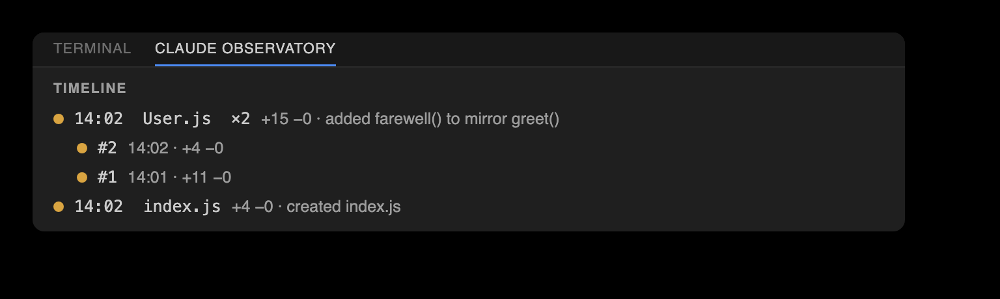

# Claude Observatory — feature walkthrough

A hands-on tour of every feature, driven by a real auto-captured session. The commands and output
below are from an actual `claude -p` run that created a small `User` model — nothing staged.


> Prefer pictures? See the **[visual showcase](https://cell-observatory.github.io/claude-observatory/showcase.html)**
> in your browser (rendered from [showcase.html](showcase.html) via GitHub Pages).

## The demo session

With the capture hooks installed, a short Claude Code session made three edits:

| # | File | Tool | Change |
| --- | --- | --- | --- |
| 1 | `src/models/User.js` | Write | create the file with `class User { constructor, greet() }` (+11) |
| 2 | `src/models/User.js` | Edit | add a `farewell()` method to the class (+4) |
| 3 | `src/index.js` | Write | import `User` and print a greeting (+4) |

No extra tokens were spent capturing any of it — the hooks run outside the model loop. The transcript
even gives the Observations panel its recap ("Create User class and test imports") and each edit's
reasoning, for free.

---

## 1 · Setup (once, with Claude Code closed)

```bash
./install.sh                              # or: npm run build && npm i -g ./packages/cli
claude-observatory init --with-statusline # capture hooks + the bundled status line (usage bars)
```

> Install the hooks **before** launching Claude Code — a running session reverts hook edits made
> mid-session. Then launch Claude Code and let it edit; every session after that captures automatically.

Confirm it's live:

```console
$ claude-observatory status
capture hooks:   installed
active session:  0c396c6b-2da9-4be2-9c6d-c8c5797de7a5
store:           ~/.claude/claude-observatory/0c396c6b-2da9-4be2-9c6d-c8c5797de7a5
last capture:    1m ago
edits:           3  (3 pending · 0 kept · 0 undone)
```

---

## 2 · List — the running log

Edits are grouped by file, newest ids last, with the line delta and status:

```console
$ claude-observatory list
3 edit(s)  ·  3 pending  ·  session 0c396c6b-2da9-4be2-9c6d-c8c5797de7a5

src/models/User.js
  #1  pending  +11 -0  Write  1m ago
  #2  pending  +4 -0  Edit  1m ago

src/index.js
  #3  pending  +4 -0  Write  1m ago

diff <id> · keep <id> · undo <id>
```


Filter with `--pending` / `--kept` / `--undone` or `--file <substr>`. List every session in the store
with `claude-observatory sessions` (a `●` marks the one that resolves for your current directory).

## 3 · Diff — inspect one edit

```console
$ claude-observatory diff 2
@@ -5,7 +5,11 @@

   greet() {
     return `Hello, my name is ${this.name}!`;
   }
+
+  farewell() {
+    return `Goodbye from ${this.name}!`;
+  }
 }

 module.exports = User;
```


## 4 · Keep vs. Undo

**Keep** marks an edit reviewed — it never touches the file:

```console
$ claude-observatory keep 2
✓ kept edit #2 (src/models/User.js)
```

**Undo** is surgical, and it refuses to corrupt: reverting edit #1 (the file creation) would strand
edit #2, which built on it — so you get a clear conflict instead:

```console
$ claude-observatory undo 1
⚠ conflict: edit #1 overlaps a later change to User.js. Run `claude-observatory undo 1 --force`
  to restore the file to its pre-edit-#1 state (this also drops later edits to this file).
```


Undoing #2, though, peels out just the `farewell()` method — `greet()` and the rest of the file
survive untouched (a **position-anchored 3-way line merge**, not a whole-file rewind):

```console
$ claude-observatory undo 2
✓ undid edit #2 (demo/src/models/User.js)

$ claude-observatory redo 2
✓ re-applied edit #2 (demo/src/models/User.js)
```

**Redo** re-applies an undone edit; `--force` on either falls back to a whole-file restore.

## 5 · Clean up

```console
$ claude-observatory clean --resolved     # drop kept/undone edits, keep pending
✓ cleared 1 resolved edit(s)

$ claude-observatory clean                # GC orphaned blobs across all sessions
✓ garbage-collected 2 orphaned blob(s), freed 1.4 KB
```

---

## 6 · Deletions & mixed edits

Claude removes and refactors code too, and the observatory captures that the same way. When an edit
deletes lines — say Claude later drops the `farewell()` method it added — `diff` shows them with a
leading `-`:

```console
$ claude-observatory diff 4
@@ -5,11 +5,7 @@

   greet() {
     return `Hello, my name is ${this.name}!`;
   }
-
-  farewell() {
-    return `Goodbye from ${this.name}!`;
-  }
 }

 module.exports = User;
```

A pure deletion lists as `+0 −4`; a refactor that both adds and removes (drop one method, add another)
lists the combined delta, e.g. `+2 −4`. In the **inline overlay**, added lines get their usual green
highlight — but deleted lines no longer exist in the buffer, so they can't be highlighted in place.
Instead the removed code is shown as **red "ghost" text** on the surviving line where it used to be
(`− farewell() { …(+2)`), over a red line highlight with a red overview-ruler tick. A **mixed edit**
shows both at once: green where it added, red ghost text where it removed. The full removed text is
always a click away — open the edit's inline diff from its ✨ star / lens.

---

## 7 · The editor observatories — VS Code & PyCharm/JetBrains

Both editor front-ends read the **same store** as the CLI, so a Keep/Undo in any surface shows up
in the others instantly. The layout is deliberately identical; only the host chrome differs:

| Surface | VS Code | PyCharm / JetBrains |
| --- | --- | --- |
| Install | `code --install-extension claude-observatory.vsix` | `./scripts/install-jetbrains.sh` (or Install Plugin from Disk) |
| **Edits · Diffs · File History** (review) | **Claude Edits** — microscope in the Activity Bar, badged with the pending count | **Claude Observatory** tool window, left stripe |
| **Actions · Observations · Timeline · Change Map · Stats** | **Claude Observatory** bottom panel, side by side (like Terminal/Problems) | **Claude Observatory Dashboards** tool window, bottom stripe — the same five panes side by side |
| Inline menu (**✨ #N · +A −R · view changes · Keep · Undo · Chat · View diff**) | CodeLens above each edit + ✨ gutter star + bold green/red highlight + coral ruler mark | lens above each edit + clickable ✨ gutter star + bold green/red highlight + coral stripe |
| Click **view changes** | opens the **inline review bubble** at the edit — the diff in git's colors + reasoning + `+A −R`, Accept/Revert/Chat/Prev/Next on its toolbar (no tab) | opens the edit's unified **diff** (reasoning in title, Keep/Undo/Chat on toolbar) |
| File heatmap | 📄 heatmap (tab-bar) | 📄 heatmap (editor banner) |
| Scoreboard | status-bar `🔬 N` (amber while pending) + live bar in Stats | status-bar `🔬 N` + live bar in Stats |
| Keyboard loop | `⌥⌘N` next · `⌥⌘Y` keep · `⌥⌘U` undo · `⌥⌘[`/`⌥⌘]` revisions (`Ctrl+Alt` on Win/Linux) | same keys |

Both front-ends now drive the review surfaces from **icon-only tabs** (hover for the label), and JetBrains
is at full **feature parity** with VS Code: the toggle-inline button, **Accept/Revert this file** on the
Edits toolbar, revision-nav buttons, Timeline bulk actions, Observations clear/switch/doctor, a 5th
**⧉ View diff** lens segment, and a pending badge on the tool-window stripe.

The **status-bar microscope** shows the pending count in realtime — the moment Claude writes a
change. Click it (or **Review next pending edit**) to jump straight to the oldest unreviewed edit;
review, decide, click again. That's the surgical loop, in either editor.


### Edits — folder → file → class

```text
▾ src
  ▾ models
      User.js                 2 edits
      ◆ class User            2 · 1 pending
          #1  +9 −0           reverted
          #2  +4 −1           kept
  index.js                    1 edit
      #3  +6 −0               pending
```

Edits nest under the class they land in (detected heuristically for JS/TS/Python). Hover a file or
class for **Keep all / Undo all** in that scope; click an edit to open the file at that change.

### Inline overlay

In the open file, each pending edit gets a **✨ gutter star** at its start and a **clearly-visible
whole-line highlight** over Claude's edited section — a **green** fill with a **bold green change-bar**
on added lines, and a **red** fill with a **red change-bar** on deletions (the removed code shown as red
ghost text) — plus a distinct **Claude-coral marker** on the overview ruler / scrollbar. The line fills
were once a deliberately faint ~10% tint; they now sit near **30%**, so a Claude-edited section stands
out at a glance instead of blending in. Above the edit sits the **inline menu**: **✨ #N · +A −R · view changes** then **✓
Keep · ↩ Undo · 💬 Chat · ⧉ View diff** (the same edit as a full diff tab — its own tab, Prev/Next on the
title bar cycling the file's edits in place). "Chat about this edit" copies a ready-made prompt (before/after included) for
your Claude Code chat or terminal.

**Click "view changes" → the changes, inline, in git's colors.** In **VS Code** it opens an **inline
review bubble** right at the edit — no tab — with the diff in **git's own theme colors** (green/red text
over the diff editor's translucent line fills — the same theme variables the real diff editor uses),
Claude's reasoning, and the `+A −R` counts, plus **Accept · Revert · Chat · Prev · Next** as real toolbar
buttons (Prev/Next step through that file's edits). In **PyCharm**, the ✨ gutter star / lens opens the
edit's before ⟷ after as a **unified diff** (reasoning in the title, Keep/Undo/Chat on its toolbar).

GitLens-style extras, in both editors: the **file heatmap** (📄) dims every unmodified line so Claude's
edits pop; **revision navigation** (`⌥⌘[` / `⌥⌘]`) steps a file's edit history in a current-vs-revision
diff.


### Navigation bar

One review bar, mirrored across three surfaces so the surgical loop is always a click away: the
**status bar** (both editors), the **editor tab bar** (VS Code's editor-title actions; a banner
across the top of the editor in JetBrains), and a single floating **review bubble** (VS Code's
Comments API) parked over the edit you're on.

```text
🔬 3  ▲ Diff 1/2 ▼  ◀ File 1/3 ▶  ✓ ↩ ✓✓ ✕  🧹 💡 🔍
```

The bar steps on **two axes**: the **Diff axis** (`Diff n/m`, ▲/▼) walks the open file's pending
edits; the **File axis** (`File n/m`, ◀/▶) walks every file that still has one. On the open file it
also carries **✓ Keep** / **↩ Undo** this edit, **✓✓ Accept File** / **✕ Reject File**, **🧹 Clear
resolved**, a **💡 Spotlight** (heatmap) toggle, and **🔍 Search**.

It's **two-tier**. The File axis plus Clear / Spotlight / Search show whenever *any* edit is pending
anywhere; the Diff axis and the per-edit / per-file actions appear only when the **open** file has
pending edits. The counters **track the active editor**, so `Diff 1/2` always means "this file." The
keyboard loop is unchanged — `⌥⌘N`/`⌥⌘P`, `⌥⌘Y`/`⌥⌘U`, `⌥⌘K`/`⌥⌘R`, `⌥⌘[`/`⌥⌘]` still drive it.

### File History — the active file's edits, in order

A flat, chronological list of just the **currently open file's** edits (id · time · status ·
reasoning) that **follows the editor** as you switch tabs. Click a row to jump to that edit, or
keep / undo / diff it; the toolbar steps revisions and does **Accept all in this file** /
**Revert all in this file** — clearing one file without touching the rest of the session.


### Timeline — a collapsed change feed

```text
🟡 19:32  index.js        +6 −0 · created index.js
🟢 19:31  User.js  ×2     +13 −1 · added farewell() to mirror greet()
```

Newest first; consecutive edits to the same file coalesce into one `×N` row with the combined delta
and a change summary (Claude's own reasoning when available). Expand a row for the individual edits;
pending / kept / reverted keep their color (and reverted stays struck through).



### Action Timeline — every tool call, zero tokens

The Timeline above is only the *edits*. The **Action Timeline** is the whole session — a typed
record of **every tool call Claude made**: reads, greps, shell commands, web fetches, subagent
spawns, to-do updates, not just the file writes the store captures. Like everything else here it
costs **zero tokens** — it's mined straight from the Claude Code transcript — and each action is
correlated with its **result** (`ok` / `error`). File-edit actions **link back to their store
record**, so you can jump from the trace into the review in one click.

It lands as a new **Actions view** — a panel view beside Observations / Timeline / Stats in VS Code,
a pane in the **Dashboards** window in JetBrains — **grouped by category**:

```text
▾ Edits          3
    ✓  Write   src/models/User.js    → #1
    ✓  Edit    src/models/User.js    → #2
    ✓  Write   src/index.js          → #3
▾ Commands       2
    ✓  node src/index.js
    ✕  npm test                        exit 1
▾ To-dos         1
    ✓  3 items · 2 done
```

By default the view is **curated** — high-signal categories only, though **errors always surface** —
with a **Show all** toggle that folds in the noise (reads, searches, meta). Errored calls are
flagged; an edit row **opens the review**, like every other surface.

The same trace is one command away:

```console
$ claude-observatory actions
9 action(s)  ·  1 error  ·  session 0c396c6b-2da9-4be2-9c6d-c8c5797de7a5

Edits
  ✓  #1  Write  src/models/User.js
  ✓  #2  Edit   src/models/User.js
  ✓  #3  Write  src/index.js
Commands
  ✓  node src/index.js
  ✕  npm test                       exit 1
To-dos
  ✓  3 items · 2 done

trace (alias) · --json · --category <c> · --errors · --limit <n> · --all
```

`--json` emits the structured form (`{ session, summary, actions, groups }`); `--category <c>`,
`--errors`, `--limit <n>`, and `--all` filter the feed.

### Observations — the recap, reasoning, and file memory

The top row is a one-line **session recap** — "here's what you were doing" — taken from Claude Code's
own session title at zero token cost (hit **✨** for a Claude-refined one-liner via
`claude -p --resume`, which reuses the session's cached context). Below it, one row per edit: a change
summary with Claude's **actual reasoning** surfaced inline (also pulled from the transcript). Click a
row for a combined report; a warning icon flags possible issues (debug statements, hard-coded secrets,
large deletions). **Analyze** spends tokens only when you click it; results are cached in the store.

Each row also carries the observatory's **memory of that file**, derived from every past session:

```text
🧠 12 edits across sessions · 92% accepted · last accepted 2d ago
⚠ history: edits to this file get reverted often (3 of 5 verdicts) — review carefully
```

The store *is* the memory — accept/revert verdicts and cached Claude analyses accumulate as you
review, so observations get sharper the longer you use the tool. Zero tokens, zero extra state.

### Stats — trends and live usage

A **top navbar** now runs across the very top of the Stats view (both editors): the **active Claude
Code session**. (The Search-edits box moved out in 0.7.5 — the **Edits** / **Diffs** title-bar search
is the single entry point.) Below it, a live **review scoreboard** leads the tab:
**pending / accepted / reverted** counts and a **progress bar** that fills as you review — updated the
instant you keep or undo an edit, and the **pending** count is now **clickable**: click it to jump
straight to the first (oldest) edit awaiting review. Then a step-line plot of **tokens** (total / input / output, logarithmic axis) with a **Today / 7 days /
30 days** toggle, then the live **Usage** bars (context fill + 5h / week plan usage with `~token`
estimates). The full scoreboard (`3 pending · 42 accepted · 5 reverted · 89% accepted · oldest 12m`)
also lives in the status-bar microscope's tooltip. The stats scan runs in a subprocess with an
incremental cache, so the UI never blocks.

### Change Map — the session's changes at a glance

The other views answer *what happened, in order*. This one answers **where did the work land, and what
still needs my eyes** — the whole session as one picture, in the **Change Map** pane (both editors).

```text
🔬 ad93a29f   185 edits · 20 pending · 27 kept · 57% reviewed · 3 agents · 2 err · 🛰 13 · ⇅ 3
● 1. Scaffold subagent tracking   ◐ 2. Risk + Egress audit   ○ 3. Update docs + showcase
[██████████ core ██████████|████ vscode ████|██ docs ██|cli]
extension.ts    vscode   ████████████  +751   6⏳
changemap.ts    core     █████         +285   ✓
README.md       docs     █              +44   2⏳
```

Three layers, top to bottom:

- **Chapters** — Claude's own to-dos, mined from its `TodoWrite` checkpoints. A filled ● is done, a
  half ◐ is in progress, a hollow ○ is still planned. **Click one to brush the map**: everything that
  chapter didn't produce fades to context. Attribution is a time-window heuristic and says so — an
  edit made outside every window is left **unassigned** rather than mis-filed onto the wrong goal.
- **The proportion strip** — one row, width by churn, colour by review status. It answers "where did
  this session actually land" before you read a single row. **Click a segment** to filter to a module.
- **The ranked ledger** — every file by churn, with a bar. Colour is **worst-unreviewed-wins**: a
  module never reads green while something under it is still pending. Hover for the class touched and
  Claude's own reasoning; **click to open the real diff** — the same review surface as everywhere else.

Toggle **± lines ⇄ count** to re-weight by edit count instead of churn.

From the shell, the same model both editors render:

```bash
claude-observatory changemap --json | jq '.modules[] | {label, churn, status, files}'
```

Every rollup — churn, status precedence, module labels, the drill-through target — is computed once in
`core`, so the VS Code webview and the JetBrains panel show identical numbers by construction.

### Risk & Egress — two zero-token audits

The Action Timeline already knows every command Claude ran and every host it reached, so two safety
audits fall straight out of it — **zero tokens, no new store or format**. Both live in the **Actions
view** (a pane in the Dashboards window / a panel beside the others in VS Code) and each gets its own
CLI verb.

**Risk** flags the shell commands that can bite: data-destroying (`rm -rf`, `git reset --hard`, force
push), remote code execution (`curl … | sh`), privilege escalation (`sudo`), or reads/writes of
credential files. Flagged rows wear a ⚠ **high** / **med** badge in place. **Egress** answers *"what did
this session touch off-machine?"* — every **WebFetch** host, **MCP server**, and network-shell command,
each tagged **remote** or **unknown** — pinned as an **Egress** node at the very top of the view:

```text
▾ ⚠ Egress                3 off-machine
    remote   WebFetch  raw.githubusercontent.com
    remote   Command   curl https://sh.rustup.rs | sh
    unknown  MCP       localhost:7331 (fs)
▾ Commands                2
    ⚠ high  ✓  rm -rf build/
    ✓  node src/index.js
```

Each audit is also one command away:

```console
$ claude-observatory risk
1 flagged  ·  1 high · 0 med  ·  session 0c396c6b-2da9-4be2-9c6d-c8c5797de7a5

⚠ high  rm -rf build/                    data-loss

$ claude-observatory egress
3 off-machine  ·  session 0c396c6b-2da9-4be2-9c6d-c8c5797de7a5

remote   WebFetch  raw.githubusercontent.com
remote   Command   curl https://sh.rustup.rs | sh
unknown  MCP       localhost:7331 (fs)
```

Both are **additive** — mined from the transcript's action trace, they add nothing to the store and
change no on-disk format.

### Subagents — every spawned agent, its own timeline

The Action Timeline already records that Claude **spawned a subagent** (the Task / Agent tool); 0.7.0
opens each one up. Every subagent now gets its **own nested action timeline** and **per-subagent
metrics** — duration, tokens, tool-use count, status — turning the observatory from a single-agent into
a **multi-agent view**. Like everything else here it costs **zero tokens**: it's mined from
`~/.claude/projects/<proj>/<session>/subagents/agent-<id>.jsonl` and correlated back to the spawning
Task call via the transcript's `toolUseResult` block (which conveniently carries the `agentId`,
`totalDurationMs`, `totalTokens`, `totalToolUseCount`, and `status`).

It lands as a **Subagents** node in the Actions view of both editors — each subagent expands into its
own reads / edits / bash / web calls:

```text
▾ Subagents               2
  ▾ ✓  general-purpose    8.4s · 12.1k tok · 9 tools
        ✓  Read   src/models/User.js
        ✓  Grep   "greet"  (4 files)
        ✕  Bash   npm test               exit 1
  ▾ ✓  general-purpose    5.1s ·  6.3k tok · 4 tools
        ✓  Read   src/index.js
        ✓  WebFetch  nodejs.org/api/modules.html
```

The same view is one command away:

```console
$ claude-observatory subagents
2 subagent(s)  ·  session 0c396c6b-2da9-4be2-9c6d-c8c5797de7a5

✓  general-purpose   8.4s · 12.1k tok · 9 tools
✓  general-purpose   5.1s ·  6.3k tok · 4 tools

agents (alias) · --json
```

Expand a subagent to see exactly which files it read, what it ran, and where it errored — the same
`ok` / `error` correlation and edit-row links as the top-level trace.

### Fleet — the other agents in this project

The observatory can also see the **other Claude Code sessions** working in the **same project**, so
0.7.0 surfaces them. For each sibling: **active / idle** status (from transcript freshness — *active*
means touched within ~60s), **pending edits**, **files touched**, and **risk-flag counts**. It is
strictly **read-only and path-only** — filenames, never contents — so nothing one agent is editing can
leak into another.

It lands as a **Fleet** node in the Actions view of both editors:

```text
▾ Fleet                   2 other agents
    ● active   a1b2c3d4   2 pending · 5 files · 1 ⚠
    ○ idle     e5f6a7b8   0 pending · 3 files · 0 ⚠
```

The CLI form is an **agent-facing digest** — an agent can call it mid-run to see what its siblings are
touching and adjust in real time:

```console
$ claude-observatory siblings
2 sibling(s)  ·  1 active · 1 idle  ·  project claude-observatory

● active   a1b2c3d4   2 pending · 5 files · 1 ⚠   12s ago
○ idle     e5f6a7b8   0 pending · 3 files · 0 ⚠   8m ago

fleet (alias) · --json (siblings only, excludes self) · --all (include self)
```

`--json` defaults to **siblings only** (excludes the calling session); `--all` folds self back in. (An
optional MCP server exposing the same digest is planned; 0.7.0 ships the CLI digest.)

### Metrics — the session by the numbers

`claude-observatory metrics [--json]` rolls up the session's numbers — all mined from the transcript
and store, **zero tokens**: per-edit diff stats (**+added / −removed** lines), **action + error**
counts, **per-subagent** duration / tokens, and **tool latency** (median / p95 / max, computed from
each `tool_use → tool_result` timestamp gap):

```console
$ claude-observatory metrics
session 0c396c6b-2da9-4be2-9c6d-c8c5797de7a5

edits         3   +19 −1
actions       9   1 error
subagents     2   13.5s · 18.4k tok
tool latency  median 0.4s · p95 2.1s · max 8.4s

--json
```

All three are **additive** — like the Action Timeline they're mined from the transcript, add nothing
to the store, and change no on-disk format. The existing `actions --json` payload simply gains four new
fields — **`subagents`**, **`subagentsSummary`**, **`fleet`**, **`fleetSummary`** — alongside its
unchanged `{ session, summary, actions, groups }`; every existing shape stays as it was.

---

## Reproduce it yourself

```bash
claude-observatory init                       # hooks on (Claude Code closed)
# then, from any project directory:
claude -p --permission-mode acceptEdits 'Do this in three separate file operations: (1) create
  src/models/User.js with a User class (constructor(name) + greet()); (2) edit it to add a
  farewell() method; (3) create src/index.js that imports User and prints a greeting.'
claude-observatory list                       # your three edits, captured automatically
```

Every edit is now under observation — keep the good ones, undo the rest, one at a time.
