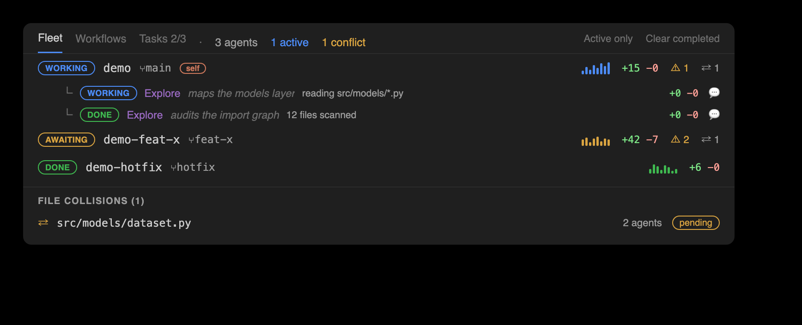

# Claude Observatory — feature walkthrough

A hands-on tour of every feature, driven by a real auto-captured session. The commands and output
below are from an actual `claude -p` run that created a small `Dataset` model — nothing staged.


> Prefer pictures? See the **[visual showcase](https://cell-observatory.github.io/claude-observatory/showcase.html)**
> in your browser (rendered from [showcase.html](showcase.html) via GitHub Pages).

## Zero-setup demo — try it without Claude

Don't want to burn a session just to see the panels move? The
**[interactive demo](https://cell-observatory.github.io/claude-observatory/demo.html)** replays the
scenario in the browser — no editor needed. Locally, the built-in simulator replays the same scripted
session through the **real pipeline** — a genuine transcript, edits captured by the same hooks, a
subagent, and a workflow run — inside an isolated `demo-…` session and an `observatory-demo/` folder:

```bash
claude-observatory demo          # run it in an open workspace and watch every panel update live
```

Open the Overview while it runs: the chapter ribbon fills chapter by chapter, the Fleet nav gains a
subagent and a workflow, the Tasks tab counts down three numbered tasks linked to those same chapters
(live statuses + per-task edit counts), and Observations streams the reasoning. The edits are real
store records on real files, so Accept / Reject / task-scoped review all genuinely work. When you're
done:

```bash
claude-observatory demo --clean  # removes the demo session, its store, and the demo folder
```

Reviewing the demo leaves no residue either way — a fully reviewed demo session clears its own store.
(`--speed 2` paces it faster; `--fast` lands everything at once, which is what the test suite uses.)

## The demo session

With the capture hooks installed, a short Claude Code session made three edits:

| # | File | Tool | Change |
| --- | --- | --- | --- |
| 1 | `src/models/dataset.py` | Write | create the file with `class Dataset` (`__init__` + `describe()`) (+11) |
| 2 | `src/models/dataset.py` | Edit | add a `validate()` method to the class (+4) |
| 3 | `src/train.py` | Write | import `Dataset` and print a validation report (+4) |

No extra tokens were spent capturing any of it — the hooks run outside the model loop. The transcript
even gives the Observations panel its recap ("Create Dataset class and test validation") and each edit's
reasoning, for free.

---

## 1 · Setup (once, with Claude Code closed)

```bash
./install.sh                              # or: npm run build && npm i -g ./packages/cli
claude-observatory init --with-statusline # capture hooks + the bundled status line (usage bars)
```

> Install the hooks **before** launching Claude Code — a running session reverts hook edits made
> mid-session. Then launch Claude Code and let it edit; every session after that captures automatically.

Confirm it's live:

```console
$ claude-observatory status
capture hooks:   installed
active session:  0c396c6b-2da9-4be2-9c6d-c8c5797de7a5
store:           ~/.claude/claude-observatory/0c396c6b-2da9-4be2-9c6d-c8c5797de7a5
last capture:    1m ago
edits:           3  (3 pending · 0 kept · 0 undone)
```

---

## 2 · List — the running log

Edits are grouped by file, newest ids last, with the line delta and status:

```console
$ claude-observatory list
3 edit(s)  ·  3 pending  ·  session 0c396c6b-2da9-4be2-9c6d-c8c5797de7a5

src/models/dataset.py
  #1  pending  +11 -0  Write  1m ago
  #2  pending  +4 -0  Edit  1m ago

src/train.py
  #3  pending  +4 -0  Write  1m ago

diff <id> · keep <id> · undo <id>
```


Filter with `--pending` / `--kept` / `--undone` or `--file <substr>`. List every session in the store
with `claude-observatory sessions` (a `●` marks the one that resolves for your current directory).

## 3 · Diff — inspect one edit

```console
$ claude-observatory diff 2
@@ -5,7 +5,11 @@

     def describe(self):
         return {
             "count": len(self.features),
             "labels": len(self.labels),
             "empty": not self.features,
         }
+
+    def validate(self):
+        ok = len(self.features) == len(self.labels) and bool(self.features)
+        return {"ok": ok}
```


## 4 · Keep vs. Undo

**Keep** marks an edit reviewed — it never touches the file:

```console
$ claude-observatory keep 2
✓ kept edit #2 (src/models/dataset.py)
```

**Undo** is surgical, and it refuses to corrupt: reverting edit #1 (the file creation) would strand
edit #2, which built on it — so you get a clear conflict instead:

```console
$ claude-observatory undo 1
⚠ conflict: edit #1 overlaps a later change to dataset.py. Run `claude-observatory undo 1 --force`
  to restore the file to its pre-edit-#1 state (this also drops later edits to this file).
```


Undoing #2, though, peels out just the `validate()` method — `describe()` and the rest of the file
survive untouched (a **position-anchored 3-way line merge**, not a whole-file rewind):

```console
$ claude-observatory undo 2
✓ undid edit #2 (observatory-demo/src/models/dataset.py)

$ claude-observatory redo 2
✓ re-applied edit #2 (observatory-demo/src/models/dataset.py)
```

**Redo** re-applies an undone edit; `--force` on either falls back to a whole-file restore.

**Keep or undo a whole task at once.** Claude's own to-dos define stable, content-hash `taskId`s (see
the [Overview](#overview--the-master-detail-multi-agent-panel)). `task-keep` / `task-undo` act **WYSIWYG
on every pending edit displayed under that chapter** — exactly the set the ribbon row shows, gap-filled
members and the synthesized session chapter included — so accepting a chapter never leaves stragglers:

```console
$ claude-observatory task-keep 4d9f1a2b3c4d
✓ kept 6 edit(s) in task 4d9f1a2b3c4d

$ claude-observatory task-undo 4d9f1a2b3c4d
⚠ reverted 5 edit(s) in task 4d9f1a2b3c4d · 1 conflict(s) left (undo individually with --force)
```

Both take `--json` — `task-keep` returns `{ kept, total, ids }`, `task-undo` `{ undone, conflicts,
total, ids }` — and both stay zero-token: the task↔edit mapping is mined from the transcript's to-dos,
never a model call.

## 5 · Clean up

```console
$ claude-observatory clean --resolved     # drop kept/undone edits, keep pending
✓ cleared 1 resolved edit(s)

$ claude-observatory clean                # GC orphaned blobs across all sessions
✓ garbage-collected 2 orphaned blob(s), freed 1.4 KB
```

---

## 6 · Deletions & mixed edits

Claude removes and refactors code too, and the observatory captures that the same way. When an edit
deletes lines — say Claude later drops the `validate()` method it added — `diff` shows them with a
leading `-`:

```console
$ claude-observatory diff 4
@@ -5,11 +5,7 @@

     def describe(self):
         return {
             "count": len(self.features),
             "labels": len(self.labels),
             "empty": not self.features,
         }
-
-    def validate(self):
-        ok = len(self.features) == len(self.labels) and bool(self.features)
-        return {"ok": ok}
```

A pure deletion lists as `+0 −4`; a refactor that both adds and removes (drop one method, add another)
lists the combined delta, e.g. `+2 −4`. In the **inline overlay**, added lines get their usual green
highlight — but deleted lines no longer exist in the buffer, so they can't be highlighted in place.
Instead the removed code is shown as **red "ghost" text** on the surviving line where it used to be
(`− def validate(self): …(+2)`), over a red line highlight with a red overview-ruler tick. A **mixed edit**
shows both at once: green where it added, red ghost text where it removed. The full removed text is
always a click away — open the edit's inline diff from its ✨ star / lens.

---

## 7 · The editor observatories — VS Code & PyCharm/JetBrains

Both editor front-ends read the **same store** as the CLI, so a Keep/Undo in any surface shows up
in the others instantly. The layout is deliberately identical; only the host chrome differs:

| Surface | VS Code | PyCharm / JetBrains |
| --- | --- | --- |
| Install | `code --install-extension claude-observatory.vsix` | `./scripts/install-jetbrains.sh` (or Install Plugin from Disk) |
| Auto-update | daily background check → one-click **Update now** | add the [plugin repository](../packages/jetbrains/README.md#auto-updates) once → IDE-native updates |
| **Edits · Diffs · File History · Actions** (the sidebar) | **Claude Edits** — microscope in the Activity Bar, badged with the pending count | **Claude Observatory** tool window, left stripe |
| **Observations · Overview · Stats** (the bottom panel) | **Claude Observatory** bottom panel, side by side (like Terminal/Problems) | **Claude Observatory Dashboards** tool window, bottom stripe — the same three panes side by side |
| Inline menu (**✨ #N · +A −R · view changes · Keep · Undo · Chat · View diff**) | CodeLens above each edit + ✨ gutter star + bold green/red highlight + coral ruler mark | lens above each edit + clickable ✨ gutter star + bold green/red highlight + coral stripe |
| Click **view changes** | opens the **inline review bubble** at the edit — the diff in git's colors + reasoning + `+A −R`, Accept/Revert/Chat/Prev/Next on its toolbar (no tab) | opens the edit's unified **diff** (reasoning in title, Keep/Undo/Chat on toolbar) |
| File spotlight | 📄 spotlight (tab-bar) | 📄 spotlight (editor banner) |
| Scoreboard | status-bar `🔬 N` (amber while pending) + live bar in Stats | status-bar `🔬 N` + live bar in Stats |
| Keyboard loop | `⌥⌘N` next · `⌥⌘Y` keep · `⌥⌘U` undo · `⌥⌘[`/`⌥⌘]` revisions (`Ctrl+Alt` on Win/Linux) | same keys |

In 0.8.0 the **sidebar** ("Claude Edits") carries the four review-and-audit panes — **Edits · Diffs ·
File History · Actions** — and the **bottom panel** ("Claude Observatory") carries the three dashboards —
**Observations · Overview · Stats**. (Timeline is gone as a standalone pane — its coalesced change-feed
now leads **Observations**; **Actions** moved up into the sidebar; and the old Multitasking window folded
into **Overview** as its **Fleet** tab.) Both front-ends drive the review surfaces from **icon-only tabs**
(hover for the label), and JetBrains is at full **feature parity** with VS Code: the toggle-inline button,
**Accept/Revert this file** on the Edits toolbar, revision-nav buttons, Overview bulk actions, Observations
clear/switch/doctor, a 5th **⧉ View diff** lens segment, and a pending badge on the tool-window stripe.

The **status-bar microscope** shows the pending count in realtime — the moment Claude writes a
change. Click it (or **Review next pending edit**) to jump straight to the oldest unreviewed edit;
review, decide, click again. That's the surgical loop, in either editor.


### Edits — folder → file → class

```text
▾ src
  ▾ models
      dataset.py              2 edits
      ◆ class Dataset         2 · 1 pending
          #1  +11 −0          reverted
          #2  +4 −0           kept
  train.py                    1 edit
      #3  +4 −0               pending
```

Edits nest under the class they land in (detected heuristically for JS/TS/Python). Hover a file or
class for **Keep all / Undo all** in that scope; click an edit to open the file at that change.

### Inline overlay

In the open file, each pending edit gets a **✨ gutter star** at its start and a **clearly-visible
whole-line highlight** over Claude's edited section — a **green** fill with a **bold green change-bar**
on added lines, and a **red** fill with a **red change-bar** on deletions (the removed code shown as red
ghost text) — plus a distinct **Claude-coral marker** on the overview ruler / scrollbar. The line fills
were once a deliberately faint ~10% tint; they now sit near **30%**, so a Claude-edited section stands
out at a glance instead of blending in. Above the edit sits the **inline menu**: **✨ #N · +A −R · view changes** then **✓
Keep · ↩ Undo · Chat · ⧉ View diff** (the same edit as a full diff tab — its own tab, Prev/Next on the
title bar cycling the file's edits in place). "Chat about this edit" copies a ready-made prompt (before/after included) for
your Claude Code chat or terminal.

**Click "view changes" → the changes, inline, in git's colors.** In **VS Code** it opens an **inline
review bubble** right at the edit — no tab — with the diff in **git's own theme colors** (green/red text
over the diff editor's translucent line fills — the same theme variables the real diff editor uses),
Claude's reasoning, and the `+A −R` counts, plus **Accept · Revert · Chat · Prev · Next** as real toolbar
buttons (Prev/Next step through that file's edits). In **PyCharm**, the ✨ gutter star / lens opens the
edit's before ⟷ after as a **unified diff** (reasoning in the title, Keep/Undo/Chat on its toolbar).

GitLens-style extras, in both editors: the **file spotlight** (📄) dims every unmodified line so Claude's
edits pop; **revision navigation** (`⌥⌘[` / `⌥⌘]`) steps a file's edit history in a current-vs-revision
diff.


### The review nav bar

One combined review bar, mirrored across four surfaces so the surgical loop is always a click away: the
**status bar** (both editors), the **editor tab bar** (VS Code's editor-title actions; a banner
across the top of the editor in JetBrains), a single floating **review bubble** (VS Code's
Comments API) parked over the edit you're on, and — new in 0.8.0 — the **Overview title bar**, where
it rides alongside the session selector and the bulk actions.

```text
🔬 3  Search  ▲ Diff 1/2 ▼  ◀ File 1/3 ▶  ✓ Keep  ↩ Undo  ✓✓ Accept File  ✕ Reject File  Clear Resolved  Spotlight
```

The bar steps on **two axes**: the **Diff axis** (`Diff n/m`, ▲/▼) walks the open file's pending
edits; the **File axis** (`File n/m`, ◀/▶) walks every file that still has one. On the open file it
also carries **✓ Keep** / **↩ Undo** this edit, **✓✓ Accept File** / **✕ Reject File**, the
session-wide **Clear Resolved** (status bar), a **Spotlight** toggle, and **Search**.

The buttons are **color-coded by what they do** (0.8.3, both editors): keep/accept **green**,
undo/reject **red**, the nav chevrons **blue**, clear **orange**, search/spotlight **purple** — the
same chart palette the Overview uses, so the destructive half of the bar never reads like the safe half.
No icon serves two actions: the session-wide bulk pair get their own glyphs (Accept All a checklist,
Revert All a history-rewind), distinct from the file-scoped double-check / ✕ and the per-edit ✓ / ↩.
On the **Overview title bar** the bar expands to **two rows**. The **top row** carries the controls: a
**session selector** — which now shows the session's human-readable **name** (its title or first prompt;
the raw id sits in the tooltip) — the session-wide bulk actions **Accept All · Revert All · Clear
Resolved · Export**, and on the right **Search · Active only · Spotlight · Refresh**. The **bottom row**
steps the pending edits on **four review axes**, each a coarser grain than the last:

- **Diff** — the open file's edits; carries **Keep · Undo · Chat** (hands this edit's before/after to
  your own Claude) · **View diff** (opens a real side-by-side diff editor), and the current edit's
  relative time.
- **File** — every changed file; shows the filename and that file's edit count, with **Accept File /
  Reject File**.
- **Folder** *(new)* — every changed folder; shows the directory and its file / edit totals, with
  **Accept Folder / Reject Folder**, which act on that folder's edits alone.
- **Chapter** — the session's subtasks (the chapters mined from Claude's own to-dos); shows the
  chapter's folder / file / edit totals, with **Review · Accept Chapter · Reject Chapter · Chat**.

It's **two-tier**. The File axis plus Clear / Spotlight / Search show whenever *any* edit is pending
anywhere; the Diff axis and the per-edit / per-file actions appear only when the **open** file has
pending edits. The counters **track the active editor**, so `Diff 1/2` always means "this file." The
keyboard loop is unchanged — `⌥⌘N`/`⌥⌘P`, `⌥⌘Y`/`⌥⌘U`, `⌥⌘K`/`⌥⌘R`, `⌥⌘[`/`⌥⌘]` still drive it.

### File History — the active file's edits, in order

A flat, chronological list of just the **currently open file's** edits (id · time · status ·
reasoning) that **follows the editor** as you switch tabs. Click a row to jump to that edit, or
keep / undo / diff it; the toolbar steps revisions and does **Accept all in this file** /
**Revert all in this file** — clearing one file without touching the rest of the session.


### Actions — every tool call, zero tokens

The whole session as a typed record of **every tool call Claude made**: reads, greps, shell commands,
web fetches, subagent spawns, to-do updates, not just the file writes the store captures. Like
everything else here it costs **zero tokens** — it's mined straight from the Claude Code transcript —
and each action is correlated with its **result** (`ok` / `error`). File-edit actions **link back to
their store record**, so you can jump from the trace into the review in one click.

In 0.8.0 **Actions** lives in the **sidebar** ("Claude Edits") alongside Edits · Diffs · File History
(it used to sit in the bottom panel). It's **grouped by category** and — new — every group is
**collapsed by default**, so you expand only the ones you care about:

```text
▾ Edits          3
    ✓  Write   src/models/dataset.py  → #1
    ✓  Edit    src/models/dataset.py  → #2
    ✓  Write   src/train.py           → #3
▾ Commands       2
    ✓  python src/train.py
    ✕  python -m unittest              exit 1
▾ To-dos         1
    ✓  3 items · 2 done
```

By default the view is **curated** — high-signal categories only, though **errors always surface** —
with a **Show all** toggle that folds in the noise (reads, searches, meta). Errored calls are
flagged; an edit row **opens the review**, like every other surface.

The same trace is one command away. The CLI prints it as a **flat chronological feed** (each row: time ·
`[category]` · tool · target · the `edit#N` link for file edits · Claude's own one-line detail); the
editors render the grouped-by-category view above from the same data:

```console
$ claude-observatory actions
Actions  9 total · 3 edit · 3 read · 2 exec · 1 todo · 1 error(s) · session 0c396c6b-2da9-4be2-9c6d-c8c5797de7a5

2m ago       [edit]    Write      src/models/dataset.py edit#1  (create the Dataset class)
2m ago       [edit]    Edit       src/models/dataset.py edit#2  (add a validate() method)
1m ago       [read]    Read       src/models/dataset.py
1m ago       [edit]    Write      src/train.py edit#3  (import Dataset and print a validation report)
1m ago       [exec]    Bash       python src/train.py  (run the training entrypoint)
1m ago     ✗ [exec]    Bash       python -m unittest  (run the test suite)
1m ago       [todo]    TodoWrite  3 items · 2 done

trace (alias) · --json · --category <c> · --errors · --limit <n> · --all
```

`--json` emits the structured form (`{ session, summary, actions, groups, egress, subagents,
subagentsSummary, fleet, fleetSummary }` — `groups` is the curated, category-grouped view the editors
render); `--category <c>`, `--errors`, `--limit <n>`, and `--all` filter the feed.

### Observations — the recap, the change feed, reasoning, and file memory

The top row is a one-line **session recap** — "here's what you were doing" — taken from Claude Code's
own session title at zero token cost (hit **✨** for a Claude-refined one-liner via
`claude -p --resume`, which reuses the session's cached context).

Below the recap, **Observations now leads with the coalesced change-feed** that used to be its own
Timeline pane — files newest-first, and consecutive edits to the same file coalesced into one `×N` run
with the combined delta and a change summary (Claude's own reasoning when available):

```text
🟡 19:32  train.py        +4 −0 · created train.py
🟢 19:31  dataset.py  ×2  +15 −0 · added validate() alongside describe()
```

Expand a run for the individual edits; pending / kept / reverted keep their color (reverted stays struck
through). The same coalesced runs come out of `claude-observatory observations --json` (each run carries
its edits and reasoning) — both editors render that view-model thin.

Then, one row per edit: a change summary with Claude's **actual reasoning** surfaced inline (also pulled
from the transcript). Click a row for a combined report; a warning icon flags possible issues (debug
statements, hard-coded secrets, large deletions). **Analyze** spends tokens only when you click it;
results are cached in the store.

Each row also carries the observatory's **memory of that file**, derived from every past session:

```text
🧠 12 edits across sessions · 92% accepted · last accepted 2d ago
⚠ history: edits to this file get reverted often (3 of 5 verdicts) — review carefully
```

The store *is* the memory — accept/revert verdicts and cached Claude analyses accumulate as you
review, so observations get sharper the longer you use the tool. Zero tokens, zero extra state.

### Stats — trends and live usage

A **top navbar** now runs across the very top of the Stats view (both editors): the **active Claude
Code session, shown by its name** (not its raw id). (The Search-edits box moved out in 0.7.5 — the
**Edits** / **Diffs** title-bar search is the single entry point.) Below it, a live **review scoreboard** leads the tab:
**pending / accepted / reverted** counts and a **progress bar** that fills as you review — updated the
instant you keep or undo an edit, and the **pending** count is now **clickable**: click it to jump
straight to the first (oldest) edit awaiting review. Then a step-line plot of **tokens** (total / input / output, logarithmic axis) with a **Today / 7 days /
30 days** toggle, then the live **Usage** bars: context fill, plus the **5h** and **weekly** plan-usage
rows, which now show an estimated **used / total** — the 100% total inferred from the reported tokens
÷ percent. The full scoreboard (`3 pending · 42 accepted · 5 reverted · 89% accepted · oldest 12m`)
also lives in the status-bar microscope's tooltip. The stats scan runs in a subprocess with an
incremental cache, so the UI never blocks.

### Overview — the master-detail multi-agent panel

The flagship 0.8.0 surface, and the one that replaces both the old **Change Map** and the old
**Multitasking** window. **Overview** is a **master-detail** panel (both editors): a **left nav**
(~25%) that lists every agent and every workflow, and a **right detail** (~75%) that shows the selected
one's **change-map**. The left nav groups its rows under **Fleet**, **Workflows**, and **Tasks** tabs,
each of which opens with a one-line description of what it lists; every tab and change-map section also
carries a hover description. A **title bar** across the top carries a **session selector** (showing the
session by its name), the combined **two-row review nav bar**, and the session-wide bulk actions. It
answers two questions at once — *what is my whole fleet doing right now* and *where did the work land,
what still needs my eyes*.


#### Left nav → **Fleet** — every running agent, live

The **Fleet** tab (this is where the old Multitasking window went) lists **one row per running agent**
across every git **worktree** of the repo. Worktrees are correlated **git-free** — the observatory reads
the `.git` **pointer files** (a linked worktree's `.git` is a *file* naming its admin dir; that dir's
`commondir` points back at the shared repo), never shelling out to the git binary — so sessions launched
from sibling worktrees of one logical repo unify into a **single fleet** keyed by that shared repo.

Each agent row carries a live **phase** badge — `working` · `awaiting-input` · `awaiting-permission` ·
`idle` · `errored` · `done` — its **worktree + branch**, an activity **sparkline**, its **±diff**,
**tokens · time**, **risk** flags, and a **collision** badge. Unfold it for the agent's nested
**subagents**, each with its `agentType` / description, phase, current task + to-dos, ±lines, and a
**chat** button. An **Active only** toggle hides the finished ones, and **Clear completed** *dismisses*
them from view — it never deletes anything, because the observatory only ever observes. Live cross-agent **conflicts** lead the **Actions** view, flagging any file touched by **2+ agents**.

The **phase** is detected **zero-token, from the transcript tail**: an active `tool_use` (or a trailing
`tool_result` — the turn is mid-flight) reads `working`; a pending `AskUserQuestion` reads
`awaiting-input`; a pending permission prompt reads `awaiting-permission`; otherwise `idle` / `errored` /
`done`, staleness-gated. The querying (self) session shows **working** while it is actively running.



The view is one JSON payload — both editors render it thin, no client-side aggregation. `multitask`
(its output is JSON either way) emits `agents[]`, `workflows[]`, `worktrees[]`, and `collisions[]`:

```console
$ claude-observatory multitask --json | jq '.agents[] | {worktree, branch: .gitBranch, phase, diff, subs: (.subagents|length)}'
{ "worktree": "…/repo",        "branch": "main",     "phase": "working",             "diff": {"added":751,"removed":12}, "subs": 2 }
{ "worktree": "…/repo-hotfix", "branch": "fix/login","phase": "awaiting-permission", "diff": {"added":44,"removed":3},   "subs": 0 }

$ claude-observatory multitask --json | jq '.collisions[]'      # same file, 2+ agents
{ "file": "…/src/store.ts", "agents": ["ad93a29f", "7b1c…"], "anyPending": true }
```

The whole thing is **zero token, git-free, path-only** — filenames, never contents — so nothing one
agent is editing leaks into another.

#### Left nav → **Workflows** — each multi-agent run

The **Workflows** tab lists every **workflow run** — Claude Code's deterministic multi-agent
orchestration — one level **above** the subagents. Each run shows an **informative name**, a
**running / done** flag, its **per-phase** progress groups, and its **agents** (each with its own
**tokens · time · edits**) under an activity **sparkline** styled identically to the Fleet rows.

Under the hood a run is tracked in `subagents/workflows/wf_<id>/` plus a rich per-run state file, so both
per-run and per-agent **tokens / time / edits** and the **phase** groups fall straight out — and the
**running** flag is **freshness-gated**: an interrupted run that never wrote `completed` is *not* shown
running. The same data is in `multitask --json .workflows` and `changemap --json .workflows` /
`.rollupByWorkflow`:

```console
$ claude-observatory changemap --json | jq '.rollupByWorkflow[] | {workflowId, edits, added, removed, pending}'
{ "workflowId": "wf_99d45022-8f2", "edits": 9, "added": 49, "removed": 43, "pending": 9 }

$ claude-observatory multitask --json | jq '.workflows[0] | {name, phases, agents: (.agents|length)}'
{ "name": "pipeline-docs", "phases": ["Build", "Verify"], "agents": 3 }

$ claude-observatory multitask --json | jq '.workflows[0].agents[] | {agentType, done, tokens, ms: .durationMs, edits}'
{ "agentType": "general-purpose", "done": true,  "tokens": 12100, "ms": 8400, "edits": 4 }
{ "agentType": "general-purpose", "done": false, "tokens": 18300, "ms": 5100, "edits": 5 }
```

#### Right detail → the change-map

Select an agent or a workflow and the right pane fills with its **change-map** — the whole of that
scope's work as one picture. (The default selection is the **orchestrator** — the querying/self
session.)

```text
🔬 ad93a29f   185 edits · 20 pending · 27 kept · 57% reviewed · 3 agents · 2 err · 🛰 13 · ⇅ 3
● 1. Scaffold subagent tracking   ◐ 2. Risk + Egress audit   ○ 3. Update docs + showcase
[██████████ core ██████████|████ vscode ████|██ docs ██|cli]
extension.ts    vscode   ████████████  +751   6⧗
changemap.ts    core     █████         +285   ✓
README.md       docs     █              +44   2⧗
```

Three labeled sections, top to bottom:

- **Chapters** — a ribbon of subtask chips, one per to-do Claude worked, each showing its **lines /
  edits / pending**. Claude's own to-dos become **named chapters**, each keyed by a **stable
  content-hash `taskId`** (a 12-char sha1 of the to-do text, so reordering or inserting to-dos never
  renumbers a task). A filled ● is done, a half ◐ is in progress, a hollow ○ is still planned. **Click a
  chip to step the Chapter axis to it** — opening the chapter's first pending edit and scoping the map,
  and the bulk actions, to that chapter, so everything the task didn't produce fades to context. Chapters
  are **total**: work done between to-dos joins the nearest preceding chapter, and a session with no
  to-dos gets a single dimmed **session chapter** named after the session's own goal — never an
  "unassigned" bucket. Destructive ops stay honest underneath: a chapter's Accept/Reject acts
  **WYSIWYG** on exactly the edits its row shows — the session chapter included — while the strict
  per-task intervals keep powering `tasklog` and the analytics rollups.
- **Folders** — a proportional strip of tiles, one per changed folder: **tile width is the lines changed,
  colour is review status**. It answers "where did this session actually land" before you read a single
  row. **Click a tile to step the Folder axis to it** — opening that folder's first pending edit and
  filtering the map to that folder.
- **Files** — a churn-ranked ledger of every changed file, each with a ±line bar. Colour is
  **worst-unreviewed-wins**: a folder never reads green while something under it is still pending. Hover
  for the class touched and Claude's own reasoning; **click to open the real diff** — the same review
  surface as everywhere else.

A **summary bar** runs along the bottom: for whatever is currently in scope it tallies the **pending /
accepted / reverted** edit counts alongside the **file** and **folder** totals, and names the current
**chapter** (or folder filter), so you always know what the numbers describe.

The map always sizes by **±lines** (churn). Under the hood the same change-map rolls up on **four
levels** — **per task**, **per subagent**, **per agent**, and **per workflow** — with **honest
attribution** throughout: where a subagent/workflow placement is ambiguous the edit is left
unattributed, never guessed. From the shell, the same model both editors render (the `unassigned` key
is the strict rollup's honest leftover — the display chapters are total, this is for scripts):

```bash
claude-observatory changemap --json | jq '.modules[]     | {label, churn, status, files}'
claude-observatory changemap --json | jq '.rollupByTask[] | {taskId, edits, added, removed}'
claude-observatory changemap --json | jq '.unassigned     | {edits, added, removed}'
```

Every rollup — churn, status precedence, module labels, the per-task / per-subagent / per-workflow
breakdowns, the drill-through target — is computed once in `core`, so the VS Code webview and the
JetBrains panel show identical numbers by construction.

#### Title bar → review nav + chapter-scoped bulk actions

Across the top of Overview sits a **session selector** (showing the session by name), then the combined
**[review nav bar](#the-review-nav-bar)** laid out over **two rows**: a **top row** of controls — the
selector, the **Accept All · Revert All · Clear Resolved · Export** bulk actions, and **Search · Active
only · Spotlight · Refresh** — over a **bottom row** stepping the **Diff · File · Folder · Chapter** axes
with live n/m counters. Selecting a ribbon chapter (or stepping the **Chapter** axis to it) **re-scopes**
Accept/Revert/Clear to *just that chapter*, so you can accept a whole to-do's worth of edits in one click.
The icons are consistent everywhere: ✓ = accept/keep, ↩ = reject/revert/undo, 🧹 = clear.

The bulk actions are the same task-scoped verbs the CLI exposes — `task-keep` / `task-undo` /
`task-clear` on a `taskId`, or `keep --all` / `undo --all` for the whole session.

**A task log across the whole fleet.** `tasklog` folds every worktree-sibling's change-map by stable
`taskId`, so **one logical task spanning agents or worktrees reads as a single row** — edit counts and
±lines use the same strict-span attribution, and `unassigned` edits are excluded rather than swept into
a neighbour:

```console
$ claude-observatory tasklog | jq '.[] | {taskId, content, agents: (.agentIds|length), subs: (.subagentIds|length), edits, added, removed}'
{ "taskId": "4d9f1a2b3c4d", "content": "Scaffold subagent tracking", "agents": 2, "subs": 1, "edits": 18, "added": 512, "removed": 30 }
```

**Chat about anything, with the context pre-assembled.** `chat-context` builds a **zero-token,
ready-to-paste** prompt about one action, edit, subagent, or task — the observatory assembles the right
context and hands it to *your own* Claude; it **never calls a model itself**:

```console
$ claude-observatory chat-context --edit 2 --json                # → { "prompt": "…before/after + reasoning…" }
$ claude-observatory chat-context --task 4d9f1a2b3c4d --json
$ claude-observatory chat-context --agent a669a284d111a7745 --json
```

Both `tasklog` and `chat-context` are **additive** — mined from the transcript + the local store, they
add nothing to the store and change no on-disk format.

### Risk & Egress — two zero-token audits

The Actions timeline already knows every command Claude ran and every host it reached, so two safety
audits fall straight out of it — **zero tokens, no new store or format**. Both ride the same **Actions**
view in the **sidebar** ("Claude Edits"), and each gets its own CLI verb.

**Risk** flags the shell commands that can bite: data-destroying (`rm -rf`, `git reset --hard`, force
push), remote code execution (`curl … | sh`), privilege escalation (`sudo`), or reads/writes of
credential files. Flagged rows wear a ⚠ **high** / **med** badge in place. **Egress** answers *"what did
this session touch off-machine?"* — every **WebFetch** host, **MCP server**, and network-shell command,
each tagged **remote** or **unknown** — pinned as an **Egress** node at the very top of the view:

```text
▾ ⚠ Egress                3 off-machine
    remote   WebFetch  raw.githubusercontent.com
    remote   Command   curl https://sh.rustup.rs | sh
    unknown  MCP       localhost:7331 (fs)
▾ Commands                2
    ⚠ high  ✓  rm -rf build/
    ✓  python src/train.py
```

Each audit is also one command away:

```console
$ claude-observatory risk
1 flagged  ·  1 high · 0 med  ·  session 0c396c6b-2da9-4be2-9c6d-c8c5797de7a5

⚠ high  rm -rf build/                    data-loss

$ claude-observatory egress
3 off-machine  ·  session 0c396c6b-2da9-4be2-9c6d-c8c5797de7a5

remote   WebFetch  raw.githubusercontent.com
remote   Command   curl https://sh.rustup.rs | sh
unknown  MCP       localhost:7331 (fs)
```

Both are **additive** — mined from the transcript's action trace, they add nothing to the store and
change no on-disk format.

### Subagents — every spawned agent, its own timeline

The Actions timeline already records that Claude **spawned a subagent** (the Task / Agent tool); the
observatory opens each one up. Every subagent gets its **own nested action timeline** and **per-subagent
metrics** — duration, tokens, tool-use count, status — which is what makes the observatory a
**multi-agent view**. Like everything else here it costs **zero tokens**: it's mined from
`~/.claude/projects/<proj>/<session>/subagents/agent-<id>.jsonl` and correlated back to the spawning
Task call via the transcript's `toolUseResult` block (which conveniently carries the `agentId`,
`totalDurationMs`, `totalTokens`, `totalToolUseCount`, and `status`).

It lands as a **Subagents** node in the sidebar **Actions** view of both editors — each subagent expands
into its own reads / edits / bash / web calls:

```text
▾ Subagents               2
  ▾ ✓  general-purpose    8.4s · 12.1k tok · 9 tools
        ✓  Read   src/models/dataset.py
        ✓  Grep   "validate"  (4 files)
        ✕  Bash   python -m unittest     exit 1
  ▾ ✓  general-purpose    5.1s ·  6.3k tok · 4 tools
        ✓  Read   src/train.py
        ✓  WebFetch  docs.python.org/3/library/statistics.html
```

The same view is one command away — each subagent as a `▸` row (its `agentType`, action count and
status), followed by its own timeline (`--all` expands every action):

```console
$ claude-observatory subagents
Subagents  2 subagent(s) · 13 action(s) · session 0c396c6b-2da9-4be2-9c6d-c8c5797de7a5

▸ general-purpose  9 action(s) · done
   Explore tests, then update the Dataset model
     [read]    Read  src/models/dataset.py
     [exec]    Grep  "validate"  (4 files)
     [exec]    Bash  python -m unittest      exit 1
   … 6 more (`--all` to expand)

▸ general-purpose  4 action(s) · done
   Verify the pipeline imports
     [read]    Read  src/train.py
     [web]     WebFetch  docs.python.org/3/library/statistics.html

agents (alias) · --json · --all
```

Expand a subagent to see exactly which files it read, what it ran, and where it errored — the same
`ok` / `error` correlation and edit-row links as the top-level trace. `--json` returns
`{ session, summary, subagents[] }`, each subagent carrying its `agentType`, `description`, `status`,
and full `actions[]`.

### Siblings — the cross-agent CLI digest

The Overview's **Fleet** tab is the *visual* fleet; `siblings` is its **agent-facing CLI digest** — an
agent can call it mid-run to see what its siblings are touching and adjust in real time. For each other
Claude Code session in the **same project**: **active / idle** status (from transcript freshness —
*active* means touched within ~60s), **pending edits**, **files touched**, and **risk-flag counts**. It's
strictly **read-only and path-only** — filenames, never contents — so nothing one agent is editing can
leak into another.

```console
$ claude-observatory siblings
Fleet  16 session(s) · 1 active · 15 sibling(s) · 117 pending across siblings

● ad93a29f (you)  1 edit(s) · 1 pending · 0s ago ⚠ 2 high
   docs/panels.html
○ f9b72393        47 edit(s) · 20 pending · 1d ago ⚠ 3 high
   packages/core/src/actions.ts, packages/core/src/subagents.ts +9 more
○ dcf61fae        5 edit(s) · 5 pending · 3d ago
   observatory-demo/src/features.py, observatory-demo/src/train.py, observatory-demo/src/models/dataset.py +2 more

fleet (alias) · --json (siblings only, excludes self) · --all (include self) · --repo (every worktree)
```

`--json` defaults to **siblings only** (excludes the calling session); `--all` folds self back in; and
**`--repo`** widens the digest to **every git worktree** of the repo, adding each session's **worktree /
branch / phase** and a cross-agent **conflicts** count — the same live-conflict data the **Actions** view leads with,
git-free.

### Metrics — the session by the numbers

`claude-observatory metrics [--json]` rolls up the session's numbers — all mined from the transcript
and store, **zero tokens**: per-edit diff stats (**+added / −removed** lines), **action + error**
counts, **per-subagent** duration / tokens, and **tool latency** (median / p95 / max, computed from
each `tool_use → tool_result` timestamp gap):

```console
$ claude-observatory metrics
Metrics  session 0c396c6b-2da9-4be2-9c6d-c8c5797de7a5

  edits         3  +19 -1  0 pending · 2 kept · 1 undone
  actions       9  1 error(s)
  subagents     2  13 action(s) · 0 edit(s) · 14s · 18k tok
  tool latency  median 420ms · p95 2.1s · max 8.4s (9 call(s))
  span          6m 12s
```

All three are **additive** — like the Actions timeline they're mined from the transcript, add nothing
to the store, and change no on-disk format. The existing `actions --json` payload simply gains four new
fields — **`subagents`**, **`subagentsSummary`**, **`fleet`**, **`fleetSummary`** — alongside its
unchanged `{ session, summary, actions, groups }`; every existing shape stays as it was.

---

## Reproduce it yourself

```bash
claude-observatory init                       # hooks on (Claude Code closed)
# then, from any project directory:
claude -p --permission-mode acceptEdits 'Do this in three separate file operations: (1) create
  src/models/dataset.py with a Dataset class (__init__(features, labels) + describe()); (2) edit it
  to add a validate() method; (3) create src/train.py that imports Dataset and prints a validation
  report.'
claude-observatory list                       # your three edits, captured automatically
```

Every edit is now under observation — keep the good ones, undo the rest, one at a time.
