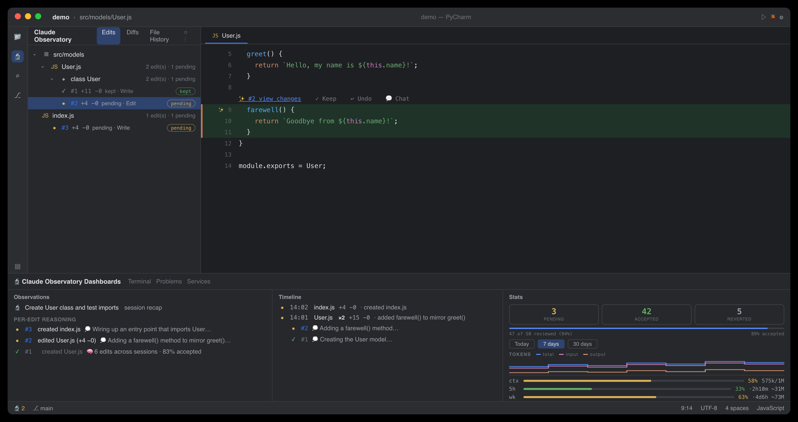

# Claude Observatory — feature walkthrough

A hands-on tour of every feature, driven by a real auto-captured session. The commands and output
below are from an actual `claude -p` run that created a small `User` model — nothing staged.


> Prefer pictures? See the **[visual showcase](https://cell-observatory.github.io/claude-observatory/showcase.html)**
> in your browser (rendered from [showcase.html](showcase.html) via GitHub Pages).

## The demo session

With the capture hooks installed, a short Claude Code session made three edits:

| # | File | Tool | Change |
| --- | --- | --- | --- |
| 1 | `src/models/User.js` | Write | create the file with `class User { constructor, greet() }` (+11) |
| 2 | `src/models/User.js` | Edit | add a `farewell()` method to the class (+4) |
| 3 | `src/index.js` | Write | import `User` and print a greeting (+4) |

No extra tokens were spent capturing any of it — the hooks run outside the model loop. The transcript
even gives the Observations panel its recap ("Create User class and test imports") and each edit's
reasoning, for free.

---

## 1 · Setup (once, with Claude Code closed)

```bash
./install.sh                              # or: npm run build && npm i -g ./packages/cli
claude-observatory init --with-statusline # capture hooks + the bundled status line (usage bars)
```

> Install the hooks **before** launching Claude Code — a running session reverts hook edits made
> mid-session. Then launch Claude Code and let it edit; every session after that captures automatically.

Confirm it's live:

```console
$ claude-observatory status
capture hooks:   installed
active session:  0c396c6b-2da9-4be2-9c6d-c8c5797de7a5
store:           ~/.claude/claude-observatory/0c396c6b-2da9-4be2-9c6d-c8c5797de7a5
last capture:    1m ago
edits:           3  (3 pending · 0 kept · 0 undone)
```

---

## 2 · List — the running log

Edits are grouped by file, newest ids last, with the line delta and status:

```console
$ claude-observatory list
3 edit(s)  ·  3 pending  ·  session 0c396c6b-2da9-4be2-9c6d-c8c5797de7a5

src/models/User.js
  #1  pending  +11 -0  Write  1m ago
  #2  pending  +4 -0  Edit  1m ago

src/index.js
  #3  pending  +4 -0  Write  1m ago

diff <id> · keep <id> · undo <id>
```

Filter with `--pending` / `--kept` / `--undone` or `--file <substr>`. List every session in the store
with `claude-observatory sessions` (a `●` marks the one that resolves for your current directory).

## 3 · Diff — inspect one edit

```console
$ claude-observatory diff 2
@@ -5,7 +5,11 @@

   greet() {
     return `Hello, my name is ${this.name}!`;
   }
+
+  farewell() {
+    return `Goodbye from ${this.name}!`;
+  }
 }

 module.exports = User;
```

## 4 · Keep vs. Undo

**Keep** marks an edit reviewed — it never touches the file:

```console
$ claude-observatory keep 2
✓ kept edit #2 (src/models/User.js)
```

**Undo** is surgical, and it refuses to corrupt: reverting edit #1 (the file creation) would strand
edit #2, which built on it — so you get a clear conflict instead:

```console
$ claude-observatory undo 1
⚠ conflict: edit #1 overlaps a later change to User.js. Run `claude-observatory undo 1 --force`
  to restore the file to its pre-edit-#1 state (this also drops later edits to this file).
```

Undoing #2, though, peels out just the `farewell()` method — `greet()` and the rest of the file
survive untouched (a **position-anchored 3-way line merge**, not a whole-file rewind):

```console
$ claude-observatory undo 2
✓ undid edit #2 (demo/src/models/User.js)

$ claude-observatory redo 2
✓ re-applied edit #2 (demo/src/models/User.js)
```

**Redo** re-applies an undone edit; `--force` on either falls back to a whole-file restore.

## 5 · Clean up

```console
$ claude-observatory clean --resolved     # drop kept/undone edits, keep pending
✓ cleared 1 resolved edit(s)

$ claude-observatory clean                # GC orphaned blobs across all sessions
✓ garbage-collected 2 orphaned blob(s), freed 1.4 KB
```

---

## 6 · Deletions & mixed edits

Claude removes and refactors code too, and the observatory captures that the same way. When an edit
deletes lines — say Claude later drops the `farewell()` method it added — `diff` shows them with a
leading `-`:

```console
$ claude-observatory diff 4
@@ -5,11 +5,7 @@

   greet() {
     return `Hello, my name is ${this.name}!`;
   }
-
-  farewell() {
-    return `Goodbye from ${this.name}!`;
-  }
 }

 module.exports = User;
```

A pure deletion lists as `+0 −4`; a refactor that both adds and removes (drop one method, add another)
lists the combined delta, e.g. `+2 −4`. In the **inline overlay**, added lines get their usual green
highlight — but deleted lines no longer exist in the buffer, so they can't be highlighted in place.
Instead the removed code is shown as **red "ghost" text** on the surviving line where it used to be
(`− farewell() { …(+2)`), over a red line highlight with a red overview-ruler tick. A **mixed edit**
shows both at once: green where it added, red ghost text where it removed. The full removed text is
always a click away — open the edit's inline diff from its ✨ star / lens.

---

## 7 · The editor observatories — VS Code & PyCharm/JetBrains

Both editor front-ends read the **same store** as the CLI, so a Keep/Undo in any surface shows up
in the others instantly. The layout is deliberately identical; only the host chrome differs:

| Surface | VS Code | PyCharm / JetBrains |
| --- | --- | --- |
| Install | `code --install-extension claude-observatory.vsix` | `./scripts/install-jetbrains.sh` (or Install Plugin from Disk) |
| **Edits · Diffs · File History** (review) | microscope in the Activity Bar, badged with the pending count | **Claude Observatory** tool window, left stripe |
| **Observations · Timeline · Stats** | bottom panel, side by side (like Terminal/Problems) | **Claude Observatory Dashboards** tool window, bottom stripe — three panes side by side |
| Inline menu (**✨ #N · +A −R · view changes · Keep · Undo · Chat · View diff**) | CodeLens above each edit + ✨ gutter star + subtle tint + coral ruler mark | lens above each edit + clickable ✨ gutter star + subtle tint + coral stripe |
| Click **view changes** | opens the **inline review bubble** at the edit — the diff in git's colors + reasoning + `+A −R`, Accept/Revert/Chat/Prev/Next on its toolbar (no tab) | opens the edit's unified **diff** (reasoning in title, Keep/Undo/Chat on toolbar) |
| File heatmap | 📄 heatmap (tab-bar) | 📄 heatmap (editor banner) |
| Scoreboard | status-bar `🔬 N` (amber while pending) + live bar in Stats | status-bar `🔬 N` + live bar in Stats |
| Keyboard loop | `⌥⌘N` next · `⌥⌘Y` keep · `⌥⌘U` undo · `⌥⌘[`/`⌥⌘]` revisions (`Ctrl+Alt` on Win/Linux) | same keys |

The **status-bar microscope** shows the pending count in realtime — the moment Claude writes a
change. Click it (or **Review next pending edit**) to jump straight to the oldest unreviewed edit;
review, decide, click again. That's the surgical loop, in either editor.



### Edits — folder → file → class

```text
▾ src
  ▾ models
      User.js                 2 edits
      ◆ class User            2 · 1 pending
          #1  +9 −0           reverted
          #2  +4 −1           kept
  index.js                    1 edit
      #3  +6 −0               pending
```

Edits nest under the class they land in (detected heuristically for JS/TS/Python). Hover a file or
class for **Keep all / Undo all** in that scope; click an edit to open the file at that change.

### Inline overlay

In the open file, each pending edit gets a **✨ gutter star** at its start, a **subtle** green tint on
added lines and a red tint (with the removed code shown as red ghost text) on deletions — toned down so
a heavily edited file doesn't drown in color — and a distinct **Claude-coral marker** on the overview
ruler / scrollbar. Above the edit sits the **inline menu**: **✨ #N · +A −R · view changes** then **✓
Keep · ↩ Undo · 💬 Chat · ⧉ View diff** (the same edit as a full diff tab — its own tab, Prev/Next on the
title bar cycling the file's edits in place). "Chat about this edit" copies a ready-made prompt (before/after included) for
your Claude Code chat or terminal.

**Click "view changes" → the changes, inline, in git's colors.** In **VS Code** it opens an **inline
review bubble** right at the edit — no tab — with the diff in **git's own theme colors** (green/red text
over the diff editor's translucent line fills — the same theme variables the real diff editor uses),
Claude's reasoning, and the `+A −R` counts, plus **Accept · Revert · Chat · Prev · Next** as real toolbar
buttons (Prev/Next step through that file's edits). In **PyCharm**, the ✨ gutter star / lens opens the
edit's before ⟷ after as a **unified diff** (reasoning in the title, Keep/Undo/Chat on its toolbar).

GitLens-style extras, in both editors: the **file heatmap** (📄) dims every unmodified line so Claude's
edits pop; **revision navigation** (`⌥⌘[` / `⌥⌘]`) steps a file's edit history in a current-vs-revision
diff.

### File History — the active file's edits, in order

A flat, chronological list of just the **currently open file's** edits (id · time · status ·
reasoning) that **follows the editor** as you switch tabs. Click a row to jump to that edit, or
keep / undo / diff it; the toolbar steps revisions and does **Accept all in this file** /
**Revert all in this file** — clearing one file without touching the rest of the session.

### Timeline — a collapsed change feed

```text
🟡 19:32  index.js        +6 −0 · created index.js
🟢 19:31  User.js  ×2     +13 −1 · added farewell() to mirror greet()
```

Newest first; consecutive edits to the same file coalesce into one `×N` row with the combined delta
and a change summary (Claude's own reasoning when available). Expand a row for the individual edits;
pending / kept / reverted keep their color (and reverted stays struck through).

### Observations — the recap, reasoning, and file memory

The top row is a one-line **session recap** — "here's what you were doing" — taken from Claude Code's
own session title at zero token cost (hit **✨** for a Claude-refined one-liner via
`claude -p --resume`, which reuses the session's cached context). Below it, one row per edit: a change
summary with Claude's **actual reasoning** surfaced inline (also pulled from the transcript). Click a
row for a combined report; a warning icon flags possible issues (debug statements, hard-coded secrets,
large deletions). **Analyze** spends tokens only when you click it; results are cached in the store.

Each row also carries the observatory's **memory of that file**, derived from every past session:

```text
🧠 12 edits across sessions · 92% accepted · last accepted 2d ago
⚠ history: edits to this file get reverted often (3 of 5 verdicts) — review carefully
```

The store *is* the memory — accept/revert verdicts and cached Claude analyses accumulate as you
review, so observations get sharper the longer you use the tool. Zero tokens, zero extra state.

### Stats — trends and live usage

A live **review scoreboard** leads the tab: **pending / accepted / reverted** counts and a
**progress bar** that fills as you review — updated the instant you keep or undo an edit. Below it, a
step-line plot of **tokens** (total / input / output, logarithmic axis) with a **Today / 7 days /
30 days** toggle, then the live **Usage** bars (context fill + 5h / week plan usage with `~token`
estimates). The full scoreboard (`3 pending · 42 accepted · 5 reverted · 89% accepted · oldest 12m`)
also lives in the status-bar microscope's tooltip. The stats scan runs in a subprocess with an
incremental cache, so the UI never blocks.

---

## Reproduce it yourself

```bash
claude-observatory init                       # hooks on (Claude Code closed)
# then, from any project directory:
claude -p --permission-mode acceptEdits 'Do this in three separate file operations: (1) create
  src/models/User.js with a User class (constructor(name) + greet()); (2) edit it to add a
  farewell() method; (3) create src/index.js that imports User and prints a greeting.'
claude-observatory list                       # your three edits, captured automatically
```

Every edit is now under observation — keep the good ones, undo the rest, one at a time.
</content>
