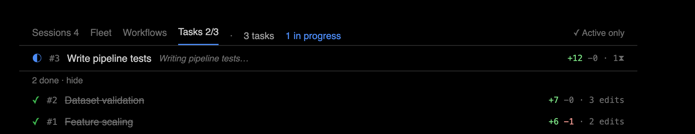
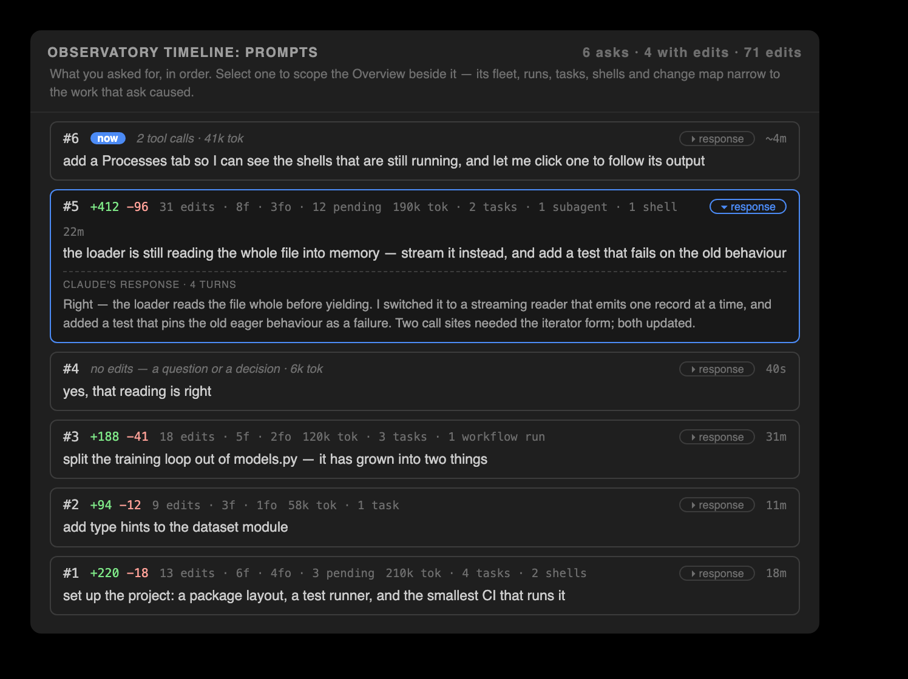

# Claude Observatory — feature walkthrough

A hands-on tour of every feature, driven by a real auto-captured session. The commands and output
below are from an actual `claude -p` run that created a small `Dataset` model, and — where a feature
needs facts that run did not produce — from the bundled `claude-observatory demo`, which drives the same
capture pipeline against a real transcript. Nothing is staged; the session id in each block's header says
which run it came from.


> The **[visual showcase](https://cell-observatory.github.io/claude-observatory/showcase.html)** presents
> the same material in the browser (rendered from [showcase.html](showcase.html) via GitHub Pages).

## Zero-setup demo — try it without Claude

The **[interactive demo](https://cell-observatory.github.io/claude-observatory/showcase.html#demo)** replays the
scenario in the browser, with no editor and no Claude session required. Locally, the built-in simulator
replays the same scripted session through the **real pipeline** — a genuine transcript, edits captured
by the same hooks, a subagent, a workflow run, and a second agent in a sibling worktree — inside isolated
`demo-…` sessions and an `observatory-demo/` folder it creates in the current directory.

**In an editor**, run **Start Demo Mode** from the VS Code command palette or JetBrains Find Action, use
the buttons at the end of the Overview's nav bar, or click **Try the demo** in an empty panel — which works
before `claude-observatory init` has ever run, because the replay drives the capture pipeline directly. The
panels fill beat by beat, and the **guided tour** opens when the replay finishes.

**In the terminal:**

```bash
claude-observatory demo          # run it in an open workspace and watch every panel update live
claude-observatory demo --tour   # the guided tour's steps, as prose
```

Open the Overview while it runs: the **Tasks** tab works through six numbered tasks, the last still in progress when the replay ends (live statuses and
per-task edit counts), the Folders strip and the Files ledger fill in as each edit lands, the **Fleet**
tab gains a second agent on `demo/hotfix` and flags the file both agents are holding, the **Workflows**
tab shows a three-phase run, and the **Processes** tab picks up three background shells — one that exits
0, one that fails, and one left running. Partway through, the scenario runs the context window out; the
compaction that follows is reported in the Actions timeline and in Stats. Click any row and the **feed**
below the change map fills with what that thing is doing. Observations streams the reasoning throughout.
The scenario also fails a tool call, runs a command `risk` flags, deletes a file, writes a report outside
the workspace, reads a file outside it, fetches a URL and calls an MCP server, so every audit has
something real to report. The edits are real store records on real files, so Accept / Reject /
task-scoped review all genuinely work.

Starting the demo again **resets** it: a run clears any previous demo for that folder before replaying,
so a second run never stacks a stale, half-reviewed session beside the fresh one. The replay is
cancellable, and what a stopped run left behind is still real, reviewable and removable. To remove it:

```bash
claude-observatory demo --clean  # both sessions, their stores, the demo folder, and the scratch dir
```

or **Exit Demo Mode** in either editor. Reviewing the demo leaves no residue either way — a fully
reviewed demo session clears its own store. (`--speed 2` paces it faster; `--fast` lands everything at
once, which is what the test suite uses; `--no-fleet` leaves out the second agent.)

## The guided tour

The tour walks **forty-one steps** covering every panel the product ships and every named feature —
including the Diffs view, revision navigation, Spotlight, search, the chat handoff, export, the status
bar, the Explorer badges, context sources and file memory. It lives in core, so the terminal and both
editors show the same steps: a step added to a panel reaches every editor at once, and none of them can
drift into its own wording.

It opens with a choice of **two tracks**: **Essentials** (13 steps — the review model, the agents, the
audits) or **Everything** (all 41). Finishing the short one offers the other 28 as its own track, in both
editors and in the terminal (`demo --tour --remainder`). The short track is a filter over the same list, in the same order, so
the two can never tell different stories. In the terminal, `demo --tour --essentials` prints the short one.

The tour **plays itself**: each step holds long enough to read it, and any control — Next, Back, a step
jump — hands you the wheel, with a transport button to resume. A **YOUR TURN** step shows a countdown and
performs the action itself if you do nothing, so watching it hands-off still shows Keep and Undo really
happening rather than only describing them.

It **docks beside your code**: an editor-area panel in VS Code, a tool window on the right in JetBrains.
VS Code can also **detach** it into a window of its own for a second screen, and remembers the choice.
JetBrains cannot — its floating window never appeared in PyCharm 2025.2, so it was removed rather than
shipped as a control that does nothing.

Each step brings its surface forward — the Overview tab, the sidebar tree, or the file itself — and
**rings** the control it names: a CSS outline in VS Code, a glass-pane painter in JetBrains. The step's
text stays in the tour window rather than being copied into the panel, so the panel keeps showing the
product and not a second narration of it. Neither editor lets an extension draw over IDE chrome it does
not own (the activity bar, the tab strip, the status bar), so for those the step's text names the control
instead. JetBrains rings some controls more coarsely than VS Code: four of the Overview's toolbar anchors
resolve to the toolbar row rather than the button, and the two token anchors in Stats both resolve to the
token strip. A step whose control this build cannot resolve rings nothing and still reads.

While the tour runs, the Overview's **Active only** filter is held open so the rows a step describes are
actually on screen — five of the demo's six tasks are completed, and the filter hides completed tasks by
default. Your own setting and your own tab come back when the tour ends.

Back, Next and a step chooser drive it (plus Dock/Float in VS Code); **Exit demo** ends it and removes
the session. In JetBrains, hiding the tour's tool window **pauses** it — a tour must never keep acting behind a
window you cannot see, and its wait steps accept and revert edits on a timer. Bringing the window back
restores the step's outline; resuming is yours to ask for, like every other control.

On a first install, and once after an update, both editors **offer the demo**: one notification, four
seconds after startup, carrying **Never ask**. It is skipped while a Claude session is live in that
project, in a workspace you have not trusted, and once a demo is already recorded there — so it never
interrupts work, and never asks twice for the same version.
Closing the tour window ends the tour. Read the whole script at any time with
`claude-observatory demo --tour`.

## The demo session

The scenario is three of your asks, six numbered tasks — the last still under way when it ends — and **nine captured edits** across two agents:

| # | File | Tool | Prompt · task | Change |
| --- | --- | --- | --- | --- |
| 1 | `src/features.py` | Edit | 1 · scaling | add `scale()` — z-score standardization |
| 2 | `src/train.py` | Edit | 1 · scaling | scale the features before the model sees them |
| 3 | `src/features.py` | Edit | 1 · scaling | guard `scale()` after the sanity run **fails** |
| 4 | `src/models/dataset.py` | Edit | 1 · validation | add `Dataset.validate()` |
| 5 | `tests/test_pipeline.py` | Write | 2 · tests and docs | written by a **subagent** |
| 6 | `docs/USAGE.md` | Write | 2 · tests and docs | written by a **workflow** agent |
| 7 | `src/legacy_scaler.py` | Bash | 2 · retire the scaler | **deleted** — captured by the tree-diff path |
| 8 | `src/features.py` | Edit | 3 · profiling | add `profile()`, in a region of its own |
| 9 | `~/.claude/claude-observatory/.demo-scratch/…/profile-report.md` | Write | 3 · profiling | **outside the workspace** |

Edits 1 and 3 change the same code, so they collapse into one review unit; edit 8 does not, which is why
`src/features.py` ends up with two units you can accept independently. A tenth edit belongs to the second
agent: a hotfix to `src/features.py` that collides with this session's, held pending on both sides.

No extra tokens were spent capturing any of it — the hooks run outside the model loop. The transcript
gives the Observations panel its recap and each edit's reasoning, for free.

---

## 1 · Setup (once, with Claude Code closed)

```bash
./install.sh                              # or: npm run build && npm i -g ./packages/cli
claude-observatory init --with-statusline # capture hooks + the bundled status line (usage bars)
```

> Install the hooks **before** launching Claude Code — a running session reverts hook edits made
> mid-session. Then launch Claude Code and let it edit; every session after that captures automatically.

Confirm it is live:

```console
$ claude-observatory status
capture hooks:   installed
hook script:     claude-observatory (on PATH) [ok]
active session:  demo-0c396c6b
store:           ~/.claude/claude-observatory/demo-0c396c6b
last capture:    1m ago
edits:           3  (3 pending · 0 kept · 0 undone)
```

---

## 2 · List — the running log

Edits are grouped by file, newest ids last, with the line delta and status:

```console
$ claude-observatory list
3 edit(s)  ·  3 pending  ·  session demo-0c396c6b

src/models/dataset.py
  #1  pending  +11 -0  Write  1m ago
  #2  pending  +4 -0  Edit  1m ago

src/train.py
  #3  pending  +4 -0  Write  1m ago

diff <id> · keep <id> · undo <id>
```


Filter with `--pending` / `--kept` / `--undone` or `--file <substr>`. `claude-observatory sessions`
lists this workspace's sessions, each led by Claude's own title for it and ordered by when the
conversation was last active; `●` marks the one that resolves for your current directory:

```console
$ claude-observatory sessions
● Pipeline: scaling, validation, tests  demo-5b039d80  5 edit(s) · 5 file(s) · 5 pending · 0s ago

● = resolves for this directory · use `--session <id>` to target another
```

## 3 · Diff — inspect one edit

```console
$ claude-observatory diff 2
@@ -5,7 +5,11 @@

     def describe(self):
         return {
             "count": len(self.features),
             "labels": len(self.labels),
             "empty": not self.features,
         }
+
+    def validate(self):
+        ok = len(self.features) == len(self.labels) and bool(self.features)
+        return {"ok": ok}
```


## 4 · Keep vs. Undo

**Keep** marks an edit reviewed — it never touches the file:

```console
$ claude-observatory keep 2
✓ kept edit #2 (src/models/dataset.py)
```

**Undo** is surgical, and it refuses to corrupt: reverting edit #1 (the file creation) would strand
edit #2, which built on it — so you get a clear conflict instead:

```console
$ claude-observatory undo 1
⚠ conflict: edit #1 overlaps a later change to dataset.py. Run `claude-observatory undo 1 --force`
  to restore the file to its pre-edit-#1 state (this also drops later edits to this file).
```


Undoing the `validate()` edit, though, peels just that method back out — `describe()` and the rest of the
file survive untouched (a **position-anchored 3-way line merge**, not a whole-file rewind). Here it is
against a demo session, whose third edit adds `validate()` the same way:

```console
$ claude-observatory undo 3
✓ undid edit #3 (/tmp/obs-demo/observatory-demo/src/models/dataset.py)

$ claude-observatory redo 3
✓ re-applied edit #3 (/tmp/obs-demo/observatory-demo/src/models/dataset.py)
```

**Redo** re-applies an undone edit; `--force` on either falls back to a whole-file restore. Note that
`undo` and `redo` name the file by its full path, while `keep` prints it relative to the workspace.

**Keep or undo a whole task at once.** Claude's own numbered to-dos define stable, content-hash
`taskId`s (see the [Overview](#overview--the-master-detail-multi-agent-panel)). `task-keep` and
`task-undo` act on a task's **strict span** — the edits captured while that task was actually in
progress, and no others:

```console
$ claude-observatory task-keep 57e216e743ae
✓ kept 2 edit(s) in task 57e216e743ae

$ claude-observatory task-undo 12d5f37a19c4
✓ reverted 2 edit(s) in task 12d5f37a19c4
```

An edit made outside every in-progress window belongs to no task: it stays in the `unassigned` bucket
rather than joining the task before or after it, so keeping or undoing a task never touches work that
task did not produce. Each revert stays conflict-guarded per edit, so a task whose edits a later change
built on reports the conflicts it left instead of forcing them. Both verbs take `--json` — `task-keep`
returns `{ kept, total, ids }`, `task-undo` `{ undone, conflicts, total, ids }` — and both stay
zero-token: the task↔edit mapping is mined from the transcript's own to-do checkpoints, never a model
call.

## 5 · Clean up

```console
$ claude-observatory clean --resolved     # drop kept/undone edits, keep pending
✓ cleared 1 resolved edit(s)

$ claude-observatory clean                # GC orphaned blobs across all sessions
✓ garbage-collected 2 orphaned blob(s), freed 1.4 KB
```

Two narrower scopes clear part of a session. `--ids` takes an explicit set of edit ids, which is how the
Overview clears one prompt's resolved edits: the work one ask produced is spread across files and
folders, so no path expresses it. `task-clear <taskId>` does the same for one task's strict span, and
`task-clear --completed` for every settled task at once — the ones whose edits are present and all
kept:

```console
$ claude-observatory clean --resolved --ids 4,5
✓ cleared 2 resolved edit(s)

$ claude-observatory task-clear 57e216e743ae
✓ cleared 2 resolved edit(s) in task 57e216e743ae
```

---

## 6 · Deletions & mixed edits

Claude removes and refactors code too, and the observatory captures that the same way. When an edit
deletes lines — say Claude later drops the `validate()` method it added — `diff` shows them with a
leading `-`:

```console
$ claude-observatory diff 4
@@ -5,11 +5,7 @@

     def describe(self):
         return {
             "count": len(self.features),
             "labels": len(self.labels),
             "empty": not self.features,
         }
-
-    def validate(self):
-        ok = len(self.features) == len(self.labels) and bool(self.features)
-        return {"ok": ok}
```

A pure deletion lists as `+0 −4`; a refactor that both adds and removes (drop one method, add another)
lists the combined delta, e.g. `+2 −4`. In the **inline overlay**, added lines get their usual green
highlight — but deleted lines no longer exist in the buffer, so they can't be highlighted in place.
Instead the removed code is shown as **red "ghost" text** on the surviving line where it used to be
(`− def validate(self): …(+2)`), over a red line highlight with a red overview-ruler tick. A **mixed edit**
shows both at once: green where it added, red ghost text where it removed. The full removed text is
always a click away — open the edit's inline diff from its ✨ star / lens.

---

## 7 · The editor observatories — VS Code & PyCharm/JetBrains

Both editor front-ends read the **same store** as the CLI, so a Keep/Undo in any surface shows up
in the others instantly. The layout is deliberately identical; only the host chrome differs:

| Surface | VS Code | PyCharm / JetBrains |
| --- | --- | --- |
| Install | `claude-observatory install-extensions` installs into both families at once (or `code --install-extension claude-observatory.vsix`) | `claude-observatory install-extensions` (or `./scripts/install-jetbrains.sh`, or Install Plugin from Disk) |
| Auto-update | daily background check → one-click **Update now** | add the [plugin repository](../packages/jetbrains/README.md#auto-updates) once → IDE-native updates |
| **Edits · Diffs · File History** (the sidebar) | **Observatory Traces** — microscope in the Activity Bar, badged with the pending count | **Observatory Traces** tool window, left stripe |
| **Overview · Stats** (the bottom panel) | **Observatory Dashboards** bottom panel, side by side (like Terminal/Problems). The Overview can also be docked as a full-height **editor tab** — palette: *Open Overview in Editor*, or set `claudeObservatory.overviewLocation`; whichever host holds it drives the refresh, never both | **Observatory Dashboards** tool window, bottom stripe |
| **Prompts** | its own **Prompts** view (new installs start it in the bottom panel; drag it to the secondary sidebar if you like) — an existing profile keeps wherever you last dragged it, since VS Code remembers view placement per profile | the **Observatory Timeline** tool window, right stripe — Prompts · Actions · Observations as tabs |
| Inline menu (**✨ #N · +A −R · view changes · Keep · Undo · Chat · View diff**) | CodeLens above each edit + ✨ gutter star + bold green/red highlight + coral ruler mark | lens above each edit + clickable ✨ gutter star + bold green/red highlight + coral stripe |
| Click **view changes** | opens the **inline review bubble** at the edit — the diff in git's colors + reasoning + `+A −R`, Keep/Undo/Chat/Prev/Next on its toolbar (no tab) | opens the edit's unified **diff** (reasoning in title, Keep/Undo/Chat on toolbar) |
| File spotlight | 📄 spotlight (tab-bar) | 📄 spotlight (editor banner) |
| Scoreboard | status-bar `🔬 N` (amber while pending) + live bar in Stats | status-bar `🔬 N` + live bar in Stats |
| Keyboard loop | `⌥⌘N` next · `⌥⌘Y` keep · `⌥⌘U` undo · `⌥⌘-`/`⌥⌘=` revisions (`Ctrl+Alt` on Win/Linux) | `⌥⌘N` next · `⌥⌘Y` keep · `⌥⌘U` undo · `⌥⌘[`/`⌥⌘]` revisions |

The **sidebar** ("Observatory Traces") carries the three per-edit review panes — **Edits · Diffs · File History**; the timeline-shaped surfaces — **Prompts · Actions · Observations** — live together in the **Observatory Timeline** panel. (Timeline is gone as a standalone pane — its coalesced
change-feed now leads **Observations**, which moved into the sidebar in 0.8.7 to make room for the
**Prompts** window beside the Overview it scopes; **Actions** moved up there in 0.8.0; and the former
multi-agent window folded into **Overview** as its **Fleet** tab.) Both front-ends drive the review
surfaces from **icon-only tabs** (hover for the label), and JetBrains is at full **feature parity** with
VS Code: the toggle-inline button, **Accept/Revert this file** on the Edits toolbar, revision-nav
buttons, Overview bulk actions, Observations clear/switch/doctor, a 5th **⧉ View diff** lens segment,
and a pending badge on the tool-window stripe.

The **status-bar microscope** shows the pending count in realtime — the moment Claude writes a
change. Click it (or **Review next pending edit**) to jump straight to the oldest unreviewed edit;
review, decide, click again. That's the surgical loop, in either editor.


### Edits — folder → file → class

```text
▾ src
  ▾ models
      dataset.py              2 edits
      ◆ class Dataset         2 · 1 pending
          #1  +11 −0          reverted
          #2  +4 −0           kept
  train.py                    1 edit
      #3  +4 −0               pending
```

Edits nest under the class they land in (detected heuristically for JS/TS/Python). Hover a file or
class for **Keep all / Undo all** in that scope; click an edit to open the file at that change.

### Inline overlay

In the open file, each pending edit gets a **✨ gutter star** at its start and a **clearly-visible
whole-line highlight** over Claude's edited section — a **green** fill with a **bold green change-bar**
on added lines, and a **red** fill with a **red change-bar** on deletions (the removed code shown as red
ghost text) — plus a distinct **Claude-coral marker** on the overview ruler / scrollbar. The line fills
were once a deliberately faint ~10% tint; they now sit near **30%**, so a Claude-edited section stands
out at a glance instead of blending in. Above the edit sits the **inline menu**: **✨ #N · +A −R · view changes** then **✓
Keep · ↩ Undo · Chat · ⧉ View diff** (the same edit as a full diff tab — its own tab, Prev/Next on the
title bar cycling the file's edits in place). "Chat about this edit" copies a ready-made prompt (before/after included) for
your Claude Code chat or terminal.

**Click "view changes" → the changes, inline, in git's colors.** In **VS Code** it opens an **inline
review bubble** right at the edit — no tab — with the diff in **git's own theme colors** (green/red text
over the diff editor's translucent line fills — the same theme variables the real diff editor uses),
Claude's reasoning, and the `+A −R` counts, plus **Accept · Revert · Chat · Prev · Next** as real toolbar
buttons (Prev/Next step through that file's edits). In **PyCharm**, the ✨ gutter star / lens opens the
edit's before ⟷ after as a **unified diff** (reasoning in the title, Keep/Undo/Chat on its toolbar).

GitLens-style extras, in both editors: the **file spotlight** (📄) dims every unmodified line so Claude's
edits pop; **revision navigation** (`⌥⌘-` / `⌥⌘=` in VS Code, `⌥⌘[` / `⌥⌘]` in PyCharm) steps a file's
edit history in a current-vs-revision diff.


### The review nav bar

One combined review bar, mirrored across four surfaces so the surgical loop is always a click away: the
**status bar** (both editors), the **editor tab bar** (VS Code's editor-title actions; a banner
across the top of the editor in JetBrains), a single floating **review bubble** (VS Code's
Comments API) parked over the current edit, and — new in 0.8.0 — the **Overview title bar**, where
it rides alongside the name of the session under review and the bulk actions.

```text
🔬 3  Search  ▲ Diff 1/2 ▼  ◀ File 1/3 ▶  ✓ Keep  ↩ Undo  ✓✓ Accept File  ✕ Reject File  Clear Resolved  Spotlight
```

The bar steps on **two axes**: the **Diff axis** (`Diff n/m`, ▲/▼) walks the open file's pending
edits; the **File axis** (`File n/m`, ◀/▶) walks every file that still has one. On the open file it
also carries **✓ Keep** / **↩ Undo** this edit, **✓✓ Accept File** / **✕ Reject File**, the
session-wide **Clear Resolved** (status bar), a **Spotlight** toggle, and **Search**.

The buttons are **color-coded by what they do** (0.8.3, both editors): keep/accept **green**,
undo/reject **red**, the nav chevrons **blue**, clear **orange**, search/spotlight **purple** — the
same chart palette the Overview uses, so the destructive half of the bar never reads like the safe half.
A glyph names the **operation**, and the axis it sits in names the **scope**: the per-edit ✓ / ↩, the
scoped double-check / ✕, and the session-wide checklist / history-rewind are three distinct pairs, while
Accept File, Accept Folder and Accept Prompt deliberately share the scoped ✓✓ — each sits beside its own
axis counter, which is what says who it acts on.
On the **Overview title bar** the bar expands to **two rows**. The **top row** carries the controls: the
**name of the session under review** (its title or first prompt; the raw id sits in the tooltip) — a
label since 0.8.8, because the **Sessions** tab is where the session changes — the session-wide bulk
actions **Accept All · Reject All · Clear Resolved · Export**, and on the right **Search · Active only · Spotlight · Refresh**. **Export** offers two
documents: the shareable **review summary** (kept / reverted per file, markdown), or the **full session
trace** — everything the observatory recorded for the session, as one JSON document (every edit with its
diff, capture skips, prompts, every action, tasks, subagents, egress, outside writes, observations, and
token usage; also `claude-observatory export [--out <file>]`). **Active only** —
which hides finished agents, finished runs, exited shells and fully reviewed work — is **on by default**
and is remembered across panel hides and restarts, in both editors. The **bottom row**
steps the pending edits on **four review axes**, each a coarser grain than the last:

- **Diff** — the open file's edits; carries **Keep · Undo · Chat** (hands this edit's before/after to
  your own Claude) · **View diff** (opens a real side-by-side diff editor), and the current edit's
  relative time.
- **File** — every changed file; shows the filename and that file's edit count, with **Accept File /
  Reject File**.
- **Folder** *(new)* — every changed folder; shows the directory and its file / edit totals, with
  **Accept Folder / Reject Folder**, which act on that folder's edits alone.
- **Prompt** — your own asks, in order; shows what each one produced, with **Review · Accept Prompt ·
  Reject Prompt**.

Since 0.8.9 the axes row is **icons only** in both editors, each button naming its verb on hover. Every
axis already labels itself in its own `n/m` counter — `Diff 1/2`, `File 3/126`, `Folder 1/23`,
`Prompt 2/9` — so a word beside each button only restated the axis the reader was already looking at, and
on a bottom dock that space is the change map's. The **top row keeps its labels**: those actions are
session-wide and destructive, and no counter above them says what they act on.

The bar is **two-tier**. The File axis plus Clear / Spotlight / Search show whenever *any* edit is pending
anywhere; the Diff axis and the per-edit / per-file actions appear only when the **open** file has
pending edits. The counters **track the active editor**, so `Diff 1/2` always means "this file." The
keyboard loop is unchanged — `⌥⌘N`/`⌥⌘P`, `⌥⌘Y`/`⌥⌘U`, `⌥⌘K`/`⌥⌘R` and the revision keys still drive it.

### File History — the active file's edits, in order

A flat, chronological list of just the **currently open file's** edits (id · time · status ·
reasoning) that **follows the editor** as you switch tabs. Click a row to jump to that edit, or
keep / undo / diff it; the toolbar steps revisions and does **Accept all in this file** /
**Revert all in this file** — clearing one file without touching the rest of the session.


### Actions — every tool call, zero tokens

The whole session as a typed record of **every tool call Claude made**: reads, greps, shell commands,
web fetches, subagent spawns, to-do updates, not just the file writes the store captures. Like
everything else here it costs **zero tokens** — mined straight from the Claude Code transcript —
and each action is correlated with its **result** (`ok` / `error`). File-edit actions **link back to
their store record**, so you can jump from the trace into the review in one click.

Since 0.9.0 **Actions** lives in the **Observatory Timeline** panel alongside Prompts and Observations
(it used to sit in the bottom panel). It's **grouped by category** and — new — every group is
**collapsed by default**, so you expand only the ones you care about:

```text
▾ Edits          3
    ✓  Write   src/models/dataset.py  → #1
    ✓  Edit    src/models/dataset.py  → #2
    ✓  Write   src/train.py           → #3
▾ Commands       2
    ✓  python src/train.py
    ✕  python -m unittest              exit 1
▾ To-dos         1
    ✓  3 items · 2 done
```

By default the view is **curated** — high-signal categories only, though **errors always surface** —
with a **Show all** toggle that folds in the noise (reads, searches, meta). Errored calls are
flagged; an edit row **opens the review**, like every other surface.

The same trace is one command away. The CLI prints it as a **flat chronological feed** (each row: time ·
`[category]` · tool · target · the `edit#N` link for file edits · Claude's own one-line detail); the
editors render the grouped-by-category view above from the same data:

```console
$ claude-observatory actions
Actions  9 total · 3 edit · 3 read · 2 exec · 1 todo · 1 error(s) · session demo-0c396c6b

2m ago       [edit]    Write      src/models/dataset.py edit#1  (create the Dataset class)
2m ago       [edit]    Edit       src/models/dataset.py edit#2  (add a validate() method)
1m ago       [read]    Read       src/models/dataset.py
1m ago       [edit]    Write      src/train.py edit#3  (import Dataset and print a validation report)
1m ago       [exec]    Bash       python src/train.py  (run the training entrypoint)
1m ago     ✗ [exec]    Bash       python -m unittest  (run the test suite)
1m ago       [todo]    TodoWrite  3 items · 2 done
```

The verb is aliased as `trace`. `--json` emits the structured form (`{ session, summary, actions, groups,
egress, subagents, subagentsSummary, fleet, fleetSummary }` — `groups` is the curated, category-grouped
view the editors render); `--category <c>`, `--errors`, `--limit <n>`, and `--all` filter the feed.

### Observations — the recap, the change feed, reasoning, and file memory

The top row is a one-line **session recap** — "here's what you were doing" — taken from Claude Code's
own session title at zero token cost (hit **✨** for a Claude-refined one-liner via
`claude -p --resume`, which reuses the session's cached context).

Below the recap, **Observations now leads with the coalesced change-feed** that used to be its own
Timeline pane — files newest-first, and consecutive edits to the same file coalesced into one `×N` run
with the combined delta and a change summary (Claude's own reasoning when available):

```text
🟡 19:32  train.py        +4 −0 · created train.py
🟢 19:31  dataset.py  ×2  +15 −0 · added validate() alongside describe()
```

Expand a run for the individual edits; pending / kept / reverted keep their color (reverted stays struck
through). The same coalesced runs come out of `claude-observatory observations --json` (each run carries
its edits and reasoning) — both editors render that view-model thin.

Then, one row per edit: a change summary with Claude's **actual reasoning** surfaced inline (also pulled
from the transcript). Click a row for a combined report; a warning icon flags possible issues (debug
statements, hard-coded secrets, large deletions). **Analyze** spends tokens only when you click it;
results are cached in the store.

Each row also carries the observatory's **memory of that file**, derived from every past session:

```text
🧠 12 edits across sessions · 92% accepted · last accepted 2d ago
⚠ history: edits to this file get reverted often (3 of 5 verdicts) — review carefully
```

The store *is* the memory — accept/revert verdicts and cached Claude analyses accumulate as you
review, so observations get sharper the longer you use the tool. Zero tokens, zero extra state.

### Stats — trends and live usage

A **top navbar** now runs across the very top of the Stats view (both editors): the **active Claude
Code session, shown by its name** (not its raw id), followed by a chip naming the **model and reasoning
effort** the session is actually running on — `Opus 4.8 · max effort` (0.8.6). The model is read from
the session's own assistant turns, excluding sidechain turns because a subagent may run a different
model; a session that switched models mid-flight shows the current one and says so, with per-model turn
counts in the tooltip. Effort comes from the field current Claude Code stamps on each turn, falling back
to the `/effort` command echo on older transcripts — and when a session never declared one, the chip
simply omits it rather than inventing a default. Beside it sits a **compaction** readout (0.8.7):
`⤺ 2 compactions · last dropped 986k` — how many times the harness summarized the conversation away and
how much context the last one dropped. It is a fact, not a chart: the per-turn context series that used
to be plotted below the token cells was removed in 0.8.7, along with the chart it fed. A session that was
never compacted shows nothing here rather than a zero. (The Search-edits box moved out in 0.7.5 — the
**Edits** / **Diffs** title-bar search is the single entry point.) Right below the title, a **Session
tokens** section (0.8.6) shows this session's cumulative spend split the way the API bills it —
**input** (uncached) / **output** / **cached** reads, plus the **cache hit rate** (reads ÷ all context
sent); cache-write totals live in the tooltip. Then, under an **Edits** heading, the live **review
scoreboard**: **pending / accepted / reverted** counts and a **progress bar** that fills as you review —
updated the instant you keep or undo an edit, and the **pending** count is now **clickable**: click it
to jump straight to the first (oldest) edit awaiting review. Then a step-line plot of **tokens** (total / input / output, logarithmic axis) with a **Today / 7 days /
30 days** toggle, then the live **Usage** bars: context fill, plus the **5h** and **weekly** plan-usage
rows, which now show an estimated **used / total** — the 100% total inferred from the reported tokens
÷ percent. The full scoreboard (`3 pending · 42 accepted · 5 reverted · 89% accepted · oldest 12m`)
also lives in the status-bar microscope's tooltip. Compaction is surfaced in two more places: as its own
curated **Compactions** group in the Actions timeline (`auto · 178k→12k · 166k dropped · 1m 32s`), and as
a **⤺ count** on the Prompts row of the ask that was interrupted by it. The stats
scan runs in a subprocess with an
incremental cache — and the session-token counters keep a per-transcript byte cursor, parsing only
what was appended since the last refresh — so the UI never blocks.

### Overview — the master-detail multi-agent panel

The flagship 0.8.0 surface, and the one that replaces both the old **Change Map** window and the old
multi-agent window. **Overview** is a **master-detail** panel (both editors): a **left nav**
(~25%) that lists every agent and every workflow, and a **right detail** (~75%) that shows the selected
one's **change-map**. The left nav groups its rows under five tabs — **Fleet**, **Workflows**, **Tasks**
(the session's numbered tasks, or, on newer Claude Code builds, its background **Agent runs**),
**Processes** (the background shells it started with `run_in_background`; see
[Processes](#processes--the-background-shells-still-running)) and **Sessions** (every Claude Code
session for this workspace; see [Sessions](#sessions--every-session-in-this-workspace)) — each of which
opens with a one-line description of what it lists; every tab and change-map section also carries a
hover description. Selecting a row in the first four opens that thing's **feed** below the change-map
(see [Feed](#feed--what-one-thing-is-doing-right-now)); selecting a **Sessions** row pins what the whole
observatory reviews. A **title bar** across the top carries a **session
selector** (showing the session by its name), the combined **two-row review nav bar**, and the
session-wide bulk actions. It answers two questions at once — *what is my whole fleet doing right now*
and *where did the work land, what still needs my eyes*.


#### Left nav → **Fleet** — every running agent, live

The **Fleet** tab lists **one row per running agent**
across every git **worktree** of the repo. Worktrees are correlated **git-free** — the observatory reads
the `.git` **pointer files** (a linked worktree's `.git` is a *file* naming its admin dir; that dir's
`commondir` points back at the shared repo), never shelling out to the git binary — so sessions launched
from sibling worktrees of one logical repo unify into a **single fleet** keyed by that shared repo.

Each agent row carries a live **phase** badge — `working` · `awaiting-input` · `awaiting-permission` ·
`idle` · `errored` · `done` — its **worktree + branch**, an activity **sparkline**, its **±diff**,
**tokens · time**, **risk** flags, a **conflict** badge, and an **↗** suffix counting the files that
agent read or wrote **outside the workspace** (`↗ 3 read · 22 written outside`) — the one glanceable
fact left over from the 0.8.6 footprint row, with the Actions panel's Risk and Egress nodes naming the
files themselves. Unfold the row for the agent's nested
**subagents**, each with its `agentType` / description, phase, current task + to-dos, ±lines, and a
**chat** button. An **Active only** toggle hides the finished ones, and **Clear completed** *dismisses*
them from view — it never deletes anything, because the observatory only ever observes. Live cross-agent **conflicts** lead the **Actions** view, flagging any file touched by **2+ agents**.

The **phase** is detected **zero-token, from the transcript tail**: an active `tool_use` (or a trailing
`tool_result` — the turn is mid-flight) reads `working`; a pending `AskUserQuestion` reads
`awaiting-input`; a pending permission prompt reads `awaiting-permission`; otherwise `idle` / `errored` /
`done`, staleness-gated. The querying (self) session shows **working** while it is actively running.


The view is one JSON payload — both editors render it thin, no client-side aggregation. `multitask`
(its output is JSON either way) emits `agents[]`, `workflows[]`, `worktrees[]`, and `collisions[]`:

```console
$ claude-observatory multitask --json | jq '.agents[] | {worktree, branch: .gitBranch, phase, diff, subs: (.subagents|length)}'
{ "worktree": "…/repo",        "branch": "main",     "phase": "working",             "diff": {"added":751,"removed":12}, "subs": 2 }
{ "worktree": "…/repo-hotfix", "branch": "fix/login","phase": "awaiting-permission", "diff": {"added":44,"removed":3},   "subs": 0 }

$ claude-observatory multitask --json | jq '.collisions[]'      # same file, 2+ agents
{ "file": "…/src/store.ts", "agents": ["ad93a29f", "7b1c…"], "anyPending": true }
```

The whole thing is **zero token, git-free, path-only** — filenames, never contents — so nothing one
agent is editing leaks into another.

#### Left nav → **Workflows** — each multi-agent run

The **Workflows** tab lists every **workflow run** — Claude Code's deterministic multi-agent
orchestration — one level **above** the subagents. Each run shows an **informative name**, a
**running / done** flag, its **per-phase** progress groups, and its **agents** (each with its own
**tokens · time · edits**) under an activity **sparkline** styled identically to the Fleet rows.

Under the hood a run is tracked in `subagents/workflows/wf_<id>/` plus a rich per-run state file, so both
per-run and per-agent **tokens / time / edits** and the **phase** groups fall straight out — and the
**running** flag is **freshness-gated**: an interrupted run that never wrote `completed` is *not* shown
running. The same data is in `multitask --json .workflows` and `changemap --json .workflows` /
`.rollupByWorkflow`:

```console
$ claude-observatory changemap --json | jq '.rollupByWorkflow[] | {workflowId, edits, added, removed, pending}'
{ "workflowId": "wf_99d45022-8f2", "edits": 9, "added": 49, "removed": 43, "pending": 9 }

$ claude-observatory multitask --json | jq '.workflows[0] | {name, phases, agents: (.agents|length)}'
{ "name": "pipeline-docs", "phases": ["Build", "Verify"], "agents": 3 }

$ claude-observatory multitask --json | jq '.workflows[0].agents[] | {agentType, done, tokens, ms: .durationMs, edits}'
{ "agentType": "general-purpose", "done": true,  "tokens": 12100, "ms": 8400, "edits": 4 }
{ "agentType": "general-purpose", "done": false, "tokens": 18300, "ms": 5100, "edits": 5 }
```

#### Left nav → **Tasks** — Claude's own numbered plan

The **Tasks** tab lists the active session's numbered to-dos — the `TaskCreate` / `TaskUpdate` plan
Claude keeps for itself — with a live status glyph (a filled ● done, a half ◐ in progress, a hollow ○
still planned) and, beside each row, the edits made while that task was in progress: **±lines, edit
count, pending count**. Each task is keyed by a **stable content-hash `taskId`** (a 12-char sha1 of the
to-do text), so reordering or inserting to-dos never renumbers one. Selecting a row opens that task's
feed — the main chain's calls inside its in-progress window.



Attribution is **strict**: an edit belongs to a task only if it was captured while that task was
actually in progress. Edits made before the first to-do went in progress, or after the last one closed,
fall in no task's span and are reported in an explicit **unassigned** bucket rather than swept into the
neighboring task. The same rollup drives the tab, the task verbs of [section 4](#4--keep-vs-undo), and
`tasklog`:

```console
$ claude-observatory changemap --json | jq -c '.rollupByTask[] | {taskId, edits, added, removed, pending}'
{"taskId":"12d5f37a19c4","edits":2,"added":24,"removed":0,"pending":2}
{"taskId":"57e216e743ae","edits":2,"added":9,"removed":3,"pending":2}
{"taskId":"a671afe1744f","edits":1,"added":7,"removed":0,"pending":1}

$ claude-observatory changemap --json | jq -c '.unassigned | {edits, added, removed}'
{"edits":0,"added":0,"removed":0}
```

`feed --kind task` prints the same window from the terminal — every call the main chain made while that
task was in progress:

```console
$ claude-observatory feed --kind task --id 57e216e743ae
Add feature scaling to the pipeline  ▣ audit log · 0s ago · task

20:37:07   TodoWrite Add feature scaling to the pipeline
20:37:07   TaskCreate Add feature scaling to the pipeline
20:37:07   TaskCreate Validate the training dataset
20:37:07   TaskCreate Tests and docs
20:37:07   TaskUpdate 1
20:37:07   Edit /tmp/obs-demo/observatory-demo/src/features.py
20:37:07   Edit /tmp/obs-demo/observatory-demo/src/train.py
20:37:07   Bash python src/train.py
20:37:07   TodoWrite Validate the training dataset
```

#### Right detail → the change-map

Select an agent or a workflow and the right pane fills with its **change-map** — the whole of that
scope's work as one picture. (The default selection is the **orchestrator** — the querying/self
session.)

```text
🔬 ad93a29f   185 edits · 20 pending · 27 kept · 57% reviewed · 3 agents · 2 err · 🛰 13 · ⇅ 3
[██████████ core ██████████|████ vscode ████|██ docs ██|cli]
extension.ts    vscode   ████████████  +751   6⧗
changemap.ts    core     █████         +285   ✓
README.md       docs     █              +44   2⧗
```

Two labeled sections, top to bottom:

- **Folders** — a strip of equal tiles, one per changed folder, **ranked by lines changed and colored by
  review status**. It shows where the session's changes landed before you read a single
  row. **Click a tile to step the Folder axis to it** — opening that folder's first pending edit and
  filtering the map to that folder. A repo-wide session spans more folders than one row can label, so the
  strip leads with the eleven that moved most and folds the rest into **+K more**; click that to see every
  folder (the strip wraps, capped at five rows and scrolling) and **show fewer** to fold it back.
- **Files** — a churn-ranked ledger of every changed file, each with a ±line bar. Color is
  **worst-unreviewed-wins**: a folder never reads green while something under it is still pending. Hover
  for the class touched and Claude's own reasoning; **click to open the real diff** — the same review
  surface as everywhere else.

A **summary bar** runs along the bottom: for whatever is currently in scope it tallies the **pending /
accepted / reverted** edit counts alongside the **file** and **folder** totals, and names the picked
prompt (or folder filter), so you always know what the numbers describe.

Below the summary bar sits the selected row's **feed** (0.8.7) — what that agent, workflow, task or
background shell is actually doing, read from the file it writes as it works. It is the editors'
rendering of the [`feed`](#feed--what-one-thing-is-doing-right-now) verb, and it carries the same
live-vs-audit distinction: a **live** header while the source is still writing, an **audit log** header
once it has finished, at which point the panel stops polling it.

The map always sizes by **±lines** (churn). Under the hood the same change-map rolls up on **four
levels** — **per task**, **per subagent**, **per agent**, and **per workflow** — with **honest
attribution** throughout: where a subagent/workflow placement is ambiguous the edit is left
unattributed, never guessed. From the shell, the same model both editors render (the `unassigned` key
holds what strict attribution could not place):

```bash
claude-observatory changemap --json | jq '.modules[]      | {label, churn, status, files}'
claude-observatory changemap --json | jq '.rollupByTask[] | {taskId, edits, added, removed}'
claude-observatory changemap --json | jq '.prompts[]      | {index, text, editIds}'
claude-observatory changemap --json | jq '.unassigned     | {edits, added, removed}'
```

Every rollup — churn, status precedence, module labels, the per-task / per-subagent / per-workflow
breakdowns, the drill-through target — is computed once in `core`, so the VS Code webview and the
JetBrains panel show identical numbers by construction.

#### Title bar → review nav + prompt-scoped bulk actions

Across the top of Overview sits the **name of the session under review**, then the combined
**[review nav bar](#the-review-nav-bar)** laid out over **two rows**: a **top row** of controls — that
label, the **Accept All · Reject All · Clear Resolved · Export** bulk actions, and **Search · Active
only · Spotlight · Refresh** — over a **bottom row** stepping the **Diff · File · Folder · Prompt**
axes with live n/m counters. Picking a prompt in the Prompts window (or stepping the **Prompt** axis to
it) **re-scopes** Accept/Reject/Clear to *just that ask*, so a whole ask's worth of edits can be
accepted in one click and the buttons relabel to say so ("Accept All in #1"). The icons are consistent
everywhere: ✓ = accept/keep, ↩ = reject/undo, 🧹 = clear.

The task verbs the CLI exposes work the same way from the shell — `task-keep` / `task-undo` /
`task-clear` on a `taskId`, `clean --resolved --ids <a,b,c>` for the set one prompt names, or
`keep --all` / `undo --all` for the whole session.

**A task log across the whole fleet.** `tasklog` folds every worktree-sibling's change-map by stable
`taskId`, so **one logical task spanning agents or worktrees reads as a single row** — edit counts and
±lines use the same strict-span attribution, and `unassigned` edits are excluded rather than swept into
a neighbour:

```console
$ claude-observatory tasklog | jq '.[] | {taskId, content, agents: (.agentIds|length), subs: (.subagentIds|length), edits, added, removed}'
{ "taskId": "4d9f1a2b3c4d", "content": "Scaffold subagent tracking", "agents": 2, "subs": 1, "edits": 18, "added": 512, "removed": 30 }
```

**Chat about anything, with the context pre-assembled.** `chat-context` builds a **zero-token,
ready-to-paste** prompt about one action, edit, subagent, or task — the observatory assembles the right
context and hands it to *your own* Claude; it **never calls a model itself**:

```console
$ claude-observatory chat-context --edit 2 --json                # → { "prompt": "…before/after + reasoning…" }
$ claude-observatory chat-context --task 4d9f1a2b3c4d --json
$ claude-observatory chat-context --agent demosub1 --json
```

Both `tasklog` and `chat-context` are **additive** — mined from the transcript + the local store, they
add nothing to the store and change no on-disk format.

### Risk & Egress — two zero-token audits

The Actions timeline already knows every command Claude ran, every file it opened, and every host it
reached, so these safety audits fall straight out of it — **zero tokens, no new store or format**. Both
ride the **Actions** view in the **Observatory Timeline** panel, and each gets its own CLI verb.

0.8.6 shipped a third surface, a capability *footprint* badge row. 0.8.7 removed it: most of what it
showed restated Risk, Egress and Subagents as a second set of numbers, and the two facts only it reported
moved into the audits where they belong. Reading a file outside the workspace is **reach**, so it is
Egress; writing outside it is **damage**, so it is Risk. One audit surface instead of two. The `footprint`
and `capabilities` verbs still run — they print both audits, with a deprecation note on stderr.

**Risk** states what the session did that could cause harm. It flags the dangerous shell commands:
data-destroying (`rm -rf`, `git reset --hard`, force push), remote code execution (`curl … | sh`),
privilege escalation (`sudo`), or reads/writes of credential files. Flagged rows wear a ⚠ **HIGH** /
**medium** badge in place on the command they describe. It then reports the **edits that landed outside
the workspace** — the fact nothing else in the product can state, because the edits ledger shows every
path workspace-relative. That is an observation about where the work went, not a score: it is reported
under its own heading rather than folded into the risk count.

**Egress** states where the session reached: every **web** host, **MCP** server, network-shell
command, and every **file read from outside the workspace**, each tagged with a scope: `remote` (it left
the machine), `outside` (it stayed on the machine but left the workspace), or `unknown` (the destination
could not be classified). `outside` is a fact and `unknown` is an admission, so the two are never
collapsed into one word.

In the Actions tree, **Live conflicts** leads the view — every file with unreviewed edits from two or
more agents, at least one of them live — expanded, because it needs eyes now. Then the category groups,
then the two audits:

```text
▾ Live conflicts             1 · 1 pending
    dataset.py               src/models · 2 agents · pending
▸ Edits                      3
▾ Commands                   2
    14:31  Bash              rm -rf build/ · ⚠ HIGH
    14:32  Bash              python src/train.py
▾ Outside the workspace      2 files · 4 edits
    MEMORY.md                ~/.claude/projects/…/memory · ×3
    notes.md                 ~/scratch
▾ Egress                     3
    docs.pytest.org          web · remote
    linear                   mcp · unknown
    CLAUDE.md                ~/.claude · file · outside
```

Each audit is one command away. This run is against a `claude-observatory demo` session, which seeds a
flagged command, a read outside the workspace, a web fetch and an MCP call:

```console
$ claude-observatory risk
Risk  1 flagged · 1 high · session demo-86aa629c

● HIGH  rm -rf build/
       recursive/forced delete (rm -rf)

$ claude-observatory egress
Egress  3 destination(s) · 1 remote · session demo-86aa629c

remote   web   docs.pytest.org
unknown  mcp   linear
outside  file  ~/.claude/CLAUDE.md
```

The demo's own edits all land inside its workspace, so `risk` prints no second section above. Point
`--root` at a narrower boundary and the same session reports the edits that fell outside it (`--all`
lifts the eight-row cap):

```console
$ claude-observatory risk --root observatory-demo/src/models
Risk  1 flagged · 1 high · session demo-86aa629c

● HIGH  rm -rf build/
       recursive/forced delete (rm -rf)

Outside the workspace  2 edit(s) across 2 file(s)
  ↗ /tmp/obs-demo/observatory-demo/src/features.py
  ↗ /tmp/obs-demo/observatory-demo/src/train.py
```

Both audits report what was **exercised, never what was approved**. Claude Code writes **nothing** to the
transcript when it prompts for permission, so from the outside auto-approved and hand-approved work are
indistinguishable: these verbs count what **ran**, never what was allowed, and every surface that renders
them says so. Lists are capped and say how much they hid, because a cap that reads as completeness is
worse than no list.

Both are **additive** — mined from the transcript's action trace, they add nothing to the store and
change no on-disk format.

### Prompts — the session as the conversation you had

Every other view organizes the work the way the *agent* saw it: its worktrees, its runs, its own to-dos,
the files it touched. `prompts` is the one that answers the question a person actually arrives with —
*what happened when I asked for X?* A **prompt** is one of your own turns, and it owns the work it
caused. One row per turn you took, in order, each carrying what that ask produced:

```console
$ claude-observatory prompts
Prompts  1 asked · 1 produced edits · 5 edit(s) total · session demo-5b039d80

#1  Add feature scaling and dataset validation to the training pipeline, then bring in tests and
     docs.
       126ms  5e 5f 4fo · 7k tok · 3t · 1a · 1w · ⤺

work is attributed to the prompt that STARTED it — a shell launched here belongs here even if it exits later
```

Each ask carries its own headline stats — **edits** (`5e`) across **files** (`5f`) and **folders**
(`4fo`), the **tokens** it spent answering, the **tasks** it worked (`3t`), and its subagents (`a`),
workflow runs (`w`), shells (`p`) and compactions (`⤺`). The ask itself is printed **whole**, wrapped
over as many lines as it needs — a truncated prompt is unrecognisable, and it is the only copy of what
you actually said. `--id <n>` prints one ask with everything it caused:

```console
$ claude-observatory prompts --id 1
#1  0s ago · 126ms

Add feature scaling and dataset validation to the training pipeline, then bring in tests and docs.

  5 edit(s) (+40/−3) · 5 pending · 0 accepted · 0 reverted
  5 file(s) · 4 folder(s)
  7k tokens
  25 tool call(s)
  3 task(s) worked
  1 subagent(s)
  1 workflow run(s)
  1 compaction(s)

  edits: 1, 2, 3, 4, 5
```

`--id <n> --response` prints **Claude's own reply** to that ask — its prose with the tool calls
stripped, the log you expand to review. `--json` emits the same rows as
`{ session, summary, prompts[] }`, and the change map carries them under its own `prompts[]` key.

In both editors this is a **window of its own**, in the bottom dock immediately left of the Overview —
so the list of asks stays visible while you read what one of them produced. Each row **expands to show
Claude's response** to that ask. Selecting a row **scopes the Overview beside it**: its fleet (only the
subagents that ask spawned), its workflow runs, its background shells, and the whole change map —
folders and files. The bulk actions retarget to it ("Accept All in #1"), and any pane that
dropped rows says how many and why. Clearing the scope puts everything back.



Attribution is by what **started** the work, never by what happened to be running when it finished: a
shell launched by prompt #4 stays #4's even when it exits during #7. Attributing by completion would
credit whatever you happened to be typing when a job ended.

### Processes — the background shells still running

Claude can leave shells running in the background (`run_in_background`) — a test watcher, a build, a
poll loop. Claude Code's own Background panel lists them; the observatory reconstructs the same set from
the transcript and adds what that panel omits: how long each has been going, what it exited with, and how
much output it has produced. They are a tab in the Overview, beside Fleet · Workflows · Tasks ·
Sessions, and a verb. Shells that are **still running sort first** — the one you might act on should not
be at the bottom of a narrow pane:

```console
$ claude-observatory processes
Processes  1 running · 2 total · session demo-86aa629c

running  demo-serve     2.4s · 62B out
             Serve the docs preview
exit 0   demo-tests      2ms · 51B out
             Watch the test suite

shell ids are the harness’s own — no OS pid is recorded in the transcript
```

`--id <shell>` prints that shell's **full command** and a tail of its output — for a job still going,
that tail is the only view of what it is actually doing:

```console
$ claude-observatory processes --id demo-serve
demo-serve  running · 2.4s

Serve the docs preview

python -m http.server 8000

output → /tmp/obs-demo/observatory-demo/.observatory-demo-demo-serve.log

--- last output ---
Serve the docs preview
… running python -m http.server 8000
```

There is deliberately **no process id**: the transcript never records one, and inferring it by scanning
local processes would be wrong the moment the agent runs somewhere else (SSH, a devcontainer, another
worktree), which is a supported setup. The harness's shell id is the honest identity, and it is what the
agent itself uses to read or kill the shell.

### Sessions — every session in this workspace

One workspace accumulates many Claude Code sessions, and the work you want to review is not always the
one running now. The **Sessions** tab — the first tab of the Overview's left nav in both editors — lists
every session for this workspace, each led by Claude's own title for it, ordered by when that
**conversation** was last active (the transcript's modification time), with the live session marked.
Ordering by the conversation rather than by the edits means accepting old work never moves a finished
session back to the top.


Clicking a row does something the other tabs do not: it **pins what the whole observatory reviews**,
the same choice **Switch Session** makes, so every panel follows it at once. The other tabs only
re-point the change map and the feed.

The **Switch Session** picker reads the same rows. Each entry leads with the session's title, the live
session comes first, the rest follow by conversation recency, the row currently in effect is
preselected, and typing filters by title or id. The listing is built from directory stats plus a bounded
title scan cached in a small on-disk sidecar per session. Each row shows the session's title and when its conversation was last active; the full stats live on the Sessions tab's rows.

`claude-observatory sessions` prints the same listing as text; `--json` emits it whole:

```console
$ claude-observatory sessions --json
{"active":"demo-5b039d80","sessions":[{"id":"demo-5b039d80","title":"Pipeline: scaling, validation, tests","lastActiveMs":1784939827172.3428,"current":true,"edits":5,"pending":5,"files":5}]}
```

`active` is the session that resolves for the current directory, and each row carries its `id`, its
`title` (null when the transcript offers none), `lastActiveMs`, `current`, and the three counts —
`edits`, `pending`, `files`.

### Feed — what one thing is doing right now

The panels answer *who is working and on what*; the feed answers the question that always follows —
*so what is it actually doing?* — for whichever row you clicked, read from the file that thing writes as
it works: an agent's own transcript, a workflow run's agents merged in time order, a task's window of the
main chain, or a background shell's output. In the editors it is the pane under the Overview's change-map;
in the terminal it is a verb, with `--kind session|agent|workflow|task|process` and `--id <id>`.

A feed means a different thing depending on whether its source is still going, so core decides and every
surface renders the same word: **● live** while it is still writing (follow it, and the age comes from
real evidence — "22h ago", never a claim of realtime), and **▣ audit log** once it has finished, because
a completed run is a record rather than a stream, and the editors stop polling it. A capped feed always
reports how many earlier entries it did not show, above the rows, since entries are oldest-first and
anything dropped was dropped off the top.

An agent that has finished reads the same way — note the title is the agent's own description, not its
id, and that the id must be the full one the transcript recorded (here the demo session's subagent):

```console
$ claude-observatory feed --kind agent --id demosub1 --limit 4
Write pipeline tests  ▣ audit log · 0s ago · agent

21:23:58   TodoWrite Write tests for scale/summarize/validate
21:23:58   Write observatory-demo/tests/test_pipeline.py
```

A finished agent's feed is an **audit log**: it is fetched once and left alone, because re-polling a run
that can no longer change would spend a process per tick to re-read the same file.

A background shell that is still going reads the same way, but live — and for a shell the entries are its
output, so they carry no timestamp of their own:

```console
$ claude-observatory feed --kind process --id demo-serve
Serve the docs preview  ● live · 20s ago · process

Serve the docs preview
… running python -m http.server 8000
```

### Subagents — every spawned agent, its own timeline

The Actions timeline already records that Claude **spawned a subagent** (the Task / Agent tool); the
observatory opens each one up. Every subagent gets its **own nested action timeline** and **per-subagent
metrics** — duration, tokens, tool-use count, status — which is what makes the observatory a
**multi-agent view**. Like everything else here it costs **zero tokens**: it is mined from
`~/.claude/projects/<proj>/<session>/subagents/agent-<id>.jsonl` and correlated back to the spawning
Task call via the transcript's `toolUseResult` block (which conveniently carries the `agentId`,
`totalDurationMs`, `totalTokens`, `totalToolUseCount`, and `status`).

It lands as a **Subagents** node in the sidebar **Actions** view of both editors — each subagent expands
into its own reads / edits / bash / web calls:

```text
▾ Subagents               2
  ▾ ✓  general-purpose    8.4s · 12.1k tok · 9 tools
        ✓  Read   src/models/dataset.py
        ✓  Grep   "validate"  (4 files)
        ✕  Bash   python -m unittest     exit 1
  ▾ ✓  general-purpose    5.1s ·  6.3k tok · 4 tools
        ✓  Read   src/train.py
        ✓  WebFetch  docs.python.org/3/library/statistics.html
```

The same view is one command away — each subagent as a `▸` row (its `agentType`, action count and
status), followed by its own timeline (`--all` expands every action):

```console
$ claude-observatory subagents
Subagents  2 subagent(s) · 13 action(s) · session demo-0c396c6b

▸ general-purpose  9 action(s) · done
   Explore tests, then update the Dataset model
     [read]    Read  src/models/dataset.py
     [exec]    Grep  "validate"  (4 files)
     [exec]    Bash  python -m unittest      exit 1
   … 6 more (`--all` to expand)

▸ general-purpose  4 action(s) · done
   Verify the pipeline imports
     [read]    Read  src/train.py
     [web]     WebFetch  docs.python.org/3/library/statistics.html
```

The verb is aliased as `agents`, and `--all` expands past the 8-action-per-subagent cap. Expand a
subagent to see exactly which files it read, what it ran, and where it errored — the same
`ok` / `error` correlation and edit-row links as the top-level trace. `--json` returns
`{ session, summary, subagents[] }`, each subagent carrying its `agentType`, `description`, `status`,
and full `actions[]`.

### Siblings — the cross-agent CLI digest

The Overview's **Fleet** tab is the *visual* fleet; `siblings` is its **agent-facing CLI digest** — an
agent can call it mid-run to see what its siblings are touching and adjust in real time. For each other
Claude Code session in the **same project**: **active / idle** status (from transcript freshness —
*active* means touched within ~60s), **pending edits**, **files touched**, and **risk-flag counts**. It's
strictly **read-only and path-only** — filenames, never contents — so nothing one agent is editing can
leak into another.

```console
$ claude-observatory siblings
Fleet  16 session(s) · 1 active · 15 sibling(s) · 117 pending across siblings

● ad93a29f (you)  1 edit(s) · 1 pending · 0s ago ⚠ 2 high
   docs/concepts.html#surfaces
○ f9b72393        47 edit(s) · 20 pending · 1d ago ⚠ 3 high
   packages/core/src/actions.ts, packages/core/src/subagents.ts +9 more
○ dcf61fae        5 edit(s) · 5 pending · 3d ago
   observatory-demo/src/features.py, observatory-demo/src/train.py, observatory-demo/src/models/dataset.py +2 more
```

The verb is aliased as `fleet`. `--json` defaults to **siblings only** (excludes the calling session);
`--all` folds self back in; and **`--repo`** widens the digest to **every git worktree** of the repo, adding each session's **worktree /
branch / phase** and a cross-agent **conflicts** count — the same live-conflict data the **Actions** view leads with,
git-free.

### Metrics — the session by the numbers

`claude-observatory metrics [--json]` rolls up the session's numbers — all mined from the transcript
and store, **zero tokens**: per-edit diff stats (**+added / −removed** lines), **action + error**
counts, **per-subagent** duration / tokens, and **tool latency** (median / p95 / max, computed from
each `tool_use → tool_result` timestamp gap):

```console
$ claude-observatory metrics
Metrics  session demo-0c396c6b

  edits         3  +19 -1  0 pending · 2 kept · 1 undone
  actions       9  1 error(s)
  subagents     2  13 action(s) · 0 edit(s) · 14s · 18k tok
  tool latency  median 420ms · p95 2.1s · max 8.4s (9 call(s))
  span          6m 12s
```

`subagents`, `siblings` and `metrics` are all **additive** — like the Actions timeline they're mined from
the transcript, add nothing to the store, and change no on-disk format. The `actions --json` payload gains four
fields — **`subagents`**, **`subagentsSummary`**, **`fleet`**, **`fleetSummary`** — alongside its
unchanged `{ session, summary, actions, groups }`; every existing shape stays as it was.

---

## Reproduce it yourself

```bash
claude-observatory init                       # hooks on (Claude Code closed)
# then, from any project directory:
claude -p --permission-mode acceptEdits 'Do this in three separate file operations: (1) create
  src/models/dataset.py with a Dataset class (__init__(features, labels) + describe()); (2) edit it
  to add a validate() method; (3) create src/train.py that imports Dataset and prints a validation
  report.'
claude-observatory list                       # your three edits, captured automatically
```

Every edit is now under observation — keep the good ones, undo the rest, one at a time.
